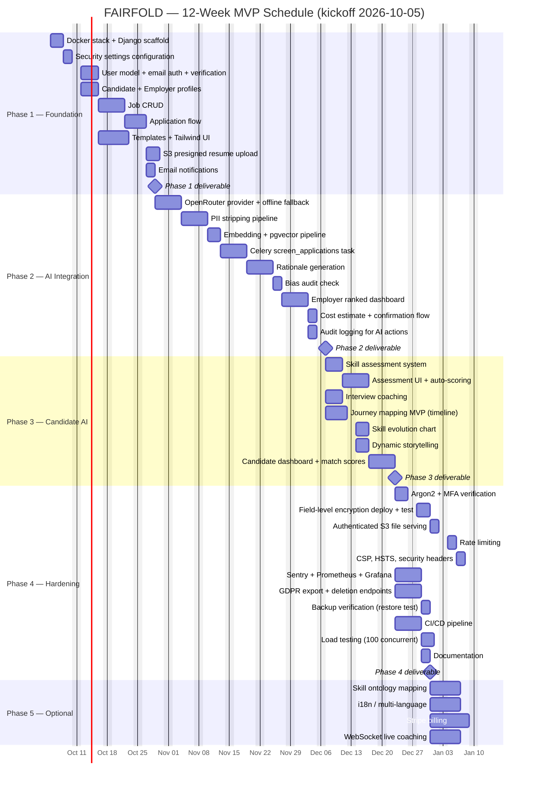
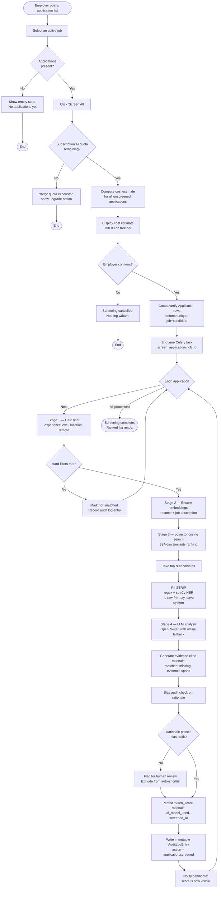

# FAIRFOLD — Feasibility & Design Analysis

**Project Title:** FAIRFOLD
**Subtitle:** AI-Powered, Explainable Recruitment Platform
**Document Purpose:** Feasibility analysis, user stories, formal design diagrams, data dictionary and UI/UX specifications.

---

## How to read this document

This file supplements — and does not replace — the specifications below:

| Document | Role | Status |
|---|---|---|
| `FAIRFOLD_Complete_Project_Document.md` | Product, market, AI strategy, security, roadmap | **Canonical** |
| `FAIRFOLD_Project_Architecture_and_Requirements.md` | Architecture, 52 FRs, 50 NFRs, SQL schema, ops | **Canonical** |
| `prd.md` | Product requirements, phases, FR list, AI requirements, release criteria | **Canonical** |
| `design.md` | UI design system, 62 page specs, 23 wireframes, implementation notes | Supplement |
| `FAIRFOLD_Feasibility_and_Design.md` (this file) | Feasibility, user stories, formal diagrams, Gantt | Supplement |

**Functional requirements live in the Arch Doc §4.1.** `prd.md` proposes them and this
document traces them to stories and pages; neither is the origin. Where a section needs
detail that already exists (compliance checklist, pricing tiers, ADRs), this document
*cites* the canonical section rather than restating it, so the documents cannot drift apart.

### Source-of-truth rule for this document

> Every requirement ID, table name, and model in this document is traceable to a
> section in the canonical specs. Nothing here is invented. Where information is
> genuinely unavailable, the section is marked **`[PLACEHOLDER]`** with the exact
> question the team must answer — rather than filled with plausible fiction.

### Reference convention

Section numbers are **ambiguous across documents by nature** — this document has a
§3.1 and so do both canonical specs. Therefore:

| Form | Means |
|---|---|
| `Arch Doc §N.M` | `FAIRFOLD_Project_Architecture_and_Requirements.md` §N.M |
| `Complete Doc §N.M` | `FAIRFOLD_Complete_Project_Document.md` §N.M |
| `Arch §N.M` / `Complete §N.M` | short form of the above, in tables and bullet lists |
| `PRD §N.M` | `prd.md` §N.M |
| `design.md §N.M` | `design.md` §N.M |
| Bare `§N.M` | **this document**, unless the surrounding sentence names the other file |

---

## 1. PROJECT FOUNDATION

### 1.1 Project summary

**What the software does.** FAIRFOLD is a web-based recruitment platform with two
portals. The **Candidate Portal** provides profile and resume management, AI skill
assessments, interview coaching, and AI-powered Professional Journey Mapping. The
**Employer Portal** provides job posting, AI-automated resume screening,
evidence-cited candidate ranking, structured interview generation, and candidate
messaging.

**Who uses it.**

| User group | Primary need | Source |
|---|---|---|
| Job seekers (candidates) | Demonstrate capability beyond a rigid resume template | Complete Doc §1 |
| Small–mid employers, SMBs, startups | Access screening that enterprise tools price out of reach | Complete Doc §3.3 |
| Recruiters / HR managers | Reduce screening effort and bias risk | Complete Doc §2.1 |
| Interviewers | Structured, consistent question sets and scoring rubrics | FR-031, FR-033 |
| Platform administrators | Governance, audit, GDPR compliance | FR-037 – FR-041 |

### 1.2 Problem statement

Hiring fails at the screening stage for two structural reasons: screening decisions
inherit the unconscious bias of human reviewers, and candidates cannot represent
genuine capability through a fixed document format.

**Evidence from the background study** (Complete Doc §2.1):

- **Eightfold AI** — black-box scoring; impossible to explain a rejection to a
  candidate or an auditor. Entry cost $200K+/year, inaccessible below 5,000 employees.
- **HireVue** — dropped facial analysis in 2021 following bias backlash; candidate
  refusal to be recorded is now widespread.
- **SeekOut** — presents "AI matching" that is keyword-driven underneath; the framing
  oversells what the system does.

These are not isolated product defects. They indicate a category-wide absence of
**explainability and auditability** in automated screening, and a pricing structure
that excludes the SMB segment entirely.

#### 1.2.1 Real-world evidence

**Filled in 2026-10-03**, closing the last placeholder in §1.2 (`prd.md` §19.1
item 2). A concrete incident is more persuasive than a market table, so four are
recorded: one primary case, three supporting.

**Primary — Amazon's recruiting engine (2014–2017).** Amazon built an internal
tool that scored applicants from one to five stars. It was trained on roughly
ten years of past resumes, most of which came from men, and learned to downgrade
resumes containing the word "women's" and resumes from two all-women's colleges.
Engineers edited those specific terms, but could not be confident the system
would not find other proxies, so the project was shut down. Amazon stated the
tool was never the sole basis for evaluating candidates.
*Source: Reuters, J. Dastin, 10 Oct 2018, "Amazon scraps secret AI recruiting
tool that showed bias against women"; also summarised the same day by MIT
Technology Review and Fortune.*

**Why it matters here.** "AI removes bias" is false by default: a model trained on
past hiring decisions copies the past. And removing a few obvious words does not
fix proxy bias — that is the part most product teams get wrong.

**FairFold design response.**

1. The system is **not** trained on historical hire/reject outcomes. It compares a
   job description to anonymised resume content (REQ-FR-029, REQ-FR-030), so it
   has no access to the outcome data that carried the bias.
2. Every score carries the **resume text that justifies it** (REQ-FR-030), so a
   wrong judgement can be traced to a specific line rather than trusted.
3. A bias audit runs on every rationale (REQ-COM-008).
4. A human always decides (`prd.md` §8.1).

**Action this triggers.** The Phase 2 versioned bias test set must include these as
mandatory categories. **Specified 2026-10-03 — see Arch Doc §7.4** (`gendered_club_role`
and `institution_gender_signal`, both `must_flag`). Synthetic cases in the same shape,
each recording its `source_pattern`.
Amazon-style proxy cases — women's-college names, "women's society captain",
gendered club roles. Stripping names, emails and phone numbers removes **none** of
that text, so it is exactly the residue the PII filter leaves behind.

| Supporting case | Facts | Lesson for FairFold |
|---|---|---|
| **EEOC v. iTutorGroup** (settled Aug 2023) | Application software was programmed to auto-reject women aged 55+ and men aged 60+, screening out more than 200 applicants. Settled for **$365,000** — the EEOC's first AI-hiring discrimination settlement. | A **hard filter** can discriminate as easily as a model. Years-of-experience and experience-level filters are age proxies. This is the origin of **Gap G3** (§2.4.1). |
| **HireVue facial analysis** (removed Jan 2021) | HireVue removed facial-expression analysis after bias and disability criticism. | Supports the non-goal of no facial, voice or emotion analysis (`prd.md` §2.3). |
| **Mobley v. Workday** (N.D. Cal., filed 2023) | A nationwide age-discrimination collective was conditionally certified in May 2025; notice authorised 17 Feb 2026 with an opt-in deadline of 7 Mar 2026. A related California-law motion to dismiss was denied 22 Jun 2026. The court has treated the vendor as potentially liable as an agent of the employers using its tools. | Vendors, not only employers, can be liable — so the audit trail protects FAIRFOLD too. **Re-verify the status before citing this publicly**; it was mid-litigation as of Jul 2026. |

#### 1.2.2 Local context — Bangladesh (supporting, not proof of the owner's case)

Peer-reviewed work on Bangladeshi graduate employability points at the same
structural issues. Hossain & Arefin (2025, *European Journal of Contemporary
Education and E-Learning* 3(2), 55–74) list restricted professional connections
among the structural obstacles to graduate employment, alongside curriculum
mismatch and language skills. Zaman (2025) reports unequal access to networks and
skills gaps from 21 structured interviews. A mixed-methods study (n = 1,320 survey
responses, 32 interviews) reports substantial technical and digital skills
mismatches among graduates.

> **Wording rule.** These sources support the claim that *network access and skill
> mismatch are recognised problems*. They do **not** measure how common internal
> lobbying in interview selection is. **No prevalence figure may be stated in any
> document until §1.3.4 produces one.** Until then the claim is stated as the
> Product Owner's experience plus corroboration, not as a statistic.

### 1.3 Requirement collection method

**Filled in 2026-10-03.** This was the last open item in the specification set
(`prd.md` §19.1 item 1) and the only one that could not be closed by analysis
alone. It asked for something specific: *"State what was actually done; do not
claim research that was not conducted."*

That instruction is honoured literally. **Every claim below is tagged**, so a
reviewer can tell at a glance what is evidence and what is not:

| Tag | Meaning |
|---|---|
| **[Done]** | It happened, and the Product Owner can vouch for it. |
| **[Illustrative]** | A scenario written to explain a requirement. **Not** a research finding and must never be quoted as data. |
| **[Planned]** | A validation step that has **not** been run. Change to [Done] only once it has actually run and the real numbers are recorded. |

#### 1.3.1 Source of the requirements

| Item | Detail |
|---|---|
| **Primary stakeholder** | The Product Owner, who is also the problem owner: a job seeker whose own interview selection was decided by internal lobbying, with **no skills check applied before shortlisting**. Around **mid-2026**, applying to a **public university** for a **Cybersecurity Engineer** role. **[Done]** |
| **Corroboration** | Fellow job seekers who shared the same experience and later formed the project team. **[Done]** |
| **Further corroboration** | A university senior described the same referral-driven pattern independently. One account, not a study. **[Done]** |
| **Technique** | Problem-owner elicitation (lived experience) + group discussion + scenario-based elicitation (§1.3.3). **[Done]** |
| **What was *not* done** | No formal interviews with recruiters, no survey, no field observation. **[Planned]** — see §1.3.4. |

No employer and no individual is named anywhere in this document, by decision.

**Statement for the PRD, used near-verbatim:**

> Requirements for FairFold originated from the Product Owner's first-hand
> experience of a hiring process in which interview selection was influenced by
> internal lobbying, and in which no skills check was applied before candidates
> were shortlisted. The same experience was shared by friends who later formed the
> project team, and corroborated independently by a university senior. The team
> converted these experiences into problem statements and then into requirements
> (§1.3.2). Employer-side needs — recruiters and hiring managers — have so far been
> *inferred* from the Product Owner's candidate-side view and from published
> market analysis; they have **not** been validated with employers. That validation
> is planned in §1.3.4.

#### 1.3.2 From experience to requirement (traceability)

Each pain point from that experience is traced to an objective and to requirements
that **already exist**, so the link is auditable. Two of the six exposed real holes
in the specification; those are now **Gap G1** and **Gap G2** in §2.4.1.

| # | Pain point experienced | What it means for the product | Objective / requirement | Covered? |
|---|---|---|---|---|
| P1 | Selection was decided by **who you knew**, not what you could do | Screening must not see identity or connections | O1; REQ-FR-011 (PII stripping), REQ-FR-029 (anonymised list; name revealed only at shortlist) | **Yes** |
| P2 | **No skills check** before the interview | Skill evidence must be part of the decision, not only a resume | O5; REQ-FR-019/020 (assessments), REQ-FR-030 (evidence-cited rationale) | **Partly** — assessments were candidate-initiated only. Now **REQ-FR-051** (Gap G1) |
| P3 | **No explanation** for the outcome; no feedback | Candidate must be able to see why they were ranked | O2; REQ-FR-024 (match score + rationale), REQ-FR-030 | **Yes** |
| P4 | **Nobody could challenge** the outcome afterwards | Decisions must leave an evidence trail | O3; REQ-COM-008 (append-only audit), REQ-FR-039 | **Yes** |
| P5 | The selection could simply be **bypassed** by someone with influence | The platform must make a bypass visible | — | **No** → now **REQ-FR-052** (Gap G2) |
| P6 | Thin resume, strong self-taught skills | Candidate must show capability outside a fixed format | O5; REQ-FR-016–018 (Journey Map) | **Yes** |

P1–P6 were derived by the team *after the fact* from the experience described in
§1.3.1. They are an interpretation of a small number of accounts, not a coded
qualitative study, and are tagged accordingly.

#### 1.3.3 Scenario-based elicitation — **[Illustrative]**

> **[Illustrative]** The scenario below is a standard requirements-engineering
> technique (scenario / persona walkthrough) written to help reviewers understand
> the requirements. **The people and numbers are invented.** It is not research
> data and must not be quoted as such.

**Scenario S-1 — "The interview that was never open" (as-is).** Rafi is a final-year
engineering graduate in Dhaka with two self-built projects and no family connections
in industry. A mid-size company posts an entry-level role.

1. Rafi applies by email with a PDF resume carrying his name, university and photo.
2. A manager who knows a candidate personally forwards that resume to HR with a
   note. That candidate is called first.
3. HR reads the first ~15 resumes, then stops. No test is given to anyone.
4. Rafi hears nothing. He never learns whether he was rejected, or why.
5. Later he finds the interview slots were filled before the deadline.

*Problems exposed: P1, P2, P3, P4, P5.*

**Scenario S-2 — the same role on FairFold (to-be).**

1. Rafi uploads his resume. Name, photo, phone, address and university identifiers
   are stripped before any AI sees it (REQ-FR-011).
2. The employer's HR officer clicks **Screen All**, sees the cost estimate
   ($0.00 on the free tier) and confirms (REQ-FR-028).
3. Applicants are ranked by anonymised ID. Rafi's score carries evidence from his
   own resume — the project where he used the required skill (REQ-FR-029/030).
4. Rafi sees his own score and the missing skills (REQ-FR-024) and takes the skill
   assessment to close a gap (REQ-FR-019/020). If the employer made that assessment
   **required**, his score alone cannot shortlist him (REQ-FR-051).
5. The manager who knows a candidate wants to shortlist that candidate out of
   order. **The system makes that visible**: a written reason is required and an
   `ai_decision`-class audit entry is written (REQ-FR-052).
6. Candidates the hard filter marked `not_matched` stay visible to the employer
   with the reason shown, and can be pulled into review (REQ-FR-029, Gap G3).
7. Every AI step is in the audit log, so a rejected candidate or a regulator can
   ask what happened (REQ-COM-008).

#### 1.3.4 Validation plan — **[Planned]**

Not run. Recorded now so the sample size, channel and questions are fixed **before**
anyone collects data, and so nobody can later describe a result that was never
collected. The aim is a small honest evidence base, not a large study.

| Activity | Who | Size (suggested) | Output | Status |
|---|---|---|---|---|
| Candidate interviews (20–30 min) | Recent graduates and early-career job seekers in Bangladesh | 8–10 | Themes on referral-driven hiring, feedback, skills checks | **[Planned]** |
| Recruiter / hiring-manager interviews | HR staff at SMEs and startups | 5–6 | How they screen today; volume; tools; tolerance for AI; willingness to override | **[Planned]** |
| Short survey | Job seekers | 30+ responses | Share reporting referral influence; share ever given a skills test; share ever given feedback | **[Planned]** |
| Concept test of S-2 against the wireframes (`design.md` §10.5) | Both groups | 5–8 sessions | Reaction to the anonymised list, the cost estimate and the shortlist reveal | **[Planned]** |

**Interview guide — candidates (core questions).**

1. Tell me about the last role you applied for. What happened after you submitted?
2. Did anyone test your skills before deciding on an interview? How?
3. Did you ever feel the outcome depended on who you knew? What made you think so?
4. Did you receive any explanation or feedback? What would you have wanted?
5. Would you trust a score that shows evidence from your own resume? What would
   make you distrust it?

**Interview guide — recruiters (core questions).**

1. Walk me through how you screened the last role you filled. How many applicants,
   how much time?
2. How often is a candidate suggested internally? What do you do with that
   suggestion?
3. Do you test skills before interviews? Why or why not?
4. What would make you comfortable letting software rank applicants? What would
   make you refuse?
5. If you wanted to shortlist someone ranked low, would you accept having to
   record a reason?

**Survey (job seekers, 5 minutes).**

1. In the last 2 years, how many roles did you apply for? (number)
2. For how many were you given a skills test before an interview? (number)
3. For how many did you receive any feedback after rejection? (number)
4. "Who you know mattered more than what you could do" in my experience. (1–5 agree)
5. I would apply through a platform that hides my name during screening. (1–5)
6. I would trust a ranking if it showed evidence from my own resume. (1–5)

**Recording results.** When this has actually run, add a table to §1.3 with the
real counts, retag each row **[Done]**, and cite those counts in place of the §1.2.2
local evidence. **Do not publish percentages from a sample this small as market
facts** — present them as "of N participants".

#### 1.3.5 What the other requirements came from

Not every requirement came from a user. Being explicit about this is the point:

| Requirement range | Origin | Confidence |
|---|---|---|
| REQ-FR-001 – 008 (auth) | Security best practice + the architecture spec | Assumption, standard practice |
| REQ-FR-009 – 024 (candidate) | Competitor gaps in §1.4 — no open-source project offers a candidate portal — plus the Journey Mapping differentiator | Inferred from competitor analysis, **not validated with candidates** |
| REQ-FR-025 – 036 (employer) | Competitor shortfalls in §1.4, principally the explainability gap (Eightfold) and the candidate-recording refusal problem (HireVue) | Inferred from competitor analysis, **not validated with recruiters** |
| REQ-FR-037 – 041 (admin / GDPR) | Legal requirement — GDPR Arts. 17 and 20, EU AI Act (REQ-COM-002, -003, -006) | Non-negotiable, external |
| REQ-FR-042 – 052 | Traceability audit (§2.4.1) + gaps G1, G2 and G3 | Derived from the specification's own internal gaps |

### 1.4 Background study and analysis

Complete and well in excess of a minimum competitor scan. Eleven systems analysed:

| Category | Systems | Documented finding |
|---|---|---|
| Enterprise incumbents | HireVue, Eightfold, SeekOut, Paradox, LinkedIn Recruiter, Manatal, Workable, Phenom, HackerEarth | §2.1 — pricing, strengths, weaknesses per system |
| Open source | CandiSift, OpenCATS, candidacy | §2.2 — stack, AI approach, lessons learned |
| Our gap | — | §2.3 — bias audit trail, privacy-first AI, freemium pricing, journey mapping |

**Analysis of related systems (2–3 in depth):**

1. **CandiSift** (confused-ai) — the closest comparator. Best-in-class open-source
   architecture: cost-aware provider, evidence-cited breakdowns, bias-audit endpoint,
   PII stripping, cost estimate before processing. *Not adopted:* FastAPI/hexagonal
   architecture and a Claude dependency; no candidate portal; not Django.
2. **Eightfold AI** — deepest talent graph in the market. *Rejected because* black-box
   scoring directly contradicts our explainability thesis, and the $200K+/year price
   excludes our target SMB segment.
3. **candidacy** (steelburn) — proves the OpenRouter multi-model integration and
   schema-as-code approach. *Not adopted:* 12-service PHP/Laravel microservice
   architecture is disproportionate operational complexity for this team.

#### 1.4.1 Does something like FairFold already exist?

**Answer: yes, in pieces. No single product found combines everything below.** The
name and the broad idea are not unique.

| Category | Examples | What they do | Gap vs. FairFold |
|---|---|---|---|
| Blind / anonymised hiring | Applied, Vervoe, MeVitae, Pinpoint, GapJumpers | Hide identity during review; Applied replaces the CV sift with job-relevant questions and work samples reviewed anonymously | Priced and designed for organisations, not job seekers. No candidate-side career tooling. Little emerging-market focus. |
| Skills assessment | TestGorilla, HackerRank, Codility, CodeSignal, Vervoe | Test skills against large libraries; TestGorilla has a free plan and paid plans from about $135/month | They assess skills but do not rank anonymised resumes, and show no evidence-cited rationale to the candidate |
| AI video / game assessment | HireVue, Pymetrics (now Harver) | Enterprise screening at scale | Opaque and expensive; HireVue's earlier facial analysis drew sustained criticism |
| Enterprise AI sourcing | Eightfold, SeekOut, Phenom | Talent intelligence and pipelines | Enterprise pricing; $200K+/year cited for Eightfold. Priced out of the SMB segment entirely |
| Open-source ATS | CandiSift, OpenCATS | PII stripping, evidence-cited breakdowns (CandiSift) | No candidate portal; depends on a paid LLM |

#### 1.4.2 Naming — ✅ decided (FairFold), 🟡 trademark clearance outstanding

**Decided 2026-10-03: the product is FairFold.** The section is kept because the
reasoning behind the decision is more useful than the decision itself.

**Why the previous name was abandoned.** Verified 2026-10-03 (web search + DNS
resolution; neither is a trademark clearance):

| Finding | Evidence |
|---|---|
| **MatchMindAI** (matchmindai.com) markets itself as an AI-powered recruitment platform matching candidates to jobs | Search result title and description; `matchmindai.com` resolves to a live host (54.205.105.28) |
| **"MatchMinds"** is also used by an AI-powered recruitment platform | Public post describing itself as "an AI-powered recruitment platform and the next frontier in hiring" |
| **"MatchMinds"** is additionally used by an unrelated Android football-prediction app, and by an unrelated teammate-recommendation system | Two further commercial uses of the same string |

Three unrelated commercial spaces, one of them recruitment. "Match Mind" is also
descriptive of what every ATS does, which makes it hard to register as a word mark in
class 42 and hard to defend even once registered.

**Candidates screened on 2026-10-03.** "No DNS record" is *not* proof of availability:

| Candidate | Meaning | Domain status | Outcome |
|---|---|---|---|
| **FairFold** | fair + a folded resume | fairfold.com, fairfold.ai — no DNS record | ✅ **Selected** |
| Niyoti (নিয়তি) | Bengali for impartiality — matches the thesis *and* the Bangladesh beachhead | niyoti.app / niyoti.io — no DNS record | Not chosen: a common Bengali given name, so a bare word mark is hard to own |
| SightFold | you can *see* the reasoning | sightfold.com — no DNS record | Not chosen: coined, so colder as a brand |
| Evidencefold | evidence-cited rationale | evidencefold.com — no DNS record | Not chosen: long and clunky in a logo |

Also rejected in the same sweep: **Meritfold** (already a UK public-sector bid
product), Sightline, Clearscreen, Showwork, Foldwork, Talentfold, Skillfold,
Plainfold, Proofhire, Openrank, Rankfold, Foldscore, Meritly, Fairhire — all taken.

**Why FairFold works.** "Fair" states the intent. "Fold" carries the résumé being
opened and read — the moment the product intervenes on. It names the *artefact* rather
than the feature, which is the thing competitors cannot copy by adding a checkbox.
No living commercial use was found.

**What changed.** The three `MATCH_MINDS_*.md` files were renamed to `FAIRFOLD_*.md`
and every internal link repaired.

**✅ Domain owned.** The team already holds a domain and intends to **run on a
temporary domain first, moving to the primary at launch**. That closes the registration
half of `RSK-011`.

**🟡 Still open — legal, not creative.** `RSK-011` stays on the register at **Medium
probability / Low impact**: commission a formal trademark search in Bangladesh and each
target export market, and file the word mark in classes 42 and 35 per market. Neither
has been done. **A domain registration is not a trademark filing** — it does not confer
the right to use a name in commerce, and it will not stop a trademark office from
refusing the mark.

**Two consequences of the temporary-domain plan**, recorded so they are not discovered
the hard way:

- Every host-dependent value — `ALLOWED_HOSTS`, `CSRF_TRUSTED_ORIGINS`, the Stripe
  webhook URL, the Sentry DSN, absolute URLs in emails — must live in environment
  variables so the switch is a config change, not a debugging session.
- **No SEO, email-sender reputation or social handles should be built against the
  temporary host.** Verification emails establish SPF/DKIM for *that* domain, and
  candidate links containing it will not survive the move. Migrate before public launch,
  not after traction exists.

#### 1.4.3 How FairFold is different — and where "better" must be proven

The status column is the important part. Three of these seven claims are designs we
have made, not results we have produced.

| Dimension | Typical competitor | FairFold | Status of the claim |
|---|---|---|---|
| **Who it serves** | Employer only | **Both sides** — the candidate sees their own score, rationale, journey map and coaching | **Designed** — §1.5 |
| **Bias handling** | Marketed as "bias-free" | PII stripped before any AI call; bias audit on every rationale; a human always decides; immutable audit trail | **Designed — not yet measured** |
| **Explainability** | Score only, or a black box | Evidence-cited rationale shown to employer *and* candidate; "no evidence found" is an explicit outcome | **Designed** — REQ-FR-030 |
| **Cost** | Quote-based or enterprise | $0 AI cost on the free tier via local embeddings, free LLMs and an offline fallback | **Assumption** — depends on free-tier availability (RSK-001) |
| **Skills evidence** | A separate tool the employer buys | Assessments and the Journey Map in one flow, with employer-required assessments (REQ-FR-051) | **Partly designed** — Gap G1, §2.4.1 |
| **Market** | US/EU enterprise | Bangladesh and emerging-market SMEs first | **Unvalidated** — RSK-008 |
| **Compliance** | Varies widely | Audit trail, GDPR export/delete, EU AI Act human oversight | **Designed — verification in Phase 4** |

> **Use "better" carefully.** The evidence supports *different* today: two-sided,
> evidence-cited, privacy-first, low-cost. *"Better"* is a claim about outcomes and
> has to be earned against measured disparity data. Until the bias audit and
> disparity analysis in `prd.md` §8.7 have run, this is the wording to use:
>
> *FairFold is designed to make screening explainable and auditable for both
> employers and candidates, at a price small employers can afford. Whether it
> reduces biased outcomes will be measured through the bias audit and disparity
> analysis described in `prd.md` §8.7.*

### 1.5 Proposed solution, objectives, scope and target users

**Proposed solution** (Complete Doc §1, §3): a full-Python-stack platform that (a) strips
PII before any AI model sees candidate data, (b) produces evidence-cited screening
rationale for every ranking decision, (c) logs a bias audit trail for each AI action,
and (d) inverts the market's pricing by offering strong candidate-side tooling free.

**Objectives** — traced to measurable success criteria (Appendix A):

| # | Objective | Measure | Source |
|---|---|---|---|
| O1 | Zero PII reaches an AI provider | 100% of AI payloads pass PII filter | REQ-SEC-002 |
| O2 | Every ranking is explainable | 100% of scores carry evidence-cited rationale | FR-030 |
| O3 | Screening bias is auditable | Every AI action has an immutable audit entry | REQ-COM-008 |
| O4 | Cost does not block adoption | $0.00 AI cost on free tier | FR-028 |
| O5 | Candidates can prove skill, not just tenure | Assessments + journey map shipped | FR-019, FR-016 |

**Scope.**

- *In scope* (Complete Doc §9, phases 1–4): both portals, job/application CRUD, AI
  screening, PII stripping, pgvector matching, rationale generation, bias audit,
  assessments, interview coaching, journey mapping, auth + MFA, GDPR endpoints,
  monitoring, CI/CD.
- *Out of scope* (Arch Doc §1.2): native mobile apps (PWA first), video hosting,
  payroll, background checks, in-app payments beyond subscription billing.
- *Deferred to phase 5:* i18n, Stripe billing, WebSockets, full skill ontology.

**Target users** — see the table in §1.1 above.

---

## 2. REQUIREMENTS & PLANNING

### 2.1 Requirement collection method

**Complete** — see §1.3. Filled in 2026-10-03: problem-owner elicitation from the
Product Owner's own experience **[Done]**, plus competitor analysis and legal
requirements. No recruiter interviews, no survey and no observation were run; the
validation plan that would close those gaps is **[Planned]** in §1.3.4 and stays
there until it has actually been run.

### 2.2 Functional requirements

**Complete.** 52 functional requirements with unique IDs, priorities, and Given/When/Then
acceptance criteria — `FAIRFOLD_Project_Architecture_and_Requirements.md` §4.1.

| Group | ID range | Count | Priority distribution |
|---|---|---|---|
| Authentication & user management | REQ-FR-001 – FR-008 | 8 | 5 High, 3 Medium |
| Candidate portal | REQ-FR-009 – FR-024 | 16 | 9 High, 7 Medium |
| Employer portal | REQ-FR-025 – FR-036 | 12 | 6 High, 6 Medium, 1 Low |
| Administrative / GDPR | REQ-FR-037 – FR-041 | 5 | 3 High, 2 Medium |
| Job discovery & messaging | REQ-FR-042 – FR-043 | 2 | 1 High, 1 Medium |
| Employer organisation & billing | REQ-FR-045 – FR-048 | 4 | 1 High, 3 Medium |
| Certification & content management | REQ-FR-044, FR-049 – FR-050 | 3 | 2 Medium, 1 Low |
| **Screening integrity** (override visibility, required assessments) | REQ-FR-051 – FR-052 | 2 | **2 High** |

Representative example:

> **REQ-FR-030 — Evidence-Cited Rationale** (High)
> **Given** AI-generated rationale; **When** employer views candidate; **Then**
> rationale shows specific resume text for each claim; **And** missing skills listed;
> **And** bias audit status shown.

### 2.3 Non-functional requirements (measurable)

**Complete.** 50 measurable NFRs across four categories — Arch Doc §4.2.

| Category | ID range | Count | Example (measurable target) |
|---|---|---|---|
| Security | REQ-SEC-001 – 014 | 14 | Argon2id hashing; 5 failed logins → 15-min lockout (REQ-FR-003) |
| Compliance / privacy | REQ-COM-001 – 009 | 9 | GDPR Art. 17 erasure; WCAG 2.1 AA; PII never sent to AI |
| Performance & availability | REQ-NFR-001 – 018 | 18 | Screening 100 applications < 5 min; 95th-percentile API < 500 ms; uptime 99.9% |
| Code quality & documentation | REQ-NFR-019 – 023 | 5 | Coverage ≥ 80%; `mypy --strict` passes |
| Operations | REQ-NFOR-001, -002, -024, -025 | 4 | Rollback < 5 min; environment parity; structured JSON logs |

**Measurability is real, not aspirational** — every one of the 50 states a threshold
and a verification method. Examples: test coverage is enforced by
`pytest --cov-fail-under=80` (REQ-NFR-019); API latency is read from a Prometheus
histogram (REQ-NFR-006); load targets are validated with Locust (REQ-NFR-008); security
headers are checked against `securityheaders.com` (Phase 4); accessibility is validated
by axe-core/pa11y in CI (REQ-COM-007).

> **Note on ID prefixes:** the source spec uses `REQ-NFR-001…023` for performance and
> `REQ-NFOR-…` for operations, where the trailing `R` means "requirement". The
> numbering therefore interleaves (REQ-NFOR-024, -025 sit above REQ-NFR-023). The
> prefixes are cited here exactly as they appear in the source; no renumbering was
> performed.

### 2.4 User stories

Derived one-to-one from the 52 FRs in Arch Doc §4.1. Written in standard
*As a / I want / so that* form with story points and MoSCoW priority.

#### Authentication — actor: Registered User

| Story ID | User story | FR | Pts | Priority |
|---|---|---|---|---|
| US-001 | As a **new user**, I want to register with my email and a role, so that I can access the portal appropriate to me. | FR-001 | 3 | Must |
| US-002 | As a **registered user**, I want to log in, so that I can reach my dashboard. | FR-002 | 3 | Must |
| US-003 | As a **user who has forgotten my password**, I want a reset link, so that I can regain access without support. | FR-004 | 2 | Must |
| US-004 | As a **security-conscious user**, I want to enable MFA, so that a stolen password alone cannot compromise my account. | FR-005, FR-006 | 5 | Should |
| US-005 | As a **user**, I want my session to end when I log out, so that someone else cannot use my device. | FR-008 | 2 | Must |
| US-006 | As a **user**, I want my account locked after repeated failed attempts, so that my account cannot be brute-forced. | FR-003 | 3 | Must |
| US-007 | As a **user**, I want my access token refreshed automatically, so that I am not logged out mid-task. | FR-007 | 3 | Must |

#### Candidate portal — actor: Candidate

| Story ID | User story | FR | Pts | Priority |
|---|---|---|---|---|
| US-010 | As a **candidate**, I want to build a profile with my title and skills, so that employers can find me. | FR-009 | 3 | Must |
| US-011 | As a **candidate**, I want to upload a resume, so that I can apply to jobs. | FR-010 | 5 | Must |
| US-012 | As a **candidate**, I want my personal details removed from my resume before AI analysis, so that my privacy is protected. | FR-011 | 5 | Must |
| US-013 | As a **candidate**, I want my resume text extracted accurately, so that employers see my full experience. | FR-012 | 3 | Must |
| US-014 | As a **candidate**, I want my resume embedded for semantic matching, so that I am considered for relevant jobs even with different wording. | FR-013 | 3 | Must |
| US-015 | As a **candidate**, I want to add and edit my skills with a level, so that my profile stays accurate. | FR-014 | 3 | Must |
| US-016 | As a **candidate**, I want "JS" and "JavaScript" treated as one skill, so that I am not penalised for abbreviation. | FR-015 | 2 | Should |
| US-017 | As a **candidate**, I want to see my skills mapped to a visual career timeline, so that I can present my growth, not just my job titles. | FR-016 | 8 | Should |
| US-018 | As a **candidate**, I want to see when I acquired each skill, so that I can identify gaps. | FR-017 | 5 | Should |
| US-019 | As a **candidate**, I want a narrative summary tailored to a specific job, so that my application reads as relevant. | FR-018 | 5 | Could |
| US-020 | As a **candidate**, I want to take a skill assessment, so that I can prove ability that a resume cannot show. | FR-019 | 5 | Should |
| US-021 | As a **candidate**, I want my assessment auto-scored, so that I get an objective result. | FR-020 | 3 | Should |
| US-022 | As a **candidate**, I want AI feedback on my practice answer, so that I improve before the real interview. | FR-021 | 5 | Should |
| US-023 | As a **candidate**, I want to browse and search jobs, so that I can find relevant openings. | FR-042 | 3 | Must |
| US-024 | As a **candidate**, I want to apply to a job, so that I can be considered for it. | FR-022 | 3 | Must |
| US-025 | As a **candidate**, I want to track my application status, so that I know where I stand. | FR-023 | 3 | Must |
| US-026 | As a **candidate**, I want to see *why* I scored as I did, so that I learn and can improve. | FR-024 | 3 | Must |

#### Employer portal — actor: Employer / Recruiter

| Story ID | User story | FR | Pts | Priority |
|---|---|---|---|---|
| US-030 | As an **employer**, I want to post a job, so that I can start recruiting. | FR-025 | 5 | Must |
| US-031 | As an **employer**, I want to edit a draft job, so that I can correct details before publishing. | FR-026 | 2 | Must |
| US-032 | As an **employer**, I want to publish a job, so that candidates can apply. | FR-027 | 2 | Must |
| US-033 | As an **employer**, I want to know the cost before running AI screening, so that I am not surprised by a bill. | FR-028 | 5 | Must |
| US-034 | As an **employer**, I want candidates ranked by match score, so that I review the most relevant people first. | FR-029 | 5 | Must |
| US-035 | As an **employer**, I want every claim in a ranking backed by resume evidence, so that I can defend the decision and check for bias. | FR-030 | 8 | Must |
| US-036 | As an **employer**, I want an AI-generated interview question pack, so that all candidates are asked comparable questions. | FR-031 | 5 | Should |
| US-037 | As an **employer**, I want to schedule an interview, so that candidates and interviewers agree on a time. | FR-032 | 3 | Should |
| US-038 | As an **interviewer**, I want to record structured scores and a recommendation, so that decisions are comparable. | FR-033 | 3 | Should |
| US-039 | As an **employer**, I want an AI-drafted offer letter I can edit, so that I do not start from a blank page. | FR-034 | 3 | Could |
| US-040 | As an **employer**, I want a dashboard of time-to-hire and drop-off, so that I can improve my process. | FR-035 | 8 | Should |
| US-041 | As an **employer**, I want a shareable link for a job, so that I can post it on my own careers page. | FR-036 | 2 | Could |

#### Administration — actor: Administrator

| Story ID | User story | FR | Pts | Priority |
|---|---|---|---|---|
| US-050 | As a **candidate**, I want to message an employer, so that I can ask questions about a role. | FR-043 | 3 | Should |
| US-051 | As an **admin**, I want system metrics and AI usage at a glance, so that I can monitor platform health. | FR-037 | 5 | Should |
| US-052 | As an **admin**, I want to manage users and unlock accounts, so that legitimate users are not blocked. | FR-038 | 5 | Must |
| US-053 | As an **admin**, I want to search and export audit logs, so that I can investigate an incident. | FR-039 | 5 | Must |
| US-054 | As a **user**, I want to export all my personal data, so that I can exercise my right to portability. | FR-040 | 5 | Must |
| US-055 | As a **user**, I want my data deleted on request, so that I can exercise my right to erasure. | FR-041 | 8 | Must |

#### Supporting platform features — actor: Candidate / Employer / Admin

> Added with `REQ-FR-044` – `REQ-FR-050` (round 2 of the traceability audit).

| Story ID | User story | FR | Pts | Priority |
|---|---|---|---|---|
| US-056 | As a **candidate**, I want to list the certifications I have earned, so that my verified skills are visible to employers. | FR-044 | 3 | Should |
| US-057 | As a **new employer**, I want to create my company profile, so that I can post jobs. | FR-045 | 3 | Must |
| US-058 | As an **employer**, I want to see my hiring pipeline at a glance, so that I know what needs my attention today. | FR-046 | 5 | Should |
| US-059 | As an **employer admin**, I want to invite colleagues and set their roles, so that the right people can act on my behalf. | FR-047 | 5 | Should |
| US-060 | As an **employer**, I want to see my plan, usage and invoices, so that I can manage cost without contacting support. | FR-048 | 5 | Could |
| US-061 | As an **admin**, I want to create and edit assessments, so that candidates can be tested on skills. | FR-049 | 5 | Should |
| US-062 | As an **admin**, I want to send a scheduled announcement to a chosen audience, so that I can communicate service changes. | FR-050 | **8** | Could |

#### Screening integrity — actor: Employer / Recruiter

> Added with `REQ-FR-051` and `REQ-FR-052` and the Gap G3 amendment to
> `REQ-FR-029`, all approved 2026-10-03. These three trace back to the Product
> Owner's own experience (§1.3.1) — pain points P2 (no skills check) and P5
> (the selection could be bypassed).

| Story ID | User story | FR | Pts | Priority |
|---|---|---|---|---|
| US-063 | As an **employer**, I want to require a skill assessment before shortlisting, so that a decision cannot be made on a resume alone. | FR-051 | 5 | Must |
| US-064 | As an **employer**, I want to have to give a reason when I shortlist someone the ranking put below my cut-off, so that the decision is visible rather than invisible. | FR-052 | 5 | Must |
| US-065 | As an **employer**, I want to see and review the candidates an automatic filter excluded, so that a rule cannot silently decide who is considered. | FR-029 | 3 | Must |

**Priority model:** MoSCoW — **Must** = core flow, MVP-blocking. No "Won't" items;
deliberate exclusions are listed in Arch Doc §1.2 Out of Scope.

**Coverage:** all 52 functional requirements map to at least one user story.
**Total effort:** 52 stories, 217 story points.
**MoSCoW:** 30 Must · 17 Should · 5 Could.

#### 2.4.1 Traceability gaps

##### Round 1 — found and closed ✅

Two capabilities appeared in the user journeys (Complete Doc §7.1, §7.2) and had
database models and use cases, but **had no functional requirement** in Arch Doc §4.1:

| Gap | Capability | Evidence it was intended | Resolution |
|---|---|---|---|
| **GAP-1** | Candidate job search / browse | Use case UC16; §7.1 candidate journey step 5; `design.md` pages #4, #5 | Now **REQ-FR-042** in Arch Doc §4.1 |
| **GAP-2** | Candidate–employer messaging | `Message` model (Complete Doc §C.11); use case UC31; §1 "real-time candidate communication"; §7.2; `design.md` pages #31, #48 | Now **REQ-FR-043** in Arch Doc §4.1 |

**Status: closed.** Both requirements were drafted in `prd.md` §7.2–7.3 and have been
promoted into the canonical Arch Doc §4.1 as a new *Job Discovery & Messaging* group,
with Given/When/Then acceptance criteria. `US-023` and `US-050` now carry the real
requirement IDs instead of ⚠️ gap markers, and FR↔story↔test traceability is unbroken.

Two conditions were written into the requirements themselves rather than left to
implementation guesswork:

- **REQ-FR-042** states that an employer name is not disclosed until the employer
  opts in, since a public job board otherwise leaks company identity by default.
- **REQ-FR-043** states that messages are excluded from all AI processing and never
  reach an external provider, and that deleting one party soft-deletes rather than
  removes the counterparty's copy (the cascade problem noted in §3.7).

##### Round 2 — found by the page-level design audit, and now closed ✅

The first pass worked from use cases and journeys. The second pass worked from
`design.md` §10, which specifies all 62 pages and names the requirement behind each one.
That surfaced **7 further pages that built a real feature with no functional requirement
behind them** — the same class of problem as GAP-1/GAP-2, but smaller and found later:

| Page | Feature | Now |
|---|---|---|
| #19 | Certifications | **REQ-FR-044** Certification Management |
| #33 | Employer onboarding | **REQ-FR-045** Employer Company Profile |
| #34 | Employer dashboard | **REQ-FR-046** Employer Dashboard |
| #49 | Team and roles | **REQ-FR-047** Employer Team and Roles |
| #50 | Billing and plan | **REQ-FR-048** Billing and Plan Management |
| #61 | Assessment management | **REQ-FR-049** Assessment Management |
| #62 | Broadcast announcement | **REQ-FR-050** Broadcast Announcement (optional) |

**Status: closed.** All seven are now in Arch Doc §4.1 as a new *Employer Organisation,
Billing & Content* group with Given/When/Then criteria, and each has a user story
(`US-056`–`US-062`) in §2.4. FR↔story↔page traceability now holds across all 62 pages
except the two marketing pages (#1 landing, #2 pricing), which correctly need no FR.

Four conditions were written into the requirements rather than left to implementation guesswork:

- **REQ-FR-045** — a job cannot be activated until a company profile exists, which stops an
  anonymous employer from posting.
- **REQ-FR-047** — the last `employer_hr` cannot be demoted or removed, which would otherwise
  orphan the account.
- **REQ-FR-048** — subscription state updates on the Stripe **webhook**, not the browser
  redirect, so a failed webhook leaves the subscription unchanged rather than half-updated.
- **REQ-FR-050** — an empty audience match must report rather than silently succeed. The
  requirement is marked **optional**: if the team decides the page is not worth building,
  remove `REQ-FR-050`, `US-062` and page #62 together.

The Arch Doc held **50 functional requirements** at the end of this round. Round 3
(below) took it to 52.

One further follow-up from round 1 remains: `Complete Doc §C.12` does not yet list public
job browse/search endpoints for REQ-FR-042, nor the GDPR export/delete endpoints for
REQ-FR-040/041 — nor endpoints for the seven requirements added in round 2.

##### Round 3 — found by tracing the Product Owner's own experience, and now closed ✅

Rounds 1 and 2 worked **outwards from the specification**: use cases, journeys, then
pages. Round 3 worked **inwards from the problem** — the traceability table in §1.3.2,
which maps the six pain points of the Product Owner's actual hiring experience to
requirements. Two of the six could not be traced to any requirement at all.

This is a different kind of finding. Rounds 1 and 2 found *capabilities with no
requirement* — a requirement-shaped hole. Round 3 found *requirements that do not
answer the problem that started the project* — a coverage-shaped hole, which is
harder to see because the document looks complete.

| Gap | What the specification could not do | Requirement | Status |
|---|---|---|---|
| **G1** | Attach a skill assessment as a **required** step. REQ-FR-019/020 assessments are candidate-initiated and Medium priority, so an employer could still shortlist on a resume with no skill evidence at all. The experience was *"no skills check before the interview."* | **REQ-FR-051** Employer-Required Skill Assessment (High, Phase 3) | **Closed** |
| **G2** | Record a shortlist or rejection that goes **against** the ranking. Nothing did. Anonymised ranking is worthless if the ranking can be quietly ignored — and the specific failure here was a selection decided by internal lobbying. | **REQ-FR-052** Override Visibility and Record (High, Phase 2–3) | **Closed** |
| **G3** | Review an automatic `not_matched`. Stage 1 marked candidates on experience level and minimum years with no reason recorded and no route back. `EEOC v. iTutorGroup` (§1.2.1) is the case that makes this concrete: a hard-coded age filter *was* the discriminating mechanism, and years of experience is an age proxy. | **Amendment to REQ-FR-029**, plus `screening_config` versioning | **Closed** |

Three decisions are worth stating, because each could reasonably have gone the other way:

- **An override is recorded, not blocked.** REQ-FR-052 requires a written reason and
  writes an `ai_decision`-class audit entry, but the employer can still do it. A
  human stays the decision-maker (`prd.md` §8.1). The requirement makes an informal
  decision *visible and countable* — which is what "bias-free" can honestly mean —
  rather than pretending software can remove a hiring manager's judgement. The
  `CHECK` constraint on `applications` enforces non-empty reasons in the database,
  not only in the form.
- **A filter may produce `not_matched`, never `rejected`.** Only a person can reject a
  candidate. This keeps `prd.md` §8.1 true at the schema level rather than in prose.
- **Filter rules are versioned, not just recorded.** `jobs.screening_config_version`
  increments on every edit and each application stores the version that judged it, so
  "which rule excluded this candidate?" is still answerable a year later after the job
  has been edited five times.

New in this round: **2 requirements** (`REQ-FR-051`, `REQ-FR-052`), **1 amendment**
(`REQ-FR-029`), **3 user stories** (`US-063`–`US-065`), **1 new table**
(`job_assessment_requirements`, §5.1), **6 new columns** on `jobs` and `applications`,
**1 `CHECK` constraint**, **2 new indexes**.

The Arch Doc now holds **52 functional requirements** and the feasibility document
**52 user stories / 217 points**.

##### Round 4 — the only approved requirement with no data model, now fixed ✅

Rounds 1–3 looked for capabilities and pain points. This one looks for **approved
requirements that cannot be built**, and there was exactly one.

**`REQ-FR-050` (Broadcast Announcement) had no table.** It was approved in scope, given a
page (`design.md` #62) and an endpoint — and nowhere to store the announcement, its
audience, its schedule, or who it reached. `notifications` cannot substitute: it has a
single `recipient_id`, so it can record that a user *was notified* but never *what was
announced, to whom, or whether it was sent*. **The requirement was unimplementable as
written**, and it had been sitting in the approved set since 2026-10-03 without anyone
checking whether the schema supported it.

**Added:** the `announcements` table (Arch Doc §5.1), the ER diagram entry, the data
dictionary section, and the five-endpoint API.

##### What goes wrong if `REQ-FR-050` is kept — asked and answered 2026-10-03

The honest answer is that it is **the highest blast-radius feature per story point in the
whole specification**, and the original 3-point estimate was wrong by more than half.

| # | What goes wrong | Severity | Now handled? |
|---|---|---|---|
| 1 | **No data model.** Nowhere to store the announcement, audience, schedule or delivery record. The feature cannot be built at all | 🔴 Blocks the feature | ✅ Table added |
| 2 | **A wrong audience is a confidentiality incident, not a UI bug.** The criteria only caught an *empty* audience. An employers-only announcement reaching candidates leaks employer-side information | 🔴 High | ✅ Role re-checked at send + `resolve-audience` preflight |
| 3 | **Email sender reputation.** Bulk sends share a provider and domain with verification and password-reset mail. A burst can get the domain rate-limited or blocked — which then **breaks account access for every user on the platform** | 🔴 High | ✅ Separate sending subaddress + hourly cap |
| 4 | **GDPR contradiction.** `REQ-FR-041` hard-deletes user data. A scheduled announcement with a snapshot audience will happily email a since-deleted account | 🟡 Medium | ✅ Audience resolved at **send** time; suppression list; `skipped_count` |
| 5 | **Celery retry double-sends.** Beat retries on timeout, and a broadcast is the one action here that cannot be recalled | 🟡 Medium | ✅ `idempotency_key` unique, set before the task runs |
| 6 | **Zero differentiation.** Every enterprise ATS has admin announcements. It competes on nothing and is not in `prd.md` §4.1's differentiation table | 🟢 Minor | Accepted |

**Re-estimated from 3 to 8 points**, because a table, a Celery Beat scheduler, an audience
matcher, a suppression list, a rate cap and an idempotency key are not three points of
work. Phase 4 moves 39 → 44; total 212 → **217**.

**DECIDED 2026-10-03 — the team kept it. Phase 4 only, never a launch dependency.**
It is cheap enough now that it is fixed, and an operator genuinely needs to tell users
about a pricing or maintenance change. But it is also the one feature in the build whose
worst case is a platform-wide incident caused by an admin clicking Send — so the "never
a launch dependency" half is the load-bearing part of the decision, not a caveat on it.

Two conditions now bind:

1. **It never becomes a launch blocker.** If Phase 4 hardening is short, this is what
   slips. Not the GDPR export, not the load test, not the backup restore.
2. **The four artefacts stay coupled.** A later cut removes **`REQ-FR-050` + `US-062` +
   page #62 + the `announcements` table`** in one change. The coupling is written into the
   requirement itself so a partial cut cannot leave a phantom table behind.

Keeping it does not lower the bar on the five constraints; they are the reason it is
affordable at all, since each one removes a failure mode rather than adding a feature.

### 2.5 Product backlog and priority

**Complete.** Feature backlog per phase — Complete Doc §C.15 — plus per-phase acceptance
criteria in Arch Doc §10. The phase breakdown aligns with the backlog:

| Phase | Weeks | Story points | Theme |
|---|---|---|---|
| 1 — Foundation | 1–3 | ~41 | Auth, profiles, jobs, job search (FR-042), applications, employer onboarding (no AI) |
| 2 — AI Integration | 4–6 | ~49 | PII stripping, screening, rationale, bias audit, **override recording (FR-052)**, **reviewable hard filters (FR-029)** |
| 3 — Candidate AI | 7–9 | ~50 | Assessments, **employer-required assessments (FR-051)**, coaching, journey mapping, messaging (FR-043), certifications |
| 4 — Hardening | 10–12 | ~44 | Security, GDPR, monitoring, CI/CD, announcements |
| 5 — Advanced | 13+ | ~33 | i18n, billing (FR-048), WebSockets, skill ontology |

**Total: ~217 story points**, matching the 52 stories in §2.4.

*(Point figures are a planning estimate for the Gantt in §2.7, not an independent
measurement — re-estimate at sprint planning. The authoritative task lists are
Complete Doc §9. The earlier split of 21/34/31/30/25 summed to 141 and did not
reconcile with the 170-point total; the 199-point split then reconciled but
predated the 2026-10-03 screening-integrity work; the figures above now do.)*

> **Schedule warning, restated.** The three requirements added on 2026-10-03 add
> **13 points** to Phases 2 and 3, and the Phase 4 milestone already lands on
> **Fri 25 Dec 2026** (§2.7.2). The plan does not fit as drawn. The scope must be
> cut or the timeline moved — this is tracked as an open item in `HISTORY.md` §4.5.

### 2.6 Feasibility study

#### 2.6.1 Technical feasibility

**Verdict: Feasible.** Every required technology is mature, documented and freely
available at the scale planned.

| Capability | Technology | Evidence it is achievable | Canonical source |
|---|---|---|---|
| Web framework | Django 5 + DRF | Mature LTS-style framework, largest Python ecosystem | §4.1, §4.2 |
| Database | PostgreSQL 17 + pgvector | `CREATE EXTENSION vector`; cosine-distance ranking in SQL | §6.5 |
| Background jobs | Celery + Redis | Industry standard; retry pattern given in code | §C.1 |
| AI/LLM | OpenRouter (free tier first) | Free models mapped per task; template fallback | §6.1, §6.2 |
| Semantic matching | sentence-transformers 384-dim | Embedding pipeline shown; zero marginal API cost | §6.5 |
| PII stripping | regex + spaCy NER | Two-layer approach; standard tooling | §9 Phase 2 |
| Document parsing | pdfplumber | Established library | FR-012 |
| Auth | Argon2id, TOTP MFA, JWT | Standard algorithms, no novel research | §5.1 |
| Infra | Docker, Nginx, GitHub Actions | All Phase-1 standard practice | §4.2 |

**No novel or unproven technology is required.** The riskiest components are
AI-quality risks (rationale accuracy, bias detection sensitivity), and both are
mitigated with an offline fallback provider (§6.4) and a bias audit check (Phase 2).

**Skills available:** the team comprises two frontend engineers, one
backend/AI engineer, and one UI/UX designer (Complete Doc §10.4) — a credible
allocation for a Django-stack project, with the noted gap of a dedicated DevOps
role currently absorbed by the backend engineer.

#### 2.6.2 Economic feasibility

**Verdict: Feasible.** Low capital cost, deliberately low operating cost, and a
revenue model whose cheapest tier is genuinely free to enter.

**Development cost — open-source stack only.**

| Item | Cost | Note |
|---|---|---|
| Language, framework, libraries | $0 | All open source |
| Database, Redis, Celery | $0 | Self-hosted via Docker |
| AI inference (development) | $0 | Free OpenRouter tier + offline fallback |
| Hosting (development) | $0 | Local Docker Compose |
| Hosting (MVP, single VPS) | ~$20–50/mo | Phase 4 target |
| Domain + TLS (Let's Encrypt) | ~$15/yr | |
| **Total to MVP** | **< $600/yr** | Excluding developer labour |

This is the key economic argument: for a student team, the barrier to entry is
**near zero**, which is precisely why the incumbents at $200K+/year (§2.1) cannot
compete on this segment.

**Revenue model** (Complete Doc §C.14 — full tier table):

| Tier | Price | Target |
|---|---|---|
| Candidate — Free | $0/mo | Individual job seekers |
| Candidate — Essential | $5/mo | Active frequent applicants |
| Candidate — Pro | $50/mo | Career-changers, senior roles |
| Employer — Free | $0/mo | Trial: 3 jobs, 50 AI screens/mo |
| Employer — Starter | $100/mo | Small business |
| Employer — Growth | $500/mo | Mid-market |
| Employer — Enterprise | $5000/mo | Large org |

**Cost-control design.** Free-tier operation is viable because embeddings are
generated locally with sentence-transformers rather than through a paid API (§6.5),
and every LLM task has a template/offline fallback that costs nothing (§6.2). AI
screening shows a cost estimate *before* execution and requires confirmation
(FR-028), so spend is never unbounded.

**Break-even note.** Fixed cost is under $600/year, so break-even requires only a
handful of paying employer accounts. The freemium design is economically viable
precisely because the marginal cost of an additional free user is close to zero.

#### 2.6.3 Operational feasibility

**Verdict: Feasible for MVP and team scale; documented limits beyond it.**

| Requirement | Provision | Canonical source |
|---|---|---|
| Deployment | Docker Compose → single VPS; Docker Swarm/K8s if scaling | §9 Phase 4, Arch §6.2 |
| Monitoring | Sentry + Prometheus + Grafana, with alert thresholds defined | §C.3, Arch §8.1 |
| Incident response | Documented procedures, escalation paths, post-mortem template | Arch §8.6, §8.7 |
| Maintenance | Scheduled patch windows | Arch §8.5 |
| Configuration drift | Promotion process between environments | Arch §8.8 |
| Versioning/releases | Documented release strategy | Arch §8.9 |
| Backup/restore | Automated backup with restore verification | §C.4 |
| Secrets | Docker secrets / cloud secret manager; no `.env` on servers | §5.6 |

**Constraint to declare honestly:** a 5-person student team operating a production
service is a genuine operational risk. The mitigation is deliberate scope control —
MVP targets a single VPS, not multi-region, and operational procedures are written
to be followable by one person.

**DevOps gap.** Complete Doc §10.4 records a missing DevOps role, currently absorbed
by the backend engineer. This is the single largest operational risk and should be
presented as a known limitation with a mitigation, not glossed over.

#### 2.6.4 Schedule feasibility

**Verdict: Feasible for MVP, with a realistic 12-week horizon and explicit
stretch beyond it.**

| Phase | Weeks | Deliverable | Source |
|---|---|---|---|
| 1 — Foundation | 1–3 | Employer posts job, candidate applies with resume, employer sees it | §9 |
| 2 — AI Integration | 4–6 | "Screen All" → cost estimate → ranked candidates with rationale | §9 |
| 3 — Candidate AI | 7–9 | Timeline, assessment, coaching, match scores | §9 |
| 4 — Hardening | 10–12 | Security audit passed, production deploy | §9 |
| 5 — Advanced | 13+ | i18n, billing, mobile, WebSockets | §9 |

**Assessment.** Phases 1–4 (12 weeks) form a coherent MVP with each phase ending in
a demonstrable increment. Phase 5 is correctly identified as optional. The phased
structure de-risks the schedule: if Phase 5 never happens, Phases 1–4 still deliver
the core value proposition (explainable, auditable screening).

**Risk:** Phase 3 is the most feature-dense (3 distinct AI features) for a
3-week window. Mitigation: §9 defines the journey-mapping MVP as the must-have, with
skill evolution and dynamic storytelling as separable increments.

#### 2.6.4.1 Capacity update — double shifts, recorded 2026-10-03

**The team has stated it is working double shifts.** That is recorded here as a
planning input, and it changes one thing: the *hours available per week*.

| | Before | After |
|---|---|---|
| Capacity assumption | Single shift, 5 students, part-time around coursework | **Double shift** |
| 217 points over 12 weeks | ~18 points/week, tight | More comfortable |
| Schedule verdict | At risk | **No longer capacity-constrained** |

**What this does *not* fix.** The 12-week plan starting 2026-10-05 originally ended
**Fri 2026-12-25, which is Christmas Day**. That was a calendar fact, not a capacity
problem — more hours in a week do not create a day that is not there. ✅ **Resolved
2026-10-03: the Phase 4 milestone moved to Thu 2026-12-24** and the team is off on the
25th. The date was the thing that needed to change, and it did.

**Double shifts raise a different risk, and it is recorded rather than dismissed.**
   Five students on double shifts for twelve weeks is a burnout and quality risk, not a
   free 2× multiplier. Sustained overtime reliably produces: slower code review, deferred
   testing (which directly threatens REQ-NFR-019's 80% coverage gate), and silent scope
   cuts that leave the documentation lying about what was built.

   **Mitigation, and it is a documentation control rather than a scheduling one:** the
   team commits to *not* cutting scope silently. Any reduction in a phase's deliverables
   updates this document, `prd.md` §5.1 and the acceptance criteria in the same commit.
   A documented scope cut is recoverable; an undocumented one is how a spec becomes
   fiction.

**New assumption recorded:** `ASM-002` — the team sustains double shifts for the full 12
weeks without attrition or quality degradation. **Unvalidated.** If it turns out to be
false at the end of Phase 2, the honest response is to re-scope, not to compress.

#### 2.6.4.2 AI-assisted development — recorded 2026-10-03, with controls

**The team has stated it is using AI to produce the code**, and that this is the reason
the 217-point scope is expected to fit. That is a legitimate reason and it is recorded
here so the plan rests on a stated assumption rather than an unexamined hope.

**What it plausibly buys:** boilerplate volume. Django models, serializers, migrations,
admin registrations, test scaffolding and Docker config are the parts of this stack that
take the most typing and the least judgement. *Plausibly* — that is a judgement, not a
measurement, and it is not evidence. It is recorded as `ASM-003` in §2.6.4.3 and is
tested at the end of Phase 1, where it costs almost nothing to be wrong.

**What it does not buy.** The specification has been built around one repeated rule —
*never state anything that was not verified* — and AI assistance attacks that rule from
several directions:

| Failure mode | Why it happens | Control | Enforced by |
|---|---|---|---|
| **Confident, plausible, wrong code** | A migration or serializer that looks right and fails on an edge case nobody asked about | No generated code merges unread | PR review — a human is a required reviewer on every PR |
| **Tests written to match the code, not the spec** | Generating the test after the implementation makes them agree by construction | **Acceptance criteria in Arch Doc §4.1 are written before the test.** A test traceable only to the implementation proves nothing | `US-###` rows name their FR; the CI traceability check fails on an orphan test |
| **Provenance and licensing** | Generated code may reproduce a known or non-OSI-licensed implementation | Record any third-party code copied in | `pip-audit`, `safety` in CI — **plus a licence scan, still to add** |
| **Security review debt** | Generated auth, crypto and query code looks plausible and is wrong exploitably | `bandit` in CI, plus the **no-AI-review-list** below | `bandit -r config/` on every push |
| **Security-relevant falsehoods in the docs** | This repository's own discipline is what is at risk | §2.19 item 12 is the precedent: when an unverifiable claim was found, it was narrowed rather than shipped | Documentation review, same as code review |

#### The no-AI-review-list

**This is the load-bearing control, so it names files rather than topics.** "Auth" is not
checkable; `accounts/` is. A named human must read these before merge — not "someone
should", not "review carefully" — and the PR cannot be approved without it.

| # | Path | Why it is on the list |
|---|---|---|
| 1 | `accounts/` — login, MFA, lockout, JWT, sessions | The one place a subtle flaw gives an attacker an account |
| 2 | `candidates/` PII stripping, `candidate_resumes` encryption | Leaked PII **cannot be recalled**. `RSK-004` treats this as a release blocker |
| 3 | `ai/` rationale generation and the **citation check** | If the "cites resume text" check passes a hallucinated quote, the evidence-cited differentiator is *false* and the audit trail is worthless. This is the single highest-risk file in the product |
| 4 | `ai/` bias-audit keyword pass | If the keyword list silently misses a seeded phrase, the audit reports a pass that is not true |
| 5 | `matching/` embeddings, pgvector ranking, Stage-1 hard filters | Gaps G1–G3 live here: `not_matched` must carry a reason, a filter must never produce `rejected`, and rules must stay versioned |
| 6 | `employers/` shortlist / reject / required-assessment gate | `REQ-FR-051`/`052`: the gate and the override reason are the product's answer to its founding problem |
| 7 | All migrations | `chk_override_has_reason` and the `filter_rules_version` stamp are constraints, not conventions, and a generated migration can silently drop one |
| 8 | Any Celery task that sends or mutates | Retries are the default. `announcements.idempotency_key` and the screening task are the two that must be idempotent by construction |

**The list is not "risky files" — it is files where a wrong answer is invisible.** Every
one of them is a place where the code runs, returns normally, and is still wrong. That is
the common property, and it is the reason a topic-level list was not enough.

**The honest statement of the risk.** AI raises *throughput*, not *correctness*. The
product's entire differentiator is that it makes decisions explainable and auditable, and
a confidently-wrong codebase is a far worse outcome here than a visibly incomplete one —
because the whole pitch is that FairFold does not make claims it cannot evidence.

**Recorded as assumption `ASM-003`** (measurable, tested in Phase 1) and risk **RSK-012**
(mitigated by the list above). Neither is a reason to slow down.

**Gantt chart:** see §2.7.

#### 2.6.4.3 Assumptions added 2026-10-03

| ID | Assumption | Basis | **How it is tested** | If it fails |
|---|---|---|---|---|
| **`ASM-001`** | The 52 requirements are the right scope for an MVP | Team judgement | Anyone who has used the product and found a missing capability | Cut `REQ-FR-050` first — it is the only requirement the team itself called optional |
| **`ASM-002`** | The team sustains **double shifts** for the full 12 weeks without attrition or quality degradation | Stated by the team | End of Phase 2: are 5 people still on it, and is review debt rising? | **Re-scope, do not compress.** A cut scope updates `prd.md` §5.1 and the acceptance criteria in the same commit |
| **`ASM-003`** | AI assistance raises delivery capacity for the 217 points | Stated by the team. *Plausible for boilerplate; unmeasured* | **End of Phase 1: points actually delivered.** If Phase 1 (41 points, 3 weeks) lands at or under schedule, the assumption holds | Drop the capacity assumption and re-plan. **Never** answer by reducing review — that converts a schedule problem into a correctness problem |

> **Correction to an earlier draft of this table (2026-10-03).** `ASM-003` previously read
> *"…**without reducing review capacity**"* and its basis column claimed *"the throughput
> half is well founded"*. **Both were wrong.** The first clause is not measurable, so it
> could never be falsified — a thing that cannot be falsified is not an assumption, it is
> a hope. The second asserted a conclusion as though it were evidence.
>
> It has been split: the **capacity** claim stays an assumption and is now measured at the
> end of Phase 1; the **review** obligation was never an assumption and has been promoted
> to a mandate — the no-AI-review-list above and the four controls, which are things the
> team *does*, not things the team *believes*.
>
> `ASM-001` exists so the ID series does not start at 002. It is the assumption the other
> two sit on: that the scope is right in the first place.

#### 2.6.5 Legal feasibility#### 2.6.5 Legal feasibility

**Verdict: Feasible, with obligations to be met rather than avoided.**

**Data protection — GDPR** (Complete Doc §5.2, §5.7):

| Obligation | Implementation | FR/NFR |
|---|---|---|
| Lawful basis + consent | Explicit consent capture at signup | REQ-COM-004 |
| Data minimisation | Only necessary fields collected | REQ-COM-001 |
| Right of access (Art. 15) | Data export endpoint, JSON, 7-day link | FR-040 |
| Right to erasure (Art. 17) | Deletion request → hard delete + audit entry | FR-041 |
| Right to portability (Art. 20) | `DataExportRequest` model | FR-040 |
| Retention limits | Retention schedule enforced | REQ-COM-005 |
| Breach notification | Incident response procedure | Arch §8.6 |

**AI-specific regulation — EU AI Act** (REQ-COM-006): employment AI is classified
**high-risk**, which obligates risk management, data governance, technical
documentation, logging, transparency, and human oversight. FAIRFOLD addresses
these directly:

- *Logging* → immutable `AuditLogEntry` (REQ-COM-008)
- *Transparency* → evidence-cited rationale shown to the employer (FR-030)
- *Human oversight* → the AI ranks, a human decides; a bias audit status is surfaced
- *Data governance* → PII stripped before any model sees the data (REQ-SEC-002)

**Bias and discrimination law.** Automated screening in hiring is a regulated
activity in many jurisdictions. A bias audit trail (§2.2) plus human-in-the-loop
decision-making is the defensible position, and it is a genuine differentiator
rather than a compliance chore.

**Third-party terms of service.** LLM providers' terms generally prohibit sending
personal data. PII stripping before the API call (§5.4) is therefore a **legal
requirement, not only a privacy feature** — without it the integration may breach
OpenRouter's terms. Credential IDs, company names and locations are stored
encrypted (`EncryptedCharField`) rather than in plaintext.

**Residual legal risk to declare:** employment AI regulation is still evolving, and
cross-border data transfer rules (data processed by an overseas LLM provider)
require a transfer mechanism such as Standard Contractual Clauses. Neither is fully
resolved in §5.7 and both should be acknowledged as open items.

### 2.7 Development methodology, Gantt chart, roles and risk analysis

#### 2.7.1 Methodology

**Agile, specifically Scrum with 1-week sprints**, chosen because:

- requirements for an AI product cannot be fully specified up front — the quality of
  rationales and bias detection can only be tuned by building and evaluating;
- the phased roadmap (§2.6.4) maps directly to sprint goals, giving visible progress;
- the 5-person team suits a lightweight ceremony structure.

**Practices:** sprint planning, daily standup, sprint review with sponsor/stakeholder,
retrospective. Definition of Done = code merged + tests passing + 80% coverage floor
+ security review + documentation updated. **Environments:** local, CI, staging,
production, with a documented promotion process (Arch §8.8).

**Mapping to the roadmap:** each roadmap phase (§9) ≈ three 1-week sprints; each
sprint targets a user-story subset from §2.4.

> **Note on the incident procedures** (Arch §8.6, §C.16) — they reference a "sprint
> backlog" and triage process, which is consistent with this methodology. This
> document is the formal statement of it.

#### 2.7.2 Gantt chart

**Kickoff: Monday 2026-10-05**, the first working day after this specification set was
completed (`prd.md` and `design.md` are dated October 2026). Weekends are excluded, so
each "week" below is five working days.

| Milestone | Week | Ends |
|---|---|---|
| Phase 1 — Foundation | 1–3 | Fri 2026-10-23 |
| Phase 2 — AI Integration | 4–6 | Fri 2026-11-13 |
| Phase 3 — Candidate AI | 7–9 | Fri 2026-12-04 |
| Phase 4 — Hardening | 10–12 | **Thu 2026-12-24** *(moved from Fri 2026-12-25 — decision 2026-10-03, option A)* |

> ✅ **Resolved 2026-10-03 — Option A. Phase 4 ends Thu 2026-12-24**, one day early,
> and the team is off on 25 December. The one day of Phase 4 work moves into the Phase 3
> buffer, which exists for exactly this.
>
> The background, kept because the reasoning is reusable: the plan originally ended
> Fri 2026-12-25, which is Christmas Day. That was never a capacity problem — 25 December
> is a holiday regardless of how many hours the team works — so the fix had to move a
> date, not add effort. Double shifts (§2.6.4.1) removed the capacity constraint
> separately and did not touch the calendar.
>
> | Option | Outcome |
> |---|---|
> | **A — Move the milestone one day** | ✅ **Chosen.** Phase 4 ends **Thu 2026-12-24** |
> | B — Demo at end of Phase 3 | Not needed. Public demo is Fri 2026-12-04, still Phase 3 |
> | C — Start earlier | Not needed. Re-basing would move every date for no gain |




**Phase dependency chain:** Phase 1 → 2 → 3 → 4 is strictly sequential, because each
phase's deliverable is the next phase's input. Within a phase, frontend and backend
tasks run in parallel. Phase 5 tasks are mutually independent and can start in any
order, or not at all.

#### 2.7.3 Team roles

Complete Doc §10.4:

| Person | Role | Responsibilities | Assigned stories |
|---|---|---|---|
| Sardar Shihab | Full-Stack Engineer | Django templates/HTMX, TailwindCSS, journey mapping charts; backend endpoints as needed | US-013, US-014, US-030–032 |
| Arnob Biswas Antu | Frontend Engineer | Employer dashboard, application review, scheduling UI, real-time status | US-033–035, US-040, **US-065** |
| Ishrak Hossain | Backend & AI Engineer | Django, DRF, Celery, OpenRouter, PII stripping, pgvector, security | US-011, US-012, US-020, US-033, US-051–054, US-057, US-059, US-061, US-062, **US-063, US-064** |
| Mohammad Abdul Ahad | UI/UX Designer | Design system ownership — tokens, component library, accessibility (WCAG 2.1 AA) | US-040, all design tokens and UI specs |
| Fahad Haque | UI/UX Designer | Candidate journey wireframes, employer dashboard UX, journey mapping interaction design | US-013, all wireframes, **US-064** (override dialog flow) |

**Declared gap:** no dedicated DevOps/Infrastructure role — currently absorbed by the
backend engineer. §2.6.3 identifies this as the largest operational risk.

#### 2.7.4 Risk analysis

Risk register maintained at Arch Doc §9; top risks below with likelihood × impact.

| # | Risk | L | I | Mitigation | Source |
|---|---|---|---|---|---|
| R1 | AI screening quality below expectation | M | H | Offline fallback provider; template-based Q generation; evaluate before shipping | §6.4 |
| R2 | Bias detection insufficient | M | H | Bias audit status surfaced on every rationale; human-in-the-loop decisions | §2.2 |
| R3 | DevOps capacity (no dedicated role) | H | M | Docker-first simplicity; single-VPS target; documented runbooks | §2.6.3 |
| R4 | Phase 3 scope too dense for 3 weeks | H | M | Journey-mapping MVP isolated as must-have; other two separable | §2.6.4 |
| R5 | OpenRouter free-tier exhaustion | M | M | Template fallback ensures $0-cost operation; rate-limit handling | §C.9 |
| R6 | GDPR/AI Act compliance gap | L | H | DataExportRequest / DataDeletionRequest models; consent capture; audit trail | §5.7 |
| R7 | PII leakage to third-party AI | L | **H** | Two-layer stripping (regex + spaCy NER) before any API call; audited | §5.4 |
| R8 | Scope creep into phase 5 early | M | M | Phase 5 explicitly out of MVP; MoSCoW "Could" items deferred | §2.5 |

**R7 is the highest-severity item** because the consequence is irreversible: once PII
reaches a third-party model provider, it cannot be recalled. It is therefore treated
as a release blocker rather than a backlog item.

---

## 3. SYSTEM ANALYSIS & DESIGN

### 3.1 System architecture

**Complete.** Arch Doc §3.2 (high-level diagram), Arch Doc §3.3 (component data flow),
Arch Doc §3.4 (technology stack matrix); Complete Doc §4.1 (stack rationale),
Complete Doc §4.2 (Django app structure).

**Architecture in brief.** A Django monolith with a DRF API, Django Templates + HTMX
for the frontend, Celery for asynchronous work, and PostgreSQL + pgvector as the
system of record. The monolith choice is deliberate and documented as an ADR
(Arch Doc §3.1): a single deployable unit is operationally appropriate for a 5-person
team, and DRF keeps a clean seam if services must be extracted later.

**Layers:**

| Layer | Components | Responsibility |
|---|---|---|
| Presentation | Django Templates, HTMX, Chart.js | Candidate + employer portals |
| API | Django REST Framework, token auth | Endpoint layer, documented in §C.12 |
| Domain | `accounts`, `candidates`, `employers`, `matching`, `interviews`, `ai` | Business logic |
| Async | Celery workers, Redis broker | Screening, embedding, PII stripping |
| Data | PostgreSQL 17, pgvector, Redis | Persistence, semantic search, caching |
| AI | OpenRouter provider + offline fallback | Screening, rationale, coaching, Q generation |
| Infra | Docker, Nginx, GitHub Actions, Sentry | Delivery and observability |

### 3.2 Complete user workflow

**Complete.** Candidate journey — Complete Doc §7.1. Employer journey — §7.2.

**Candidate:** register → verify email → create profile → upload resume → PII stripped
and text extracted → embedding generated → browse/search jobs → apply → match score
computed and rationale returned → track status → take assessment → request interview
coaching → receive offer.

**Employer:** register → create company profile → post job → AI suggests screening
questions → activate job → receive applications → review cost estimate → confirm
"Screen All" → Celery batch runs (hard filter → pgvector rank → LLM analyse top N) →
review ranked list with evidence-cited rationale → shortlist → generate interview pack
→ schedule interview → collect feedback → extend offer.

### 3.3 Use case diagram

Actors from Complete Doc §5.1 (Django Groups: `admin`, `employer_hr`,
`employer_manager`, `interviewer`, `candidate`, `guest`); use cases from Arch Doc §4.1.

```mermaid
flowchart LR
    %% ---------- ACTORS ----------
    subgraph ACTORS[" "]
        GUEST["👤 Guest"]
        CAND["👤 Candidate"]
        EMP["👤 Employer / HR"]
        MGR["👤 Hiring Manager"]
        INT["👤 Interviewer"]
        ADM["👤 Administrator"]
    end

    %% ---------- SYSTEM BOUNDARY ----------
    subgraph MMS["FAIRFOLD SYSTEM"]
        direction LR
        subgraph UC_AUTH["Authentication"]
            UC1([Register])
            UC2([Log in / Log out])
            UC3([Reset password])
            UC4([Enable MFA])
        end

        subgraph UC_CAND["Candidate Portal"]
            UC10([Manage profile])
            UC11([Upload resume])
            UC12([Manage skills])
            UC13([View journey timeline])
            UC14([Take skill assessment])
            UC15([Get interview coaching])
            UC16([Browse / search jobs])
            UC17([Apply to job])
            UC18([Track application status])
            UC19([View match score + rationale])
        end

        subgraph UC_EMP["Employer Portal"]
            UC20([Post / edit job])
            UC21([Activate job])
            UC22([Run AI screening])
            UC23([Review ranked candidates])
            UC24([View evidence-cited rationale])
            UC25([Shortlist candidate])
            UC26([Generate interview pack])
            UC27([Schedule interview])
            UC28([View analytics dashboard])
            UC29([Generate offer letter])
        end

        subgraph UC_INT["Interview Process"]
            UC30([Submit interview feedback])
            UC31([Message candidate])
        end

        subgraph UC_ADM["Administration & Compliance"]
            UC40([View admin dashboard])
            UC41([Manage users])
            UC42([Search / export audit logs])
            UC43([Export personal data — GDPR Art. 20])
            UC44([Approve data deletion — GDPR Art. 17])
        end
    end

    %% ---------- ASSOCIATIONS ----------
    GUEST -.-> UC1
    GUEST -.-> UC2
    GUEST -.-> UC3
    GUEST -.-> UC16

    CAND --> UC2
    CAND --> UC10
    CAND --> UC11
    CAND --> UC12
    CAND --> UC13
    CAND --> UC14
    CAND --> UC15
    CAND --> UC17
    CAND --> UC18
    CAND --> UC19
    CAND --> UC31
    CAND --> UC43

    EMP --> UC2
    EMP --> UC4
    EMP --> UC20
    EMP --> UC21
    EMP --> UC22
    EMP --> UC23
    EMP --> UC24
    EMP --> UC25
    EMP --> UC28
    EMP --> UC29
    EMP --> UC31
    EMP --> UC41

    MGR --> UC25
    MGR --> UC28
    MGR --> UC43

    INT --> UC30
    INT --> UC31

    ADM --> UC40
    ADM --> UC41
    ADM --> UC42
    ADM --> UC44

    %% ---------- KEY INCLUDE / EXTEND ----------
    UC17 -.->|"includes"| UC19
    UC11 -.->|"includes"| UC12
    UC22 -.->|"extends"| UC23
    UC25 -.->|"extends"| UC26
    UC27 -.->|"includes"| UC26
    UC27 -.->|"includes"| UC30

    classDef actor fill:#e8eef7,stroke:#3b5f8a,stroke-width:1px,color:#16243a
    classDef usecase fill:#ffffff,stroke:#7a8a9a,stroke-width:1px,color:#16243a
    classDef boundary fill:#fafbfc,stroke:#9aa7b4,stroke-dasharray:4 3,color:#16243a

    class GUEST,CAND,EMP,MGR,INT,ADM actor
    class UC1,UC2,UC3,UC4,UC10,UC11,UC12,UC13,UC14,UC15,UC16,UC17,UC18,UC19 usecase
    class UC20,UC21,UC22,UC23,UC24,UC25,UC26,UC27,UC28,UC29,UC30,UC31 usecase
    class UC40,UC41,UC42,UC43,UC44 usecase
    class MMS,UC_AUTH,UC_CAND,UC_EMP,UC_INT,UC_ADM boundary
```



**System boundary:** everything inside the dashed box is FAIRFOLD. External systems
(S3, OpenRouter, Piston, email provider, Stripe) are *outside* the boundary and appear
as integration points in Arch Doc §5.1 and §C.12 rather than as actors, because they
have no goals of their own in this context.

### 3.4 Activity diagram — AI screening (major process)

The most consequential process in the system, and the one that carries the project's
core value claim. Same flow as the sequence diagram in Arch Doc §5.3, shown here as
control flow with decision points made explicit.



**Cost-control property:** the pipeline uses pgvector for the first-pass ranking
(§6.5) so the LLM is called only for the top N candidates, not all applicants. This is
what keeps screening at $0.00 on the free tier (FR-028).

### 3.5 Sequence diagram

**Complete** — Arch Doc §5.3, AI screening flow. Not duplicated here. The activity
diagram in §3.4 covers the same process from the control-flow perspective; §5.3 covers
it from the message-passing perspective, including participant lifetimes and
failure handling.

### 3.6 Class diagram

Derived from the model definitions in Complete Doc §8.2 (core models) and §C.11
(complete models). Encrypted attributes are marked; relationships reflect declared
`ForeignKey` / `OneToOneField` targets and `on_delete` behaviour.

```mermaid
classDiagram
    direction LR

    class User {
        +UUID id
        +str email
        +str password_hash
        +str first_name 🔒
        +str last_name 🔒
        +str auth_provider
        +bool email_verified
        +bool mfa_enabled
        +bytes mfa_secret 🔒
        +datetime locked_until
        +int failed_login_attempts
        +datetime created_at
        +login() bool
        +lock(duration) void
    }

    class CandidateProfile {
        +UUID id
        +UUID user_id
        +str title
        +str bio
        +str location 🔒
        +bool remote_ok
        +list skills
        +list journey_timeline
        +dict match_scores
        +Vector resume_embedding
        +get_skills() list
        +add_skill(skill, level) void
    }

    class EmployerProfile {
        +UUID id
        +UUID user_id
        +str company_name 🔒
        +str industry
        +int company_size
        +str billing_plan
        +str billing_cycle
        +str stripe_customer_id 🔒
    }

    class EmployerTeamMember {
        +UUID id
        +UUID employer_id
        +UUID user_id
        +str role
        +UUID invited_by
        +str invite_status
        +bool mfa_enforced
        +datetime joined_at
        +can_be_removed() bool
    }

    class Subscription {
        +UUID id
        +UUID employer_id
        +str plan
        +str stripe_customer_id 🔒
        +str stripe_subscription_id 🔒
        +datetime current_period_end
        +int ai_quota_remaining
        +datetime ai_quota_reset_date
        +int max_jobs
        +int jobs_used
        +has_quota() bool
        +consume_quota() void
    }

    class Job {
        +UUID id
        +UUID employer_id
        +str title
        +str description
        +str requirements
        +str location
        +bool remote_allowed
        +str experience_level
        +str status
        +Vector description_embedding
        +list screening_questions
        +str ai_model_used
        +activate() void
        +is_open() bool
    }

    class Application {
        +UUID id
        +UUID job_id
        +UUID candidate_id
        +str status
        +int match_score
        +str match_rationale
        +str ai_model_used
        +datetime screened_at
        +datetime shortlisted_at
        +shortlist() void
    }

    class CandidateResume {
        +UUID id
        +UUID candidate_id
        +str file_key
        +str original_filename 🔒
        +int file_size
        +str mime_type
        +str extracted_text
        +str raw_text_hash
    }

    class Skill {
        +UUID id
        +str canonical_name
        +list aliases
        +str category
        +str description
    }

    class CandidateSkill {
        +UUID id
        +UUID candidate_id
        +UUID skill_id
        +str level
        +Decimal years_experience
        +str source
        +bool verified
    }

    class Certification {
        +UUID id
        +UUID candidate_id
        +str name
        +str issuing_organization
        +date issue_date
        +date expiry_date
        +str credential_id 🔒
        +bool verified
    }

    class Assessment {
        +UUID id
        +str title
        +UUID skill_id
        +str difficulty
        +int question_count
        +int time_limit_minutes
        +bool is_active
    }

    class AssessmentQuestion {
        +UUID id
        +UUID assessment_id
        +str question_type
        +str question_text
        +list options
        +str correct_answer
        +str code_language
        +int max_score
    }

    class AssessmentAttempt {
        +UUID id
        +UUID candidate_id
        +UUID assessment_id
        +datetime started_at
        +datetime completed_at
        +Decimal score
        +str status
        +list answers
    }

    class InterviewPack {
        +UUID id
        +UUID job_id
        +str title
        +list questions
        +list scoring_rubric
        +str ai_model_used
        +bool is_active
    }

    class Interview {
        +UUID id
        +UUID application_id
        +UUID interview_pack_id
        +datetime scheduled_at
        +int duration_minutes
        +str status
        +str video_call_url
        +str notes
    }

    class InterviewFeedback {
        +UUID id
        +UUID interview_id
        +UUID interviewer_id
        +dict scores
        +str comments
        +str overall_recommendation
        +datetime submitted_at
    }

    class Message {
        +UUID id
        +UUID application_id
        +UUID sender_id
        +UUID recipient_id
        +str content
        +bool read
        +datetime deleted_at
        +bool deleted_by_user
        +datetime created_at
        +soft_delete(by_user) void
    }

    class Notification {
        +UUID id
        +UUID recipient_id
        +str title
        +str message
        +str notification_type
        +bool read
        +str url
    }

    class AuditLogEntry {
        +UUID id
        +UUID actor_id
        +str action
        +str resource_type
        +UUID resource_id
        +dict details
        +str ip_address
        +str user_agent
        +str result
        +datetime created_at
    }

    class DataExportRequest {
        +UUID id
        +UUID user_id
        +str status
        +str file_url
        +datetime requested_at
        +datetime completed_at
        +datetime expires_at
    }

    class DataDeletionRequest {
        +UUID id
        +UUID user_id
        +str reason
        +datetime requested_at
        +datetime processed_at
        +str status
    }

    %% ---------- RELATIONSHIPS ----------
    User "1" --> "0..1" CandidateProfile : has candidate profile
    User "1" --> "0..1" EmployerProfile : has employer profile

    CandidateProfile "1" *-- "0..N" CandidateResume : uploads
    CandidateProfile "1" *-- "0..N" CandidateSkill : declares
    CandidateProfile "1" *-- "0..N" Certification : holds
    CandidateProfile "1" *-- "0..N" AssessmentAttempt : attempts
    CandidateProfile "1" *-- "0..N" Application : submits

    Skill "1" <-- "0..N" CandidateSkill : canonicalises
    Skill "1" <-- "0..N" Assessment : assesses

    Assessment "1" *-- "0..N" AssessmentQuestion : contains
    Assessment "1" <-- "0..N" AssessmentAttempt : attempted in

    EmployerProfile "1" *-- "0..1" Subscription : subscribes via
    EmployerProfile "1" *-- "0..N" Job : posts
    EmployerProfile "1" *-- "0..N" EmployerTeamMember : has
    User "1" <-- "0..N" EmployerTeamMember : joins as
    User "1" <-- "0..N" EmployerTeamMember : invites

    Job "1" *-- "0..N" Application : receives
    Job "1" *-- "0..N" InterviewPack : has

    Application "1" *-- "0..N" Interview : schedules
    Application "1" *-- "0..N" Message : exchanges

    InterviewPack "0..1" --> "0..N" Interview : guides

    Interview "1" *-- "0..N" InterviewFeedback : evaluated by
    User "1" <-- "0..N" InterviewFeedback : authors

    User "1" <-- "0..N" Message : sends
    User "1" <-- "0..N" Notification : receives
    User "1" <-- "0..N" AuditLogEntry : acts
    User "1" <-- "0..N" DataExportRequest : requests
    User "1" <-- "0..1" DataDeletionRequest : requests
```



**Legend:** `🔒` = field-level AES-256-GCM encryption (`EncryptedCharField`).
`-->` inheritance/ownership; `<--` "referenced by"; `*--` composition.

**Two integrity rules visible in the diagram and enforced in code** (Complete Doc §8.2):

- `CandidateProfile.user` and `EmployerProfile.user` are `OneToOneField` — a user
  cannot hold both roles.
- `Application` has `unique_together = [("job", "candidate")]` — a candidate cannot
  apply twice to the same job.

### 3.7 ER diagram

Derived from the SQL schema in Arch Doc §5.1 (24 tables) and the Django models in
Complete Doc §8.2 / §C.11.

```mermaid
erDiagram
    USERS ||--o| CANDIDATE_PROFILES : "has"
    USERS ||--o| EMPLOYER_PROFILES : "has"
    USERS ||--o{ NOTIFICATIONS : "receives"
    USERS ||--o{ MESSAGES : "sends / receives"
    USERS ||--o{ AUDIT_LOG_ENTRIES : "acts"
    USERS ||--o{ DATA_EXPORT_REQUESTS : "requests"
    USERS ||--o| DATA_DELETION_REQUESTS : "requests"
    USERS ||--o{ INTERVIEW_FEEDBACK : "authors"

    CANDIDATE_PROFILES ||--o{ CANDIDATE_RESUMES : "uploads"
    CANDIDATE_PROFILES ||--o{ CANDIDATE_SKILLS : "declares"
    CANDIDATE_PROFILES ||--o{ CERTIFICATIONS : "holds"
    CANDIDATE_PROFILES ||--o{ ASSESSMENT_ATTEMPTS : "attempts"
    USERS ||--o{ ANNOUNCEMENTS : "authors"
    USERS ||--o{ DATA_DELETION_REQUESTS : "approves erasure"

    CANDIDATE_PROFILES ||--o{ APPLICATIONS : "submits"

    SKILLS ||--o{ CANDIDATE_SKILLS : "canonicalises"
    SKILLS ||--o{ ASSESSMENTS : "assesses"

    ASSESSMENTS ||--o{ ASSESSMENT_QUESTIONS : "contains"
    ASSESSMENTS ||--o{ ASSESSMENT_ATTEMPTS : "attempted in"
    ASSESSMENTS ||--o{ JOB_ASSESSMENT_REQUIREMENTS : "required by job (FR-051)"

    EMPLOYER_PROFILES ||--o| SUBSCRIPTIONS : "subscribes via"
    EMPLOYER_PROFILES ||--o{ JOBS : "posts"
    EMPLOYER_PROFILES ||--o{ EMPLOYER_TEAM_MEMBERS : "has"
    USERS ||--o{ EMPLOYER_TEAM_MEMBERS : "joins / invites"

    JOBS ||--o{ APPLICATIONS : "receives"
    JOBS ||--o{ INTERVIEW_PACKS : "has"
    JOBS ||--o{ JOB_ASSESSMENT_REQUIREMENTS : "requires"

    APPLICATIONS ||--o{ INTERVIEWS : "schedules"
    APPLICATIONS ||--o{ MESSAGES : "exchanges"

    INTERVIEW_PACKS ||--o{ INTERVIEWS : "guides"
    INTERVIEWS ||--o{ INTERVIEW_FEEDBACK : "evaluated by"

    USERS {
        uuid id PK
        varchar email UK
        varchar password_hash "Argon2id"
        varchar first_name "ENCRYPTED"
        varchar last_name "ENCRYPTED"
        varchar auth_provider
        boolean email_verified
        boolean mfa_enabled
        bytea mfa_secret "encrypted TOTP"
        timestamptz locked_until
        integer failed_login_attempts
        timestamptz last_login
        boolean is_active
        timestamptz created_at
    }

    CANDIDATE_PROFILES {
        uuid id PK
        uuid user_id FK
        varchar title
        text bio
        text location "ENCRYPTED"
        boolean remote_ok
        jsonb skills
        jsonb journey_timeline
        jsonb match_scores
        vector resume_embedding "pgvector 384"
        timestamptz created_at
    }

    CANDIDATE_RESUMES {
        uuid id PK
        uuid candidate_id FK
        varchar file_key "S3 key"
        text original_filename "ENCRYPTED"
        integer file_size
        varchar mime_type
        text extracted_text "PII-stripped"
        varchar raw_text_hash "dedup"
        timestamptz created_at
    }

    EMPLOYER_PROFILES {
        uuid id PK
        uuid user_id FK
        text company_name "ENCRYPTED"
        varchar industry
        integer company_size
        boolean show_company_name "REQ-FR-042: public-board disclosure opt-in, off by default"
        varchar billing_plan
        varchar billing_cycle
        text stripe_customer_id "ENCRYPTED"
    }

    SUBSCRIPTIONS {
        uuid id PK
        uuid employer_id FK
        varchar plan
        text stripe_customer_id "ENCRYPTED"
        text stripe_subscription_id "ENCRYPTED"
        timestamptz current_period_end
        integer ai_quota_remaining
        timestamptz ai_quota_reset_date
        integer max_jobs
        integer jobs_used
    }

    EMPLOYER_TEAM_MEMBERS {
        uuid id PK
        uuid employer_id FK
        uuid user_id FK
        varchar role "manager-hr-interviewer"
        uuid invited_by FK "nullable, SET NULL"
        varchar invite_status "pending-accepted-revoked"
        boolean mfa_enforced
        timestamptz joined_at
        timestamptz created_at
    }

    JOBS {
        uuid id PK
        uuid employer_id FK
        varchar title
        text description
        text requirements
        varchar location
        boolean remote_allowed
        varchar experience_level
        varchar status "draft-active-paused-closed"
        vector description_embedding "pgvector 384"
        jsonb screening_questions
        varchar ai_model_used
        decimal cost_estimate
        timestamptz created_at
    }

    APPLICATIONS {
        uuid id PK
        uuid job_id FK
        uuid candidate_id FK
        varchar status "applied-screened-not_matched-shortlisted-interview-offered-hired-rejected"
        integer match_score "0-100 from AI"
        text match_rationale "evidence-cited"
        varchar ai_model_used
        timestamptz screened_at
        timestamptz shortlisted_at
        text not_matched_reason "G3: which filter fired"
        integer filter_rules_version "G3: which rule set judged it"
        varchar assessment_gate_status "G1 FR-051: not_required-pending-passed-failed"
        boolean decision_override "G2 FR-052"
        text decision_override_reason "G2 FR-052: required if override"
        uuid decided_by FK "nullable, SET NULL"
        timestamptz created_at
    }

    SKILLS {
        uuid id PK
        varchar canonical_name UK
        jsonb aliases
        varchar category
        text description
        timestamptz created_at
    }

    CANDIDATE_SKILLS {
        uuid id PK
        uuid candidate_id FK
        uuid skill_id FK
        varchar level
        decimal years_experience
        varchar source "resume_parse-self_reported-assessment-journey_map"
        boolean verified
        timestamptz created_at
    }

    CERTIFICATIONS {
        uuid id PK
        uuid candidate_id FK
        varchar name
        varchar issuing_organization
        date issue_date
        date expiry_date
        varchar credential_id "ENCRYPTED"
        boolean verified
    }

    ASSESSMENTS {
        uuid id PK
        varchar title
        uuid skill_id FK
        varchar difficulty
        integer question_count
        integer time_limit_minutes
        boolean is_active
    }

    ASSESSMENT_QUESTIONS {
        uuid id PK
        uuid assessment_id FK
        varchar question_type
        text question_text
        jsonb options
        text correct_answer
        varchar code_language
        integer max_score
    }

    ASSESSMENT_ATTEMPTS {
        uuid id PK
        uuid candidate_id FK
        uuid assessment_id FK
        timestamptz started_at
        timestamptz completed_at
        decimal score
        varchar status
        jsonb answers
    }

    JOB_ASSESSMENT_REQUIREMENTS {
        uuid id PK
        uuid job_id FK
        uuid assessment_id FK
        decimal min_score "nullable: pass mark"
        integer sort_order
        timestamptz created_at
    }

    INTERVIEW_PACKS {
        uuid id PK
        uuid job_id FK
        varchar title
        jsonb questions
        jsonb scoring_rubric
        varchar ai_model_used
        boolean is_active
    }

    INTERVIEWS {
        uuid id PK
        uuid application_id FK
        uuid interview_pack_id FK
        timestamptz scheduled_at
        integer duration_minutes
        varchar status
        varchar video_call_url
        text notes
    }

    INTERVIEW_FEEDBACK {
        uuid id PK
        uuid interview_id FK
        uuid interviewer_id FK
        jsonb scores
        text comments
        varchar overall_recommendation
        timestamptz submitted_at
    }

    MESSAGES {
        uuid id PK
        uuid application_id FK "nullable, SET NULL"
        uuid sender_id FK "nullable, SET NULL"
        uuid recipient_id FK "nullable, SET NULL"
        text content "blanked on erasure"
        boolean read
        timestamptz deleted_at "soft delete"
        boolean deleted_by_user
        timestamptz created_at
    }

    NOTIFICATIONS {
        uuid id PK
        uuid recipient_id FK
        varchar title
        text message
        varchar notification_type
        boolean read
        varchar url
        timestamptz created_at
    }

    AUDIT_LOG_ENTRIES {
        uuid id PK
        uuid actor_id FK "nullable, SET NULL"
        varchar action
        varchar resource_type
        uuid resource_id "matches Arch Doc §5.1"
        jsonb details "no raw PII"
        varchar ip_address
        varchar user_agent
        varchar result "success-failure"
        timestamptz created_at "indexed"
    }

    ANNOUNCEMENTS {
        uuid id PK
        varchar title
        text body
        varchar audience "all-candidates-employers-employers_by_plan-custom"
        jsonb audience_filter "the resolved predicate"
        varchar channel "in_app-email-both"
        varchar status "draft-scheduled-sending-sent-failed-cancelled"
        timestamptz scheduled_at
        timestamptz sent_at
        integer recipient_count "resolved at SEND time"
        integer skipped_count "suppressed: deleted, bounced, unsubscribed"
        uuid created_by FK "nullable, SET NULL"
        uuid idempotency_key UK "Celery retry must not double-send"
        timestamptz created_at
        timestamptz updated_at
    }

    DATA_EXPORT_REQUESTS {
        uuid id PK
        uuid user_id FK
        varchar status
        varchar file_url
        timestamptz requested_at
        timestamptz completed_at
        timestamptz expires_at
    }

    DATA_DELETION_REQUESTS {
        uuid id PK
        uuid user_id FK "nullable, SET NULL"
        text reason
        timestamptz requested_at
        timestamptz processed_at
        uuid approved_by FK "nullable, SET NULL"
        varchar status "pending-approved-rejected-completed"
    }
```



**Cardinality reading:** `||` = exactly one, `o|` = zero or one, `o{` = zero or many.
All 24 tables and 32 relationships shown. The canonical SQL (Arch Doc §5.1) declares
**35** foreign keys; the three not drawn are redundant self-references on `users` that
would clutter the diagram without adding information — `USERS → CANDIDATE_PROFILES`,
`USERS → EMPLOYER_PROFILES` and `USERS → APPLICATIONS.decided_by` are all already
implied by a drawn relationship. PK/FK detail is carried in the attribute blocks.

Note the three special cases:

- `AUDIT_LOG_ENTRIES.actor_id` is nullable with `ON DELETE SET NULL` — audit records
  must survive deletion of the actor.
- `DATA_DELETION_REQUESTS` has `UNIQUE (user_id, status)` — at most one erasure request
  per status, so a user cannot hold two `pending` deletions. **This constraint is in the DDL
  as of 2026-10-03**; the ER diagram had been asserting it while the SQL did not have it.
- `APPLICATIONS` carries a composite `UNIQUE(job_id, candidate_id)` constraint, not
  expressible in Mermaid's ER notation; it is documented here and in the class diagram.
- `EMPLOYER_TEAM_MEMBERS` is the join that makes an employer organisation many-to-many
  with users. `EmployerProfile.user` is `OneToOneField`, so without this table an employer
  company could have exactly one person — which is what `REQ-FR-047` needs and could not
  previously express. It carries `UNIQUE(employer_id, user_id)` and a `CHECK` constraint
  limiting `role` to the three defined employer roles.
- `MESSAGES` is the one table whose foreign keys are `SET NULL` rather than `CASCADE`;
  see the erasure note below.

**On `ON DELETE CASCADE` breadth, and the one deliberate exception.** Most foreign keys
cascade, so deleting a user deletes their profile, resumes, applications and interviews.
That is intentional (GDPR erasure, REQ-FR-041). But a cascade from `USERS` reaches
`APPLICATIONS`, and therefore `INTERVIEWS` and `MESSAGES`, belonging to **other** users —
so erasing one party to a conversation would have deleted it for both.

That is now fixed. `MESSAGES` is the single exception: `application_id`, `sender_id` and
`recipient_id` are all `ON DELETE SET NULL`, and the table carries `deleted_at` and
`deleted_by_user`. On erasure the row is **retained** with `content` blanked and the party
references nulled, so the counterparty keeps a thread with a visible gap rather than losing
it silently. This is what `REQ-FR-043` requires; before this change the requirement and
the DDL contradicted each other.

`INTERVIEWS` still cascades, and deliberately so — an interview is a mutual arrangement
with no separable half, so deleting a user's interview history is correct.

### 3.8 Data dictionary

Field-level definitions for the 10 entities that carry the interesting behaviour: the four
lifecycle tables plus the five with non-obvious constraints or erasure semantics
(`EMPLOYER_TEAM_MEMBERS`, `MESSAGES`, `JOB_ASSESSMENT_REQUIREMENTS`). Full SQL DDL:
Arch Doc §5.1 (24 tables).

#### USERS

| Field | Type | Key | Null | Default | Encryption | Description |
|---|---|---|---|---|---|---|
| id | UUID | **PK** | NO | `gen_random_uuid()` | — | Primary identifier |
| email | VARCHAR(255) | **UK** | NO | — | — | Login identity, unique |
| password_hash | VARCHAR(255) | | NO | — | Argon2id | Never stored in plaintext |
| first_name | VARCHAR(150) | | NO | — | **AES-256-GCM** | PII |
| last_name | VARCHAR(150) | | NO | — | **AES-256-GCM** | PII |
| auth_provider | VARCHAR(20) | | NO | `'email'` | — | `email`, `google`, `github` |
| email_verified | BOOLEAN | | NO | `FALSE` | — | Gates login access |
| mfa_enabled | BOOLEAN | | NO | `FALSE` | — | TOTP enabled flag |
| mfa_secret | BYTEA | | NO | — | **Encrypted** | TOTP shared secret |
| locked_until | TIMESTAMPTZ | | YES | — | — | Account lockout expiry |
| failed_login_attempts | INTEGER | | NO | `0` | — | Reset on success; 5 → lockout |
| last_login | TIMESTAMPTZ | | YES | — | — | Last successful login |
| is_active | BOOLEAN | | NO | `TRUE` | — | Soft-disable flag |
| is_staff | BOOLEAN | | NO | `FALSE` | — | Django admin access |
| created_at | TIMESTAMPTZ | | NO | `NOW()` | — | Audit trail |

#### CANDIDATE_PROFILES

| Field | Type | Key | Null | Default | Encryption | Description |
|---|---|---|---|---|---|---|
| id | UUID | **PK** | NO | `gen_random_uuid()` | — | Primary identifier |
| user_id | UUID | **FK** → `users.id` | YES | — | — | `ON DELETE CASCADE`; one-to-one |
| title | VARCHAR(200) | | NO | — | — | Current professional title |
| bio | TEXT | | NO | — | — | Candidate summary |
| location | TEXT | | YES | — | **AES-256-GCM** | PII |
| remote_ok | BOOLEAN | | NO | `TRUE` | — | Open to remote work |
| skills | JSONB | | NO | `'[]'` | — | Denormalised quick list |
| journey_timeline | JSONB | | NO | `'[]'` | — | Career timeline events |
| match_scores | JSONB | | NO | `'{}'` | — | `{job_id: score}` cache |
| resume_embedding | VECTOR(384) | | YES | — | — | pgvector; null until embedded |
| created_at | TIMESTAMPTZ | | NO | `NOW()` | — | — |

#### JOBS

| Field | Type | Key | Null | Default | Encryption | Description |
|---|---|---|---|---|---|---|
| id | UUID | **PK** | NO | `gen_random_uuid()` | — | Primary identifier |
| employer_id | UUID | **FK** → `employer_profiles.id` | NO | — | — | `ON DELETE CASCADE` |
| title | VARCHAR(300) | | NO | — | — | Job title |
| description | TEXT | | NO | — | — | Full job description |
| responsibilities | TEXT | | YES | — | — | — |
| requirements | TEXT | | YES | — | — | Used for matching |
| nice_to_have | TEXT | | YES | — | — | Weighted lower in scoring |
| location | VARCHAR(200) | | NO | — | — | — |
| remote_allowed | BOOLEAN | | NO | `FALSE` | — | Remote permitted |
| experience_level | VARCHAR(20) | | NO | — | — | `entry`, `intermediate`, `senior`, `lead` |
| status | VARCHAR(20) | | NO | `'draft'` | — | `draft`, `active`, `paused`, `closed` |
| description_embedding | VECTOR(384) | | YES | — | — | pgvector; for semantic ranking |
| screening_questions | JSONB | | NO | `'[]'` | — | AI-suggested + edited |
| screening_config | JSONB | | NO | `'{}'` | — | **G3** stage-1 hard-filter rule set, e.g. `{"filters":{"min_years":2}}` |
| screening_config_version | INTEGER | | NO | `1` | — | **G3** increments on every rule edit; stamped onto each application as `filter_rules_version` |
| ai_model_used | VARCHAR(100) | | YES | — | — | Provenance for audit |
| cost_estimate | DECIMAL(10,4) | | YES | — | — | Pre-screening estimate |
| created_at | TIMESTAMPTZ | | NO | `NOW()` | — | — |
| updated_at | TIMESTAMPTZ | | NO | `NOW()` | — | Maintained by trigger |

#### APPLICATIONS

| Field | Type | Key | Null | Default | Encryption | Description |
|---|---|---|---|---|---|---|
| id | UUID | **PK** | NO | `gen_random_uuid()` | — | Primary identifier |
| job_id | UUID | **FK** → `jobs.id` | NO | — | — | `ON DELETE CASCADE` |
| candidate_id | UUID | **FK** → `candidate_profiles.id` | NO | — | — | `ON DELETE CASCADE` |
| status | VARCHAR(20) | | NO | `'applied'` | — | `applied`→`screened`→`shortlisted`→`interview`→`offered`→`hired`/`rejected`; **`not_matched`** is a filter outcome, not a decision (G3) |
| match_score | INTEGER | | YES | — | — | 0–100, from AI |
| match_rationale | TEXT | | YES | — | — | Evidence-cited explanation |
| ai_model_used | VARCHAR(100) | | YES | — | — | Provenance for audit |
| screened_at | TIMESTAMPTZ | | YES | — | — | Screening completion time |
| shortlisted_at | TIMESTAMPTZ | | YES | — | — | Shortlist decision time |
| not_matched_reason | TEXT | | YES | — | — | **G3** which hard-filter rule fired, e.g. `experience_level` |
| filter_rules_version | INTEGER | | YES | — | — | **G3** = `jobs.screening_config_version` at screening time |
| assessment_gate_status | VARCHAR(20) | | NO | `'not_required'` | — | **G1 / REQ-FR-051** `not_required`, `pending`, `passed`, `failed` |
| decision_override | BOOLEAN | | NO | `FALSE` | — | **G2 / REQ-FR-052** shortlist or reject went against the ranking |
| decision_override_reason | TEXT | | YES | — | — | **G2** required when `decision_override` is true |
| decided_by | UUID | **FK** → `users.id` | YES | — | — | **G2** `ON DELETE SET NULL` — the record survives the account |
| created_at | TIMESTAMPTZ | | NO | `NOW()` | — | Application timestamp |

> **Composite constraint:** `UNIQUE(job_id, candidate_id)` — a candidate may apply to
> a given job only once.
>
> **Check constraint:** `chk_override_has_reason` — `decision_override = FALSE OR
> (decision_override_reason IS NOT NULL AND length(btrim(...)) > 0)`. A recorded
> override cannot have an empty reason even if it is written by a script rather than
> the UI. (G2 / REQ-FR-052)
>
> **Why these nine columns exist:** they were all added on 2026-10-03 to answer pain
> points P2 and P5 of the Product Owner's own hiring experience (§1.3.2). Before this,
> the platform could rank fairly and still have the real decision made informally and
> invisibly — which is the exact failure that started the project.

#### JOB_ASSESSMENT_REQUIREMENTS

| Field | Type | Key | Null | Default | Description |
|---|---|---|---|---|---|
| id | UUID | **PK** | NO | `gen_random_uuid()` | — |
| job_id | UUID | **FK** → `jobs.id` | NO | — | `ON DELETE CASCADE` — the requirement dies with the job |
| assessment_id | UUID | **FK** → `assessments.id` | NO | — | `ON DELETE CASCADE` |
| min_score | DECIMAL(5,2) | | YES | — | Pass mark; NULL = any completed attempt satisfies the gate |
| sort_order | INTEGER | | NO | `0` | Display order on the job form |
| created_at | TIMESTAMPTZ | | NO | `NOW()` | — |

> **Constraint:** `UNIQUE(job_id, assessment_id)` — the same assessment cannot be
> attached to one job twice.
>
> **Why this table exists:** `REQ-FR-019/020` made assessments a *candidate* action.
> Nothing made them an *employer* action, so an employer could reach shortlist having
> seen no skill evidence at all — pain point P2. This table is the join that lets an
> employer attach an assessment to a job as a required step (REQ-FR-051). It reuses
> the existing `assessments` / `assessment_attempts` pair; the gate is satisfied by
> matching candidate + assessment on a completed attempt, so no attempt data is
> duplicated.

#### EMPLOYER_TEAM_MEMBERS

| Field | Type | Key | Null | Default | Description |
|---|---|---|---|---|---|
| id | UUID | **PK** | NO | `gen_random_uuid()` | — |
| employer_id | UUID | **FK** → `employer_profiles.id` | NO | — | `ON DELETE CASCADE` — company is deleted with its team |
| user_id | UUID | **FK** → `users.id` | NO | — | `ON DELETE CASCADE` |
| role | VARCHAR(20) | | NO | `'interviewer'` | `employer_manager`, `employer_hr`, `interviewer` |
| invited_by | UUID | **FK** → `users.id` | YES | — | `ON DELETE SET NULL` — invite record survives |
| invite_status | VARCHAR(20) | | NO | `'pending'` | `pending`, `accepted`, `revoked` |
| mfa_enforced | BOOLEAN | | NO | `TRUE` | REQ-FR-047 requires MFA before an invited member can act |
| joined_at | TIMESTAMPTZ | | YES | — | Set when the invite is accepted |
| created_at | TIMESTAMPTZ | | NO | `NOW()` | — |

> **Constraints:** `UNIQUE(employer_id, user_id)` — one person has one role per company.
> `CHECK (role IN ('employer_manager','employer_hr','interviewer'))` — the role set is
> closed, so an invalid role cannot be written.
>
> **Why this table exists:** `EmployerProfile.user` is `OneToOneField`, so before this
> table an employer company could have exactly **one** person. `REQ-FR-047` requires
> inviting, re-roling and removing colleagues, which a 1-to-1 relation cannot express.

#### ANNOUNCEMENTS

| Field | Type | Key | Null | Default | Description |
|---|---|---|---|---|---|
| id | UUID | **PK** | NO | `gen_random_uuid()` | — |
| title | VARCHAR(200) | | NO | — | — |
| body | TEXT | | NO | — | The message |
| audience | VARCHAR(30) | | NO | `'all'` | `all`, `candidates`, `employers`, `employers_by_plan`, `custom` |
| audience_filter | JSONB | | NO | `'{}'` | The resolved predicate, e.g. `{"plan": ["growth"]}` |
| channel | VARCHAR(20) | | NO | `'in_app'` | `in_app`, `email`, `both` |
| status | VARCHAR(20) | | NO | `'draft'` | `draft`, `scheduled`, `sending`, `sent`, `failed`, `cancelled` |
| scheduled_at | TIMESTAMPTZ | | YES | — | Null = send now |
| sent_at | TIMESTAMPTZ | | YES | — | — |
| recipient_count | INTEGER | | NO | `0` | **Resolved at send time, not at create time** |
| skipped_count | INTEGER | | NO | `0` | Suppressed: deleted, bounced, unsubscribed |
| failure_detail | TEXT | | YES | — | Why a send failed |
| created_by | UUID | **FK** → `users.id` | YES | — | `ON DELETE SET NULL` — the record survives the admin account |
| idempotency_key | UUID | **UK** | YES | — | Set before the task runs, so a Celery retry cannot double-send |
| created_at | TIMESTAMPTZ | | NO | `NOW()` | — |
| updated_at | TIMESTAMPTZ | | NO | `NOW()` | — |

> **Why this table exists.** `REQ-FR-050` was approved in scope and given a page
> (`design.md` #62) and an endpoint, but had **no table at all**. `notifications` cannot
> substitute: it carries a single `recipient_id`, so it can record that a user was
> notified but never what was announced, to whom, or whether it was sent. The requirement
> was unimplementable as written.
>
> **Two fields carry the weight.** `recipient_count` is resolved at **send** time, not at
> create time — an audience stored as a snapshot goes stale, and a scheduled announcement
> whose audience includes a since-deleted account would email a user that `REQ-FR-041`
> has hard-deleted. `idempotency_key` is unique and set *before* the task runs, because
> Celery retries on timeout and a broadcast is the one action here that cannot be undone.

#### MESSAGES (soft-delete)

| Field | Type | Key | Null | Default | Description |
|---|---|---|---|---|---|
| id | UUID | **PK** | NO | `gen_random_uuid()` | — |
| application_id | UUID | **FK** → `applications.id` | YES | — | `ON DELETE SET NULL` — thread survives application deletion |
| sender_id | UUID | **FK** → `users.id` | YES | — | `ON DELETE SET NULL` |
| recipient_id | UUID | **FK** → `users.id` | YES | — | `ON DELETE SET NULL` |
| content | TEXT | | NO | — | Blanked on erasure — see note |
| read | BOOLEAN | | NO | `FALSE` | Unread marker |
| deleted_at | TIMESTAMPTZ | | YES | — | Set on soft delete |
| deleted_by_user | BOOLEAN | | NO | `FALSE` | Whether the erasure was the user's own request |
| created_at | TIMESTAMPTZ | | NO | `NOW()` | Indexed with `application_id` |

> **The one table where FKs do not cascade.** On GDPR erasure (REQ-FR-041) of one party,
> the row is retained with `content` blanked and the party references nulled, so the
> counterparty keeps a thread with a visible gap rather than losing it silently
> (`REQ-FR-043`). `deleted_at` distinguishes a soft delete from a live row; `null`
> `sender_id`/`recipient_id` plus a blank body is the erasure marker.

#### AUDIT_LOG_ENTRIES (append-only)

| Field | Type | Key | Null | Default | Description |
|---|---|---|---|---|---|
| id | UUID | **PK** | NO | `gen_random_uuid()` | — |
| actor_id | UUID | **FK** → `users.id` | YES | — | `ON DELETE SET NULL` — log survives actor deletion |
| action | VARCHAR(100) | | NO | — | e.g. `application.screened` |
| resource_type | VARCHAR(50) | | NO | — | `application`, `job`, `candidate`, `user` |
| resource_id | UUID | | NO | — | Target entity id — UUID, because core entities use UUID PKs (Arch Doc §5.1) |
| details | JSONB | | NO | `'{}'` | Action context — **no raw PII** |
| ip_address | INET | | NO | — | Request origin |
| user_agent | VARCHAR(500) | | YES | — | Client identification |
| result | VARCHAR(20) | | NO | — | `success`, `failure` |
| created_at | TIMESTAMPTZ | | NO | `NOW()` | **Indexed** for fast audit queries |

> **Immutability:** this table is never updated or deleted. It is the evidence base for
> the bias audit trail and for GDPR/AI Act accountability (REQ-COM-008).

#### Encryption summary

Ten fields are encrypted at rest (Arch Doc §5.1, marked `ENCRYPTED` in the DDL):

| Table | Encrypted fields |
|---|---|
| `users` | `first_name`, `last_name`, `mfa_secret` (TOTP secret, `BYTEA`) |
| `candidate_profiles` | `location` |
| `candidate_resumes` | `original_filename` |
| `employer_profiles` | `company_name`, `stripe_customer_id` |
| `subscriptions` | `stripe_customer_id`, `stripe_subscription_id` |
| `certifications` | `credential_id` |

`mfa_secret` is annotated as an encrypted TOTP secret in the DDL comment rather than
carrying the `ENCRYPTED` keyword, but is treated here as encrypted.

Encrypted columns are **not searchable or filterable** without decryption — a
deliberate trade-off, recorded in Complete Doc §5.2, which is why non-sensitive
denormalised copies exist where search performance matters (e.g.
`candidate_profiles.skills`).

### 3.9 Wireframes, navigation and accessibility

#### 3.9.1 Wireframes

> **Status: complete for low fidelity.** `design.md` §10 specifies all 62 pages and
> draws **23 wireframes** covering **36 of those 62 pages** — which includes **all 18**
> required screens and **all 22** core-flow pages. This section no longer needs any
> visual assets to be complete.

**Screens required (per §3.2 workflows and §3.3 use cases):**

| # | Screen | Primary actor | Source FRs | Pages | Wireframe |
|---|---|---|---|---|---|
| 1 | Registration / login (incl. MFA) | Guest, all | FR-001 – FR-008 | #6–8 | ✅ S01 |
| 2 | Candidate onboarding + profile | Candidate | FR-009 | #14, #16 | ✅ S02 |
| 3 | Resume upload + upload progress | Candidate | FR-010 – FR-013 | #17 | ✅ S03 |
| 4 | Job browse / search results | Candidate | FR-042 | #4 | ✅ S04 |
| 5 | Job detail + apply | Candidate | FR-022, FR-042 | #5, #30 | ✅ S05 |
| 6 | Application tracker (status timeline) | Candidate | FR-023 | #28 | ✅ S06 |
| 7 | Match score + rationale view | Candidate | FR-024 | #29 | ✅ S07 |
| 8 | Journey map (timeline + skill evolution) | Candidate | FR-016, FR-017 | #20, #21 | ✅ S08 |
| 9 | Assessment taking (timed) | Candidate | FR-019 | #25, #26 | ✅ S09 |
| 10 | Interview coaching feedback | Candidate | FR-021 | #27 | ✅ S10 |
| 11 | Employer job list + create/edit job | Employer | FR-025 – FR-027 | #35, #36 | ✅ S11 |
| 12 | Application list (ranked) | Employer | FR-029 | #40 | ✅ S12 |
| 13 | Candidate review (rationale + bias audit) | Employer | FR-030 | #41 | ✅ S13 |
| 14 | AI screening confirm + cost estimate | Employer | FR-028 | #38, #39 | ✅ S14 |
| 15 | Interview pack builder | Employer | FR-031 | #42 | ✅ S15 |
| 16 | Scheduling + feedback form | Employer, Interviewer | FR-032, FR-033 | #43, #45 | ✅ S16 |
| 17 | Analytics dashboard | Employer | FR-035 | #47 | ✅ S17 |
| 18 | Admin: users, audit log search | Admin | FR-038, FR-039 | #56, #58 | ✅ S18 |

Wireframes `X01`–`X05` add the remaining core-flow pages: landing (#1), password
recovery and verification (#9–11), candidate dashboard (#15), skills manager (#18),
and employer dashboard (#34).

**Not drawn yet:** the two components added on 2026-10-03 for gaps G1–G2 — the Override
Reason Dialog (`design.md` §7.11) and the Assessment Gate Pill (§7.12) — are specified
but have no screen drawing, nor does the `not_matched` filter state of page #40. Tracked
as `design.md` §12 item 11.

**What `design.md` delivers** — all owned by Mohammad Abdul Ahad, UI/UX Designer
(Complete Doc §10.4):

| Deliverable | Where | State |
|---|---|---|
| Brand, voice, verbatim microcopy library | §1–2 | ✅ complete |
| Colour tokens + 16 verified contrast ratios | §3.1–3.2 | ✅ complete |
| Typography, spacing, breakpoints, app shell | §4–5 | ✅ complete |
| 19 generic + 10 product-specific components | §6–7 | Specified, not drawn |
| Component state sheet (all states, text rendering) | §6.6 | ✅ complete |
| State matrix, HTMX interaction patterns, error copy | §8 | ✅ complete |
| 13 accessibility rules, WCAG 2.1 AA | §9 | ✅ complete |
| 62 page specifications with FR, phase and core-flow flag | §10.0–10.4 | ✅ complete |
| Marker legend and page-to-wireframe map | §10.0 | ✅ complete |
| 23 low-fi wireframes (36 of 62 pages) | §10.5 | ✅ complete |
| Per-screen `A11y:` annotations inside each wireframe | §10.5 | ✅ complete |
| CSS variables, Tailwind config, template tree, perf budget | §11 | ✅ complete |
| Deliverables checklist with owners and status | §12 | 10 items, 7 drafted |

**What is still missing** — tracked in `design.md` §12, all low-risk:

- **Figma file and Figma components.** The tokens and state decisions are recorded as
  text, which is enough to brief a build, but the design tool itself has not been started.
- **High-fidelity mockups** (mobile 360px, desktop 1280px) for the core flow
- **Interactive Journey Map prototype** — `S08` draws timeline, skills, story and the
  table alternative, but nothing is clickable yet
- Logo set, favicon, social image, icon set, illustration notes
- Microcopy for emails and notifications (in-app copy is drafted in §2.3)
- Usability test plan (5 candidates, 5 recruiters)

**26 pages have a written spec but no wireframe** (`design.md` §10.6): #2, #3, #12, #13,
#19, #23, #24, #31, #32, #33, #37, #44, #46, #48, #49, #50, #51, #52, #53, #54, #55,
#57, #59, #60, #61, #62. These reuse components already drawn in `S01`–`S18`, so they
are lower risk — but note that **#31 and #48 are the two messaging pages**, so the
`REQ-FR-043` UI has no drawing even though the requirement now exists.

**Design decisions still unconfirmed** (`design.md` §12): score-band thresholds once
the scoring model is calibrated; **when the candidate's name is revealed to the
employer** (also open in `prd.md` §19.2 item 4 — this one changes screens #40 and #41);
whether dark mode ships in the MVP; whether Bengali ships at launch; final brand
styling and accent colour.

#### 3.9.2 Navigation structure

Derived from the use case grouping in §3.3. The two portals are deliberately
separated — a candidate has no access to employer functions and vice versa,
enforced by Django group permissions (Complete Doc §5.1).

```
FAIRFOLD
├── Public (no auth)
│   ├── Home / value proposition
│   ├── Job search & public job board
│   └── Register · Login · Password reset
│
├── Candidate portal                    [Group: candidate]
│   ├── Dashboard ── match scores, active applications, alerts
│   ├── Profile ── title, bio, location, skills
│   ├── Resume ── upload, parse status, history
│   ├── Journey Map ── timeline · skill evolution · storytelling
│   ├── Assessments ── browse · take · results
│   ├── Coaching ── practice answer → AI feedback
│   ├── Applications ── status tracker · match rationale
│   └── Messages ── employer conversations
│
├── Employer portal                     [Groups: employer_hr, employer_manager, interviewer]
│   ├── Dashboard ── KPIs, recent activity
│   ├── Jobs ── list · create/edit · activate · share
│   ├── Applications ── ranked list · shortlist
│   ├── Screening ── cost estimate · confirm · run
│   ├── Interviews ── pack builder · schedule
│   ├── Feedback ── scorecard submission
│   ├── Analytics ── time-to-hire, drop-off, AI accuracy
│   ├── Team ── members, roles, plan/quota     [employer_hr]
│   └── Settings ── company profile, billing
│
└── Admin                               [Group: admin]
    ├── Overview ── metrics, user counts, AI usage
    ├── Users ── manage, roles, lockout
    ├── Audit log ── search, filter, CSV export
    └── Compliance ── data export / deletion requests
```

**Navigation principles** (to be validated against the designer's system, §10.4):

- Global header: logo, primary portal nav, notifications bell, account menu.
- Portal-scoped sidebar on desktop, collapsible drawer on mobile.
- Notification badge counts on Applications and Messages.
- Employer actions that trigger AI always show a cost estimate and require explicit
  confirmation (FR-028) — this is a safety affordance, not a UI preference.

#### 3.9.3 Accessibility

**Target: WCAG 2.1 Level AA** (REQ-COM-007; Complete Doc §5.7, §C.13).

| Concern | Requirement | Verification |
|---|---|---|
| Automated compliance | No critical axe-core violations on any page | axe-core in CI — build fails on violation |
| Screen readers | All interactive elements reachable and labelled | pa11y + manual AT testing |
| Keyboard navigation | Full task completion without a mouse; visible focus | Manual + pa11y |
| Colour contrast | ≥ 4.5:1 text, ≥ 3:1 UI components | Automated contrast checks |
| Forms | Labels tied to inputs; errors announced, not colour-only | Manual review |
| Motion | Respects `prefers-reduced-motion` | CSS + manual |
| Charts | Data available as text/table, not canvas-only | Manual review of Journey Map, analytics |

**Test tooling** (Complete Doc §C.13): axe-core and pa11y, run in CI across all HTML
pages, form fields and keyboard navigation paths.

**Design-system responsibility:** Mohammad Abdul Ahad owns the design system
(Complete Doc §10.4). **This is now delivered** — `design.md` §3.1 defines the token
set, §3.2 records 16 measured contrast ratios (lowest passing pair is
`--ink-4` on `--surface` at 4.76 : 1), §3.1 states that `--border` at 1.48 : 1 is
decorative only and interactive control edges must use `--border-input`, and §9 sets
13 accessibility rules including focus-visible rings, `aria-describedby` error
linking, and a table alternative for every chart. §11.1 provides the CSS variables
ready to drop into `static/css/tokens.css`.

Two rules are load-bearing for the charts called out above: `design.md` §9 requires
**every** chart to ship a table alternative and a one-sentence summary, and §11.3
provides a reusable `chart_with_table.html` component so it is defined once rather
than re-implemented per page.

`design.md` §10.5 goes further and carries a per-screen **`A11y:` annotation line inside
each of the 23 wireframes**, so accessibility is specified at the level of the individual
screen rather than only as a general rule set. `S08` (Journey Map) and `S17` (Analytics)
are the two charts to check those annotations against.

**A note on charts:** the Journey Mapping timeline (FR-016) and the employer analytics
dashboard (FR-035) are both chart-heavy. Canvas-based charting libraries are
inaccessible by default. These two screens need an explicit accessible alternative —
a data table and screen-reader summary — or they will be the project's most likely
accessibility failure.

---

## 4. Coverage checklist

Section coverage of this document against the project specification. ✅ = complete,
⚠️ = partial, ❌ = needs team input.

| # | Item | Status | Where |
|---|---|---|---|
| **PROJECT FOUNDATION** ||||
| 1 | Title, team and roles | ✅ | Header; §2.7.3 for the full table |
| 2 | Project summary and users | ✅ | §1.1 |
| 3 | Problem statement + real example | ✅ | §1.2 — **complete 2026-10-03**: Amazon 2018 primary case, iTutorGroup / HireVue / Mobley supporting, three Bangladesh sources (§1.2.1) |
| 4 | Background study, competitor analysis | ✅ | §1.4 (11 systems, 3 in depth; §1.4.1 second pass by job-to-be-done; §1.4.2 naming risk) |
| 5 | Solution, objectives, scope, users | ✅ | §1.5 |
| **REQUIREMENTS & PLANNING** ||||
| 6 | Requirement collection method | ✅ | §1.3 — **complete 2026-10-03**, tagged [Done]/[Illustrative]/[Planned]. Validation plan §1.3.4 remains [Planned] |
| 7 | Functional requirements with IDs | ✅ | §2.2 (52 FRs — Arch Doc §4.1) |
| 8 | Measurable NFRs | ✅ | §2.3 (50 NFRs — Arch Doc §4.2) |
| 9 | User stories, priority, backlog | ✅ | §2.4 (52 stories), §2.5 |
| 10 | Five-way feasibility | ✅ | §2.6.1 – §2.6.5 |
| 11 | Methodology, Gantt, roles, risk | ✅ | §2.7.1 – §2.7.4 |
| **SYSTEM ANALYSIS & DESIGN** ||||
| 12 | Architecture + user workflow | ✅ | §3.1, §3.2 |
| 13 | Use case diagram | ✅ | §3.3 |
| 14 | Activity + sequence diagrams | ✅ | §3.4 + Arch §5.3 |
| 15 | Class diagram | ✅ | §3.6 |
| 16 | ER diagram, keys, data dictionary | ✅ | §3.7, §3.8 |
| 17 | Wireframes, UI, navigation, a11y | ✅ | §3.9.1 (18/18 screens, 23 wireframes), §3.9.2, §3.9.3 — `design.md` |

### Outstanding items requiring team input

1. ~~**§1.3 — Requirement collection method.**~~ **Closed 2026-10-03.** Stated in §1.3
   with every claim tagged **[Done]** / **[Illustrative]** / **[Planned]**. The
   validation plan in §1.3.4 remains **[Planned]** and needs the team to actually run
   it — but it no longer blocks the document.
2. ~~**§1.2 — Real-world problem example.**~~ **Closed 2026-10-03.** §1.2.1: Amazon
   (2018) primary, *EEOC v. iTutorGroup*, HireVue and *Mobley v. Workday*
   supporting, three Bangladesh sources. **Caveat:** *Mobley v. Workday* was
   mid-litigation as of Jul 2026 and must be re-verified before public citation.
3. **§3.9.1 — design tooling.** Wireframes are now complete for low fidelity (23 of them,
   covering all 18 required screens and all 22 core-flow pages), but the **Figma file,
   Figma components and high-fidelity mockups have not been started**. The decisions they
   would encode are recorded as text in `design.md` §3–§7, §6.6 and §11, which is enough to
   brief a build. Tracked as `design.md` §12 items 1–4. The two new screening-integrity
   components (§7.11, §7.12) are specified but not yet drawn — `design.md` §12 item 11.
4. **§2.4.1 round 2 — decided.** The page-level design audit found 7 pages with features
   but no functional requirement. All seven are now in the Arch Doc as `REQ-FR-044`–`050`
   with matching stories `US-056`–`US-062`. **One decision remains: is `REQ-FR-050`
   (broadcast announcement, page #62) worth building?** It is marked optional; if not,
   remove the FR, the story and the page together.
5. **§2.4.1 follow-up — API list.** `Complete Doc §C.12` now lists the screening-integrity
   endpoints added for `REQ-FR-051`/`052` and the `not_matched` review endpoint for
   `REQ-FR-029`, so the new requirements do not recreate the gap they were written to
   close. **Still open:** public job browse/search endpoints for `REQ-FR-042` and the
   GDPR export/delete endpoints for `REQ-FR-040`/`041`.
6. **§1.4.2 / `prd.md` §4.3 — ✅ name decided (FairFold); 🟡 clearance outstanding.**
   The old name was contested by three unrelated commercial users, so it was abandoned
   on 2026-10-03. FairFold was chosen from four screened candidates; no living
   commercial use was found. The four `MATCH_MINDS_*.md` files were renamed and all
   internal links repaired. **Still to do, and it is legal work rather than a design
   decision:** a formal trademark search in Bangladesh and each target export market,
   registration of `fairfold.com` / `fairfold.ai`, and filing the word mark in classes
   42 and 35 per market. Logged as **RSK-011**, downgraded to Medium/Low.
7. **Unconfirmed design decisions** (`design.md` §12) — score band thresholds, dark
   mode, Bengali at launch, and brand styling. ~~When the candidate's name is revealed~~
   was **decided 2026-10-03: at shortlist**; branding is now blocked on item 6 above.

---

## 5. PRE-DEVELOPMENT READINESS REVIEW

**Compiled 2026-10-03.** One place to answer: *is the documentation complete enough to
start building?* Nothing here repeats §2.4.1 or §1.3; it is the consolidated verdict.

### 5.1 The files, and what each one owns

| File | Role | Canonical for | Lines |
|---|---|---|---|
| `FAIRFOLD_Complete_Project_Document.md` | **Canonical** | Vision, market, AI strategy, security architecture, pricing (§C.14), models (§C.11), API (§C.12), migrations/seed (§C.8), team (§10.4) | 2245 |
| `FAIRFOLD_Project_Architecture_and_Requirements.md` | **Canonical** | **All 52 FRs** (§4.1), 50 NFRs (§4.2), SQL schema (§5.1), risk register (§9), acceptance criteria (§10) | 2047 |
| `prd.md` | **Canonical** | Objectives, metrics, AI requirements, phases, data model, API surface, monetization, open questions (§19) | 1223 |
| `FAIRFOLD_Feasibility_and_Design.md` | Supplement | *This document* — feasibility, user stories, UML, Gantt, data dictionary, this readiness review | 2778 |
| `design.md` | Supplement | Design tokens, 21 components, 62 page specs, 23 wireframes, build tooling (§11.2), deliverables checklist | 1418 |
| `HISTORY.md` | Log | What was done, what is still open, and why | 808 |
| `README.md` | Entry point | Setup, project structure, the two standing warnings | 240 |

**⚠️ Ownership rule that must survive the rename.** *Functional requirements live in
the Arch Doc §4.1, not the PRD.* The PRD proposes and summarises them. Any new FR starts
in the Arch Doc; the PRD table is a pointer, never the definition.

### 5.2 Verification run on 2026-10-03

| Check | Result |
|---|---|
| Internal markdown links resolve | ✅ all, 0 dangling |
| `REQ-FR-###` references point at a real requirement | ✅ 0 dangling across all 7 documents |
| Every FR has at least one user story | ✅ 52/52 |
| Story rows parse and sum | ✅ 52 stories, 217 points, 30 Must / 17 Should / 5 Could |
| Duplicate FR rows | ✅ none — 52 rows, 52 unique IDs |
| `CREATE TABLE` / `REFERENCES` / `CREATE INDEX` in the SQL | ✅ 24 / 35 / 13 |
| Mermaid diagrams parse | ✅ 5 of 5 |
| `scripts/verify_docs.py` (added 2026-10-03, runs in CI) | ✅ all checks pass — counts, id contiguity, dangling refs, story arithmetic, links, anchors, naming, stale figures, placeholders, secrets, self-reported line counts |
| `makemigrations --check` in CI | ✅ so a model change cannot land without its migration (Complete Doc §C.8.1) |
| Frontend build in CI | ✅ `npm ci && npm run build`, plus a hard 30 KB budget on the built CSS (`design.md` §11.4) |
| `[PLACEHOLDER]` / `?` cells / `TBD` remaining | ✅ none |
| Secrets in committed files | ✅ none; `.env` is gitignored, `.env.example` is placeholders |
| Old product name anywhere | ✅ none except where it describes *other* companies' products |

### 5.3 Conflicts found in this review, and how each was settled

Nine. Every one was a contradiction between two documents or between a document and the
code, not a missing idea.

| # | Conflict | Resolution | Evidence used |
|---|---|---|---|
| 1 | **Django project package** — Complete Doc §4.2 implied `fairfold/`; `.env.example`, the CI workflow and the README all set `DJANGO_SETTINGS_MODULE=config.settings.*` | Project package is **`config/`**; apps are top-level packages at the repo root. All lint/test/coverage commands corrected | `.env.example` and `config.settings.ci` both assume `config` |
| 2 | **SQLite fallback** — settings comments offered a SQLite fallback, but pgvector does not exist in SQLite and screening depends on vector search | **No SQLite fallback.** Local dev uses PostgreSQL + pgvector via Docker. `test.py` is SQLite **only** for tests touching no `VectorField`; `ci.py` is Postgres for everything | The schema — `VECTOR(384)` columns cannot be created in SQLite |
| 3 | **No Django Redis cache backend** — §5.4 and §C.2 specify a 7-key Redis cache strategy with TTLs and invalidation, and rate-limit counters in Redis, but no Redis cache library was in `requirements.txt` | **`django-redis==5.4.0` added** | The cache strategy was unimplementable as written |
| 4 | **Rate limiting would not have limited** — `django-ratelimit` defaults to the local-memory cache, so under gunicorn each worker would enforce its own limit | Documented that it **must** be pointed at the Redis cache | The stack matrix listed `django-ratelimit`; §5.4 puts its counters in Redis |
| 5 | **`drf-spectacular` in dev dependencies** — `prd.md` §13 serves the OpenAPI schema, so it is a runtime dependency | **Moved to `requirements.txt`** | A missing package in production breaks `/api/schema/` |
| 6 | **Version drift in the stack matrix** — DRF listed as 3.14, pinned 3.15.1; pgvector 0.2.4 vs 0.2.0+; "Django Templates 5.x" in a version column | Corrected to match `requirements.txt` | `requirements.txt` is executable; the matrix is prose |
| 7 | **No Free employer tier in the pricing table** — `prd.md` §15.2 listed one; Complete Doc §C.14 did not | **Free row added to §C.14** | The `subscriptions` table already implements it: `plan DEFAULT 'free'`, `max_jobs 3`, `ai_quota_remaining 50` |
| 8 | **"Trial" on the free plan** — unsupported by the schema | Changed to **"Not time-limited"**; flagged that a real trial needs a `trial_ends_at` column | `subscriptions` has no expiry column |
| 9 | **"a focused team of 4"** vs a five-person team | Corrected to 5 | §10.4 and §2.7.3 both list five |

**How these were settled.** In every case the **executable artefact won** — the SQL
schema, `requirements.txt`, `.env.example`. Those can be checked; prose cannot. Where
two documents merely disagreed and neither was executable (§7, candidate pricing),
the canonical document's rule was applied and the stale one corrected.

### 5.4 New gaps opened by this review

| Gap | What it is | Severity | Where it is tracked | Status |
|---|---|---|---|---|
| **O** | **Prebuilt frontend tooling is unspecified.** TailwindCSS 3.4, HTMX 1.18 and Chart.js 4.4 were in the stack matrix, but there was no `package.json`, no Tailwind config file and no build step in CI — so `design.md` §11.2's *"build Tailwind to a static CSS file"* was an instruction nobody could execute, and production would have fallen back to the Tailwind CDN the CSP does not allow | 🟡 | `design.md` §11.2/§12, Arch Doc §3.4/§6.2/§6.5, `README.md` §Build Order | ✅ Closed 2026-10-03 |
| **P** | **ClamAV had no service, only clients.** `python-magic` and `clamav-client` were pinned and `.env.example` documents `CLAMD_HOST`/`CLAMD_PORT`, and `libmagic1`/`clamav-daemon` *were* already in the Dockerfile — but there was **no ClamAV daemon in `docker-compose` or in CI**. `.env.example` says uploads are *rejected* if ClamAV is unreachable, so every resume upload would have failed | 🟡 | Arch Doc §6.1/§6.2/§6.5 | ✅ Closed 2026-10-03 (with a correction — see below) |
| **Q** | **`torch` is not pinned to a CPU build.** `requirements.txt` has `torch>=2.3.0`, which by default pulls the full CUDA wheel — multi-gigabyte, and it does not fit the "2–4 vCPU VPS" assumption in §18.2 | 🟡 | `requirements.txt`, Arch Doc §3.4 | ✅ Closed 2026-10-03 |
| **R** | **No migration/seed strategy for existing data.** `C.8` had a migration *plan*, but no decision on `makemigrations` vs hand-written migrations, and no seed fixtures for roles, skills or the taxonomy | 🟢 | Complete Doc §C.8.1–C.8.3, Arch Doc §6.5 | ✅ Closed 2026-10-03 |
| **S** | **Double-shift assumption is unvalidated.** Now recorded as `ASM-002`. If it fails at the end of Phase 2 the answer is to re-scope, not compress | 🟡 | §2.6.4.1 | ⏳ Open by design — tested at the end of Phase 2 |

> **Correction on gap P.** The gap as first written said the OS packages "have not been
> checked to install `libmagic1` and a ClamAV daemon". That was wrong about the
> Dockerfile — `libmagic1` and `clamav-daemon` were both already installed there. The
> real gap was narrower and worse: **no ClamAV *daemon* anywhere to connect to**, in
> Compose or in CI, on a path that rejects files when the daemon is unreachable. The
> row above states the corrected gap. Recording it because the original wording would
> have sent a reviewer to check something that was already correct.

### 5.5 Everything still open, in one list

**🟠 Blocks the start of development** — the specification contradicts itself or cannot be executed:

| # | Blocker | Owner | Effort |
|---|---|---|---|
| — | ~~**API list is incomplete.**~~ ✅ **Closed 2026-10-03.** All five missing groups written into Complete Doc §C.12: `jobs/public/` (`REQ-FR-042`), `gdpr/export/*` + `gdpr/deletion/*` (`REQ-FR-040/041`), `employers/team/*` (`REQ-FR-047`), `assessments/*` authoring (`REQ-FR-049`). Writing them exposed two schema holes, both now filled — see §5.7 | — | Done |
| — | ~~**Phase 4 milestone is 25 December.**~~ ✅ **Resolved 2026-10-03** — moved to **Thu 2026-12-24**, team off on the 25th (§2.7.2 option A) | — | Done |

> **There are no orange items left.** The two that existed on the first pass are both
> closed, and both closures changed something downstream rather than just ticking a box.

**🟡 Blocks the public launch, not the build:**

| # | Item | Owner |
|---|---|---|
| 3 | Formal trademark search + class 42/35 filing (**RSK-011**). Domain is owned, but a search is not a clearance | Legal / PM |
| 4 | Phase 2 **versioned bias test set** — **✅ authored 2026-10-03**, `tests/bias/v1.0.0/`: 76 cases across all ten categories, validated in CI. ⬜ **The bias pass itself is still to be implemented and the pass rate is unmeasured.** ⚠️ `LIM-003`: the term list is **english-only** while the target market is Bangladesh — v1.1.0, needs native review | Ishrak |
| 5 | Cross-border data transfer (SCCs) and provider ToS — `prd.md` §19.1 item 4, still open | Legal / PM |
| 6 | Figma file, components and hi-fi mockups (`design.md` §12 items 1–4) | UI/UX |
| 7 | Screens for the two new components (§7.11, §7.12) — `design.md` §12 item 11 | UI/UX |
| 8 | ~~**`REQ-FR-050` (broadcast, page #62) — keep or cut.**~~ ✅ **Decided 2026-10-03: kept**, Phase 4 only, never a launch dependency. Two binding conditions recorded in §2.4.1 and in the requirement itself | — |

**🟢 Build work, no decision needed:** dark mode, Bengali at launch, score-band
thresholds (they need a calibrated model, not a meeting). Gaps **O–R are now closed**;
`ASM-002` and `ASM-003` remain assumptions **by design** — both have a stated test date
(Phase 2 end, Phase 1 end) and a stated fallback.

### 5.6 Verdict

**The specification is complete enough to start Phase 1.** Requirements, schema, stack,
acceptance criteria and user stories are consistent and machine-verifiable.

**Both first-hour blockers are now closed** — the API list (Complete Doc §C.12) and the
Phase 4 milestone date (Thu 2026-12-24). Nothing else in §5.5 prevents work starting
today; the remaining items are legal, design or measurement work that belongs to a later
phase by design.

**What is deliberately *not* settled, and why that is the honest position.** Three
assumptions remain open and each has a test date rather than a hopeful tone:
`ASM-001` (52 requirements is the right MVP scope — test at the end of Phase 1; if it
fails, cut `REQ-FR-050` first), `ASM-002` (double shifts — test at the end of Phase 2; if
it fails, re-scope rather than compress), and `ASM-003` (AI assistance raises capacity for
217 points — test at the end of Phase 1, 41 points in 3 weeks). A specification that
claimed to have no open assumptions would be less useful than one that names them and says
when each will be found out.

### 5.7 Two schema holes found by writing the API, not by reading it

Worth recording as a method note. These were **not** caught by any table-by-table review of
§5.1. They appeared only when the endpoints had to be written down, because each one
forces a question the schema had never been asked.

| Hole | What the endpoints needed | Schema had | Now |
|---|---|---|---|
| `employer_profiles.show_company_name` | `GET /api/v1/jobs/public/` has to decide whether an employer's name is exposed to an unauthenticated caller. A public job board cannot answer that without a stored per-employer preference, and inferring it from "is this the default" would make anonymity a side effect of lazy data entry | no column | `show_company_name BOOLEAN DEFAULT FALSE` — withheld by default, opt-in by the employer. The endpoint also returns **404, not 403**, for a hidden draft, so the response does not confirm that a private job exists |
| `data_deletion_requests.approved_by` | `POST /gdpr/deletion/` is admin-approved, not self-service (Complete Doc §7), so an approval has to record *who* approved it and *when* — that is the whole audit value of an erasure request. It also needs the requester and the approver to be different people | no column, and `UNIQUE (user_id, status)` was drawn in the ER diagram but absent from the DDL | `approved_by BIGINT REFERENCES users(id)` plus `UNIQUE (user_id, status)`. Audit rows are **never deleted**, even after the personal data is |

The second one is the more interesting: the ER diagram and the `CREATE TABLE` disagreed,
and both were previously described as verified. A diagram is prose with boxes. The DDL is
the artefact.
