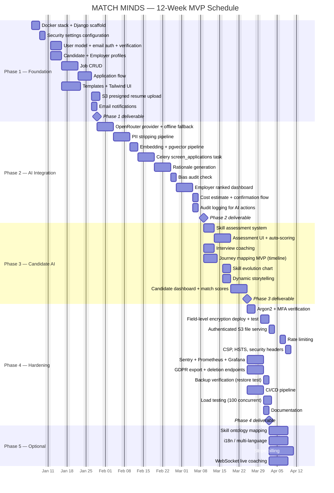
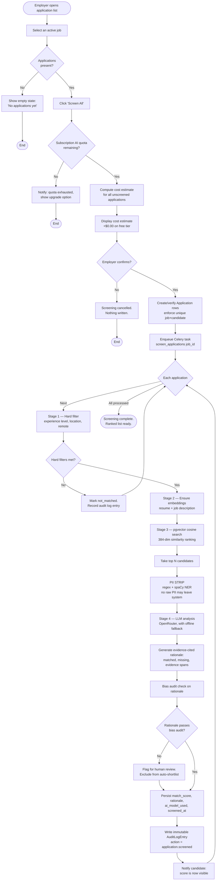

# MATCH MINDS — Feasibility & Design Analysis

**Project Title:** MATCH MINDS
**Subtitle:** AI-Powered Bias-Free Recruitment Platform
**Document Purpose:** Feasibility analysis, user stories, formal design diagrams, data dictionary and UI/UX specifications.

---

## How to read this document

This file supplements — and does not replace — the specifications below:

| Document | Role | Status |
|---|---|---|
| `MATCH_MINDS_Complete_Project_Document.md` | Product, market, AI strategy, security, roadmap | **Canonical** |
| `MATCH_MINDS_Project_Architecture_and_Requirements.md` | Architecture, 50 FRs, 50 NFRs, SQL schema, ops | **Canonical** |
| `prd.md` | Product requirements, phases, FR list, AI requirements, release criteria | **Canonical** |
| `design.md` | UI design system, 62 page specs, 23 wireframes, implementation notes | Supplement |
| `MATCH_MINDS_Feasibility_and_Design.md` (this file) | Feasibility, user stories, formal diagrams, Gantt | Supplement |

**Functional requirements live in the Arch Doc §4.1.** `prd.md` proposes them and this
document traces them to stories and pages; neither is the origin. Where a section needs
detail that already exists (compliance checklist, pricing tiers, ADRs), this document
*cites* the canonical section rather than restating it, so the documents cannot drift apart.

### Source-of-truth rule for this document

> Every requirement ID, table name, and model in this document is traceable to a
> section in the canonical specs. Nothing here is invented. Where information is
> genuinely unavailable, the section is marked **`[PLACEHOLDER]`** with the exact
> question the team must answer — rather than filled with plausible fiction.

### Reference convention

Section numbers are **ambiguous across documents by nature** — this document has a
§3.1 and so do both canonical specs. Therefore:

| Form | Means |
|---|---|
| `Arch Doc §N.M` | `MATCH_MINDS_Project_Architecture_and_Requirements.md` §N.M |
| `Complete Doc §N.M` | `MATCH_MINDS_Complete_Project_Document.md` §N.M |
| `Arch §N.M` / `Complete §N.M` | short form of the above, in tables and bullet lists |
| `PRD §N.M` | `prd.md` §N.M |
| `design.md §N.M` | `design.md` §N.M |
| Bare `§N.M` | **this document**, unless the surrounding sentence names the other file |

---

## 1. PROJECT FOUNDATION

### 1.1 Project summary

**What the software does.** MATCH MINDS is a web-based recruitment platform with two
portals. The **Candidate Portal** provides profile and resume management, AI skill
assessments, interview coaching, and AI-powered Professional Journey Mapping. The
**Employer Portal** provides job posting, AI-automated resume screening, bias-free
candidate ranking, structured interview generation, and candidate messaging.

**Who uses it.**

| User group | Primary need | Source |
|---|---|---|
| Job seekers (candidates) | Demonstrate capability beyond a rigid resume template | Complete Doc §1 |
| Small–mid employers, SMBs, startups | Access screening that enterprise tools price out of reach | Complete Doc §3.3 |
| Recruiters / HR managers | Reduce screening effort and bias risk | Complete Doc §2.1 |
| Interviewers | Structured, consistent question sets and scoring rubrics | FR-031, FR-033 |
| Platform administrators | Governance, audit, GDPR compliance | FR-037 – FR-041 |

### 1.2 Problem statement

Hiring fails at the screening stage for two structural reasons: screening decisions
inherit the unconscious bias of human reviewers, and candidates cannot represent
genuine capability through a fixed document format.

**Evidence from the background study** (Complete Doc §2.1):

- **Eightfold AI** — black-box scoring; impossible to explain a rejection to a
  candidate or an auditor. Entry cost $200K+/year, inaccessible below 5,000 employees.
- **HireVue** — dropped facial analysis in 2021 following bias backlash; candidate
  refusal to be recorded is now widespread.
- **SeekOut** — presents "AI matching" that is keyword-driven underneath; the framing
  oversells what the system does.

These are not isolated product defects. They indicate a category-wide absence of
**explainability and auditability** in automated screening, and a pricing structure
that excludes the SMB segment entirely.

> **`[PLACEHOLDER]` — Real-world example (team input required)**
>
> A concrete incident is far more persuasive than a market table, and none is
> currently recorded. **Still open** — `prd.md` §19.1 item 2 lists it as team-supplied.
> Supply one of:
> - a published discrimination lawsuit or EEOC/tribunal ruling involving an
>   automated screening tool (the 2018 Amazon CV-screening tool case is the
>   best-documented public example and directly relevant — a model trained on
>   a decade of male-dominated CVs downgraded CVs containing "women's");
> - a local/regional case from Bangladesh;
> - or an interview quote from a recruiter you spoke to (see §1.3).
>
> **Suggested placement:** paste directly under this paragraph.

### 1.3 Requirement collection method

> **`[PLACEHOLDER]` — Must be completed by the team.**
>
> The engineering specs contain **no record of how requirements were gathered.**
> Requirements should be *elicited* from users, not inferred from a competitor's
> feature list — without a stated method there is no way to tell which parts of this
> 43-requirement set came from real user need and which from assumption.
>
> **Confirmed still open.** The PRD was built without filling this in, and says so
> explicitly: `prd.md` §19.1 item 1 — *"The specs record no interviews, surveys or
> observation. State what was actually done; do not claim research that was not
> conducted."*
>
> Replace the table below with what actually happened. If a method was not used, say
> so and remove that row — **do not claim research that was not conducted.**

| Method | Used? | Respondents / N | Key findings | Resulting requirements |
|---|---|---|---|---|
| Interviews (recruiters / HR) | ? | ? | ? | ? |
| Surveys (candidates) | ? | ? | ? | ? |
| Observation (screening workflow) | ? | ? | ? | ? |
| Competitor analysis | Yes | 11 systems | See Complete Doc §2 | FR-030 (evidence-cited rationale), FR-029 |
| Stakeholder review | ? | ? | ? | ? |

**Where the requirements actually came from** (inferred from the specs, and
defensible if stated honestly):

- **FR-001 – FR-008 (auth):** security best practice + §5.1 architecture requirements
- **FR-009 – FR-024 (candidate):** competitor gaps in §2.2 (no open-source project
  offers a candidate portal) + the Journey Mapping differentiator in §3
- **FR-025 – FR-036 (employer):** competitor shortfalls in §2.1, principally the
  explainability gap (Eightfold) and the candidate-recording refusal problem (HireVue)
- **FR-037 – FR-041 (admin/GDPR):** legal requirements — GDPR Arts. 17, 20 and EU AI Act
  (REQ-COM-002, REQ-COM-003, REQ-COM-006)

### 1.4 Background study and analysis

Complete and well in excess of a minimum competitor scan. Eleven systems analysed:

| Category | Systems | Documented finding |
|---|---|---|
| Enterprise incumbents | HireVue, Eightfold, SeekOut, Paradox, LinkedIn Recruiter, Manatal, Workable, Phenom, HackerEarth | §2.1 — pricing, strengths, weaknesses per system |
| Open source | CandiSift, OpenCATS, candidacy | §2.2 — stack, AI approach, lessons learned |
| Our gap | — | §2.3 — bias audit trail, privacy-first AI, freemium pricing, journey mapping |

**Analysis of related systems (2–3 in depth):**

1. **CandiSift** (confused-ai) — the closest comparator. Best-in-class open-source
   architecture: cost-aware provider, evidence-cited breakdowns, bias-audit endpoint,
   PII stripping, cost estimate before processing. *Not adopted:* FastAPI/hexagonal
   architecture and a Claude dependency; no candidate portal; not Django.
2. **Eightfold AI** — deepest talent graph in the market. *Rejected because* black-box
   scoring directly contradicts our explainability thesis, and the $200K+/year price
   excludes our target SMB segment.
3. **candidacy** (steelburn) — proves the OpenRouter multi-model integration and
   schema-as-code approach. *Not adopted:* 12-service PHP/Laravel microservice
   architecture is disproportionate operational complexity for this team.

### 1.5 Proposed solution, objectives, scope and target users

**Proposed solution** (Complete Doc §1, §3): a full-Python-stack platform that (a) strips
PII before any AI model sees candidate data, (b) produces evidence-cited screening
rationale for every ranking decision, (c) logs a bias audit trail for each AI action,
and (d) inverts the market's pricing by offering strong candidate-side tooling free.

**Objectives** — traced to measurable success criteria (Appendix A):

| # | Objective | Measure | Source |
|---|---|---|---|
| O1 | Zero PII reaches an AI provider | 100% of AI payloads pass PII filter | REQ-SEC-002 |
| O2 | Every ranking is explainable | 100% of scores carry evidence-cited rationale | FR-030 |
| O3 | Screening bias is auditable | Every AI action has an immutable audit entry | REQ-COM-008 |
| O4 | Cost does not block adoption | $0.00 AI cost on free tier | FR-028 |
| O5 | Candidates can prove skill, not just tenure | Assessments + journey map shipped | FR-019, FR-016 |

**Scope.**

- *In scope* (Complete Doc §9, phases 1–4): both portals, job/application CRUD, AI
  screening, PII stripping, pgvector matching, rationale generation, bias audit,
  assessments, interview coaching, journey mapping, auth + MFA, GDPR endpoints,
  monitoring, CI/CD.
- *Out of scope* (Arch Doc §1.2): native mobile apps (PWA first), video hosting,
  payroll, background checks, in-app payments beyond subscription billing.
- *Deferred to phase 5:* i18n, Stripe billing, WebSockets, full skill ontology.

**Target users** — see the table in §1.1 above.

---

## 2. REQUIREMENTS & PLANNING

### 2.1 Requirement collection method

See §1.3. **`[PLACEHOLDER]`**

### 2.2 Functional requirements

**Complete.** 50 functional requirements with unique IDs, priorities, and Given/When/Then
acceptance criteria — `MATCH_MINDS_Project_Architecture_and_Requirements.md` §4.1.

| Group | ID range | Count | Priority distribution |
|---|---|---|---|
| Authentication & user management | REQ-FR-001 – FR-008 | 8 | 5 High, 3 Medium |
| Candidate portal | REQ-FR-009 – FR-024 | 16 | 9 High, 7 Medium |
| Employer portal | REQ-FR-025 – FR-036 | 12 | 6 High, 6 Medium, 1 Low |
| Administrative / GDPR | REQ-FR-037 – FR-041 | 5 | 3 High, 2 Medium |
| Job discovery & messaging | REQ-FR-042 – FR-043 | 2 | 1 High, 1 Medium |
| Employer organisation & billing | REQ-FR-045 – FR-048 | 4 | 1 High, 3 Medium |
| Certification & content management | REQ-FR-044, FR-049 – FR-050 | 3 | 2 Medium, 1 Low |

Representative example:

> **REQ-FR-030 — Evidence-Cited Rationale** (High)
> **Given** AI-generated rationale; **When** employer views candidate; **Then**
> rationale shows specific resume text for each claim; **And** missing skills listed;
> **And** bias audit status shown.

### 2.3 Non-functional requirements (measurable)

**Complete.** 50 measurable NFRs across four categories — Arch Doc §4.2.

| Category | ID range | Count | Example (measurable target) |
|---|---|---|---|
| Security | REQ-SEC-001 – 014 | 14 | Argon2id hashing; 5 failed logins → 15-min lockout (REQ-FR-003) |
| Compliance / privacy | REQ-COM-001 – 009 | 9 | GDPR Art. 17 erasure; WCAG 2.1 AA; PII never sent to AI |
| Performance & availability | REQ-NFR-001 – 018 | 18 | Screening 100 applications < 5 min; 95th-percentile API < 500 ms; uptime 99.9% |
| Code quality & documentation | REQ-NFR-019 – 023 | 5 | Coverage ≥ 80%; `mypy --strict` passes |
| Operations | REQ-NFOR-001, -002, -024, -025 | 4 | Rollback < 5 min; environment parity; structured JSON logs |

**Measurability is real, not aspirational** — every one of the 50 states a threshold
and a verification method. Examples: test coverage is enforced by
`pytest --cov-fail-under=80` (REQ-NFR-019); API latency is read from a Prometheus
histogram (REQ-NFR-006); load targets are validated with Locust (REQ-NFR-008); security
headers are checked against `securityheaders.com` (Phase 4); accessibility is validated
by axe-core/pa11y in CI (REQ-COM-007).

> **Note on ID prefixes:** the source spec uses `REQ-NFR-001…023` for performance and
> `REQ-NFOR-…` for operations, where the trailing `R` means "requirement". The
> numbering therefore interleaves (REQ-NFOR-024, -025 sit above REQ-NFR-023). The
> prefixes are cited here exactly as they appear in the source; no renumbering was
> performed.

### 2.4 User stories

Derived one-to-one from the 50 FRs in Arch Doc §4.1. Written in standard
*As a / I want / so that* form with story points and MoSCoW priority.

#### Authentication — actor: Registered User

| Story ID | User story | FR | Pts | Priority |
|---|---|---|---|---|
| US-001 | As a **new user**, I want to register with my email and a role, so that I can access the portal appropriate to me. | FR-001 | 3 | Must |
| US-002 | As a **registered user**, I want to log in, so that I can reach my dashboard. | FR-002 | 3 | Must |
| US-003 | As a **user who has forgotten my password**, I want a reset link, so that I can regain access without support. | FR-004 | 2 | Must |
| US-004 | As a **security-conscious user**, I want to enable MFA, so that a stolen password alone cannot compromise my account. | FR-005, FR-006 | 5 | Should |
| US-005 | As a **user**, I want my session to end when I log out, so that someone else cannot use my device. | FR-008 | 2 | Must |
| US-006 | As a **user**, I want my account locked after repeated failed attempts, so that my account cannot be brute-forced. | FR-003 | 3 | Must |
| US-007 | As a **user**, I want my access token refreshed automatically, so that I am not logged out mid-task. | FR-007 | 3 | Must |

#### Candidate portal — actor: Candidate

| Story ID | User story | FR | Pts | Priority |
|---|---|---|---|---|
| US-010 | As a **candidate**, I want to build a profile with my title and skills, so that employers can find me. | FR-009 | 3 | Must |
| US-011 | As a **candidate**, I want to upload a resume, so that I can apply to jobs. | FR-010 | 5 | Must |
| US-012 | As a **candidate**, I want my personal details removed from my resume before AI analysis, so that my privacy is protected. | FR-011 | 5 | Must |
| US-013 | As a **candidate**, I want my resume text extracted accurately, so that employers see my full experience. | FR-012 | 3 | Must |
| US-014 | As a **candidate**, I want my resume embedded for semantic matching, so that I am considered for relevant jobs even with different wording. | FR-013 | 3 | Must |
| US-015 | As a **candidate**, I want to add and edit my skills with a level, so that my profile stays accurate. | FR-014 | 3 | Must |
| US-016 | As a **candidate**, I want "JS" and "JavaScript" treated as one skill, so that I am not penalised for abbreviation. | FR-015 | 2 | Should |
| US-017 | As a **candidate**, I want to see my skills mapped to a visual career timeline, so that I can present my growth, not just my job titles. | FR-016 | 8 | Should |
| US-018 | As a **candidate**, I want to see when I acquired each skill, so that I can identify gaps. | FR-017 | 5 | Should |
| US-019 | As a **candidate**, I want a narrative summary tailored to a specific job, so that my application reads as relevant. | FR-018 | 5 | Could |
| US-020 | As a **candidate**, I want to take a skill assessment, so that I can prove ability that a resume cannot show. | FR-019 | 5 | Should |
| US-021 | As a **candidate**, I want my assessment auto-scored, so that I get an objective result. | FR-020 | 3 | Should |
| US-022 | As a **candidate**, I want AI feedback on my practice answer, so that I improve before the real interview. | FR-021 | 5 | Should |
| US-023 | As a **candidate**, I want to browse and search jobs, so that I can find relevant openings. | FR-042 | 3 | Must |
| US-024 | As a **candidate**, I want to apply to a job, so that I can be considered for it. | FR-022 | 3 | Must |
| US-025 | As a **candidate**, I want to track my application status, so that I know where I stand. | FR-023 | 3 | Must |
| US-026 | As a **candidate**, I want to see *why* I scored as I did, so that I learn and can improve. | FR-024 | 3 | Must |

#### Employer portal — actor: Employer / Recruiter

| Story ID | User story | FR | Pts | Priority |
|---|---|---|---|---|
| US-030 | As an **employer**, I want to post a job, so that I can start recruiting. | FR-025 | 5 | Must |
| US-031 | As an **employer**, I want to edit a draft job, so that I can correct details before publishing. | FR-026 | 2 | Must |
| US-032 | As an **employer**, I want to publish a job, so that candidates can apply. | FR-027 | 2 | Must |
| US-033 | As an **employer**, I want to know the cost before running AI screening, so that I am not surprised by a bill. | FR-028 | 5 | Must |
| US-034 | As an **employer**, I want candidates ranked by match score, so that I review the most relevant people first. | FR-029 | 5 | Must |
| US-035 | As an **employer**, I want every claim in a ranking backed by resume evidence, so that I can defend the decision and check for bias. | FR-030 | 8 | Must |
| US-036 | As an **employer**, I want an AI-generated interview question pack, so that all candidates are asked comparable questions. | FR-031 | 5 | Should |
| US-037 | As an **employer**, I want to schedule an interview, so that candidates and interviewers agree on a time. | FR-032 | 3 | Should |
| US-038 | As an **interviewer**, I want to record structured scores and a recommendation, so that decisions are comparable. | FR-033 | 3 | Should |
| US-039 | As an **employer**, I want an AI-drafted offer letter I can edit, so that I do not start from a blank page. | FR-034 | 3 | Could |
| US-040 | As an **employer**, I want a dashboard of time-to-hire and drop-off, so that I can improve my process. | FR-035 | 8 | Should |
| US-041 | As an **employer**, I want a shareable link for a job, so that I can post it on my own careers page. | FR-036 | 2 | Could |

#### Administration — actor: Administrator

| Story ID | User story | FR | Pts | Priority |
|---|---|---|---|---|
| US-050 | As a **candidate**, I want to message an employer, so that I can ask questions about a role. | FR-043 | 3 | Should |
| US-051 | As an **admin**, I want system metrics and AI usage at a glance, so that I can monitor platform health. | FR-037 | 5 | Should |
| US-052 | As an **admin**, I want to manage users and unlock accounts, so that legitimate users are not blocked. | FR-038 | 5 | Must |
| US-053 | As an **admin**, I want to search and export audit logs, so that I can investigate an incident. | FR-039 | 5 | Must |
| US-054 | As a **user**, I want to export all my personal data, so that I can exercise my right to portability. | FR-040 | 5 | Must |
| US-055 | As a **user**, I want my data deleted on request, so that I can exercise my right to erasure. | FR-041 | 8 | Must |

#### Supporting platform features — actor: Candidate / Employer / Admin

> Added with `REQ-FR-044` – `REQ-FR-050` (round 2 of the traceability audit).

| Story ID | User story | FR | Pts | Priority |
|---|---|---|---|---|
| US-056 | As a **candidate**, I want to list the certifications I have earned, so that my verified skills are visible to employers. | FR-044 | 3 | Should |
| US-057 | As a **new employer**, I want to create my company profile, so that I can post jobs. | FR-045 | 3 | Must |
| US-058 | As an **employer**, I want to see my hiring pipeline at a glance, so that I know what needs my attention today. | FR-046 | 5 | Should |
| US-059 | As an **employer admin**, I want to invite colleagues and set their roles, so that the right people can act on my behalf. | FR-047 | 5 | Should |
| US-060 | As an **employer**, I want to see my plan, usage and invoices, so that I can manage cost without contacting support. | FR-048 | 5 | Could |
| US-061 | As an **admin**, I want to create and edit assessments, so that candidates can be tested on skills. | FR-049 | 5 | Should |
| US-062 | As an **admin**, I want to send a scheduled announcement to a chosen audience, so that I can communicate service changes. | FR-050 | 3 | Could |

**Priority model:** MoSCoW — **Must** = 26 stories (core flow, MVP-blocking),
**Should** = 13, **Could** = 3. No "Won't" items; deliberate exclusions are listed in
Arch Doc §1.2 Out of Scope.

**Coverage:** all 50 functional requirements map to at least one user story.
**Total effort:** 49 stories, 199 story points.
**MoSCoW:** 27 Must · 17 Should · 5 Could.

#### 2.4.1 Traceability gaps

##### Round 1 — found and closed ✅

Two capabilities appeared in the user journeys (Complete Doc §7.1, §7.2) and had
database models and use cases, but **had no functional requirement** in Arch Doc §4.1:

| Gap | Capability | Evidence it was intended | Resolution |
|---|---|---|---|
| **GAP-1** | Candidate job search / browse | Use case UC16; §7.1 candidate journey step 5; `design.md` pages #4, #5 | Now **REQ-FR-042** in Arch Doc §4.1 |
| **GAP-2** | Candidate–employer messaging | `Message` model (Complete Doc §C.11); use case UC31; §1 "real-time candidate communication"; §7.2; `design.md` pages #31, #48 | Now **REQ-FR-043** in Arch Doc §4.1 |

**Status: closed.** Both requirements were drafted in `prd.md` §7.2–7.3 and have been
promoted into the canonical Arch Doc §4.1 as a new *Job Discovery & Messaging* group,
with Given/When/Then acceptance criteria. `US-023` and `US-050` now carry the real
requirement IDs instead of ⚠️ gap markers, and FR↔story↔test traceability is unbroken.

Two conditions were written into the requirements themselves rather than left to
implementation guesswork:

- **REQ-FR-042** states that an employer name is not disclosed until the employer
  opts in, since a public job board otherwise leaks company identity by default.
- **REQ-FR-043** states that messages are excluded from all AI processing and never
  reach an external provider, and that deleting one party soft-deletes rather than
  removes the counterparty's copy (the cascade problem noted in §3.7).

##### Round 2 — found by the page-level design audit, and now closed ✅

The first pass worked from use cases and journeys. The second pass worked from
`design.md` §10, which specifies all 62 pages and names the requirement behind each one.
That surfaced **7 further pages that built a real feature with no functional requirement
behind them** — the same class of problem as GAP-1/GAP-2, but smaller and found later:

| Page | Feature | Now |
|---|---|---|
| #19 | Certifications | **REQ-FR-044** Certification Management |
| #33 | Employer onboarding | **REQ-FR-045** Employer Company Profile |
| #34 | Employer dashboard | **REQ-FR-046** Employer Dashboard |
| #49 | Team and roles | **REQ-FR-047** Employer Team and Roles |
| #50 | Billing and plan | **REQ-FR-048** Billing and Plan Management |
| #61 | Assessment management | **REQ-FR-049** Assessment Management |
| #62 | Broadcast announcement | **REQ-FR-050** Broadcast Announcement (optional) |

**Status: closed.** All seven are now in Arch Doc §4.1 as a new *Employer Organisation,
Billing & Content* group with Given/When/Then criteria, and each has a user story
(`US-056`–`US-062`) in §2.4. FR↔story↔page traceability now holds across all 62 pages
except the two marketing pages (#1 landing, #2 pricing), which correctly need no FR.

Four conditions were written into the requirements rather than left to implementation guesswork:

- **REQ-FR-045** — a job cannot be activated until a company profile exists, which stops an
  anonymous employer from posting.
- **REQ-FR-047** — the last `employer_hr` cannot be demoted or removed, which would otherwise
  orphan the account.
- **REQ-FR-048** — subscription state updates on the Stripe **webhook**, not the browser
  redirect, so a failed webhook leaves the subscription unchanged rather than half-updated.
- **REQ-FR-050** — an empty audience match must report rather than silently succeed. The
  requirement is marked **optional**: if the team decides the page is not worth building,
  remove `REQ-FR-050`, `US-062` and page #62 together.

The Arch Doc now holds **50 functional requirements**.

One further follow-up from round 1 remains: `Complete Doc §C.12` does not yet list public
job browse/search endpoints for REQ-FR-042, nor the GDPR export/delete endpoints for
REQ-FR-040/041 — nor endpoints for the seven requirements added in round 2.

### 2.5 Product backlog and priority

**Complete.** Feature backlog per phase — Complete Doc §C.15 — plus per-phase acceptance
criteria in Arch Doc §10. The phase breakdown aligns with the backlog:

| Phase | Weeks | Story points | Theme |
|---|---|---|---|
| 1 — Foundation | 1–3 | ~41 | Auth, profiles, jobs, job search (FR-042), applications, employer onboarding (no AI) |
| 2 — AI Integration | 4–6 | ~41 | PII stripping, screening, rationale, bias audit |
| 3 — Candidate AI | 7–9 | ~45 | Assessments, coaching, journey mapping, messaging (FR-043), certifications |
| 4 — Hardening | 10–12 | ~39 | Security, GDPR, monitoring, CI/CD, announcements |
| 5 — Advanced | 13+ | ~33 | i18n, billing (FR-048), WebSockets, skill ontology |

**Total: ~199 story points**, matching the 49 stories in §2.4.

*(Point figures are a planning estimate for the Gantt in §2.7, not an independent
measurement — re-estimate at sprint planning. The authoritative task lists are
Complete Doc §9. The earlier split of 21/34/31/30/25 summed to 141 and did not
reconcile with the 170-point total; the figures above now do.)*

### 2.6 Feasibility study

#### 2.6.1 Technical feasibility

**Verdict: Feasible.** Every required technology is mature, documented and freely
available at the scale planned.

| Capability | Technology | Evidence it is achievable | Canonical source |
|---|---|---|---|
| Web framework | Django 5 + DRF | Mature LTS-style framework, largest Python ecosystem | §4.1, §4.2 |
| Database | PostgreSQL 17 + pgvector | `CREATE EXTENSION vector`; cosine-distance ranking in SQL | §6.5 |
| Background jobs | Celery + Redis | Industry standard; retry pattern given in code | §C.1 |
| AI/LLM | OpenRouter (free tier first) | Free models mapped per task; template fallback | §6.1, §6.2 |
| Semantic matching | sentence-transformers 384-dim | Embedding pipeline shown; zero marginal API cost | §6.5 |
| PII stripping | regex + spaCy NER | Two-layer approach; standard tooling | §9 Phase 2 |
| Document parsing | pdfplumber | Established library | FR-012 |
| Auth | Argon2id, TOTP MFA, JWT | Standard algorithms, no novel research | §5.1 |
| Infra | Docker, Nginx, GitHub Actions | All Phase-1 standard practice | §4.2 |

**No novel or unproven technology is required.** The riskiest components are
AI-quality risks (rationale accuracy, bias detection sensitivity), and both are
mitigated with an offline fallback provider (§6.4) and a bias audit check (Phase 2).

**Skills available:** the team comprises two frontend engineers, one
backend/AI engineer, and one UI/UX designer (Complete Doc §10.4) — a credible
allocation for a Django-stack project, with the noted gap of a dedicated DevOps
role currently absorbed by the backend engineer.

#### 2.6.2 Economic feasibility

**Verdict: Feasible.** Low capital cost, deliberately low operating cost, and a
revenue model whose cheapest tier is genuinely free to enter.

**Development cost — open-source stack only.**

| Item | Cost | Note |
|---|---|---|
| Language, framework, libraries | $0 | All open source |
| Database, Redis, Celery | $0 | Self-hosted via Docker |
| AI inference (development) | $0 | Free OpenRouter tier + offline fallback |
| Hosting (development) | $0 | Local Docker Compose |
| Hosting (MVP, single VPS) | ~$20–50/mo | Phase 4 target |
| Domain + TLS (Let's Encrypt) | ~$15/yr | |
| **Total to MVP** | **< $600/yr** | Excluding developer labour |

This is the key economic argument: for a student team, the barrier to entry is
**near zero**, which is precisely why the incumbents at $200K+/year (§2.1) cannot
compete on this segment.

**Revenue model** (Complete Doc §C.14 — full tier table):

| Tier | Price | Target |
|---|---|---|
| Candidate — Free | $0/mo | Individual job seekers |
| Candidate — Essential | $5/mo | Active frequent applicants |
| Candidate — Pro | $50/mo | Career-changers, senior roles |
| Employer — Free | $0/mo | Trial: 3 jobs, 50 AI screens/mo |
| Employer — Starter | $100/mo | Small business |
| Employer — Growth | $500/mo | Mid-market |
| Employer — Enterprise | $5000/mo | Large org |

**Cost-control design.** Free-tier operation is viable because embeddings are
generated locally with sentence-transformers rather than through a paid API (§6.5),
and every LLM task has a template/offline fallback that costs nothing (§6.2). AI
screening shows a cost estimate *before* execution and requires confirmation
(FR-028), so spend is never unbounded.

**Break-even note.** Fixed cost is under $600/year, so break-even requires only a
handful of paying employer accounts. The freemium design is economically viable
precisely because the marginal cost of an additional free user is close to zero.

#### 2.6.3 Operational feasibility

**Verdict: Feasible for MVP and team scale; documented limits beyond it.**

| Requirement | Provision | Canonical source |
|---|---|---|
| Deployment | Docker Compose → single VPS; Docker Swarm/K8s if scaling | §9 Phase 4, Arch §6.2 |
| Monitoring | Sentry + Prometheus + Grafana, with alert thresholds defined | §C.3, Arch §8.1 |
| Incident response | Documented procedures, escalation paths, post-mortem template | Arch §8.6, §8.7 |
| Maintenance | Scheduled patch windows | Arch §8.5 |
| Configuration drift | Promotion process between environments | Arch §8.8 |
| Versioning/releases | Documented release strategy | Arch §8.9 |
| Backup/restore | Automated backup with restore verification | §C.4 |
| Secrets | Docker secrets / cloud secret manager; no `.env` on servers | §5.6 |

**Constraint to declare honestly:** a 5-person student team operating a production
service is a genuine operational risk. The mitigation is deliberate scope control —
MVP targets a single VPS, not multi-region, and operational procedures are written
to be followable by one person.

**DevOps gap.** Complete Doc §10.4 records a missing DevOps role, currently absorbed
by the backend engineer. This is the single largest operational risk and should be
presented as a known limitation with a mitigation, not glossed over.

#### 2.6.4 Schedule feasibility

**Verdict: Feasible for MVP, with a realistic 12-week horizon and explicit
stretch beyond it.**

| Phase | Weeks | Deliverable | Source |
|---|---|---|---|
| 1 — Foundation | 1–3 | Employer posts job, candidate applies with resume, employer sees it | §9 |
| 2 — AI Integration | 4–6 | "Screen All" → cost estimate → ranked candidates with rationale | §9 |
| 3 — Candidate AI | 7–9 | Timeline, assessment, coaching, match scores | §9 |
| 4 — Hardening | 10–12 | Security audit passed, production deploy | §9 |
| 5 — Advanced | 13+ | i18n, billing, mobile, WebSockets | §9 |

**Assessment.** Phases 1–4 (12 weeks) form a coherent MVP with each phase ending in
a demonstrable increment. Phase 5 is correctly identified as optional. The phased
structure de-risks the schedule: if Phase 5 never happens, Phases 1–4 still deliver
the core value proposition (bias-free, explainable screening).

**Risk:** Phase 3 is the most feature-dense (3 distinct AI features) for a
3-week window. Mitigation: §9 defines the journey-mapping MVP as the must-have, with
skill evolution and dynamic storytelling as separable increments.

**Gantt chart:** see §2.7.

#### 2.6.5 Legal feasibility

**Verdict: Feasible, with obligations to be met rather than avoided.**

**Data protection — GDPR** (Complete Doc §5.2, §5.7):

| Obligation | Implementation | FR/NFR |
|---|---|---|
| Lawful basis + consent | Explicit consent capture at signup | REQ-COM-004 |
| Data minimisation | Only necessary fields collected | REQ-COM-001 |
| Right of access (Art. 15) | Data export endpoint, JSON, 7-day link | FR-040 |
| Right to erasure (Art. 17) | Deletion request → hard delete + audit entry | FR-041 |
| Right to portability (Art. 20) | `DataExportRequest` model | FR-040 |
| Retention limits | Retention schedule enforced | REQ-COM-005 |
| Breach notification | Incident response procedure | Arch §8.6 |

**AI-specific regulation — EU AI Act** (REQ-COM-006): employment AI is classified
**high-risk**, which obligates risk management, data governance, technical
documentation, logging, transparency, and human oversight. MATCH MINDS addresses
these directly:

- *Logging* → immutable `AuditLogEntry` (REQ-COM-008)
- *Transparency* → evidence-cited rationale shown to the employer (FR-030)
- *Human oversight* → the AI ranks, a human decides; a bias audit status is surfaced
- *Data governance* → PII stripped before any model sees the data (REQ-SEC-002)

**Bias and discrimination law.** Automated screening in hiring is a regulated
activity in many jurisdictions. A bias audit trail (§2.2) plus human-in-the-loop
decision-making is the defensible position, and it is a genuine differentiator
rather than a compliance chore.

**Third-party terms of service.** LLM providers' terms generally prohibit sending
personal data. PII stripping before the API call (§5.4) is therefore a **legal
requirement, not only a privacy feature** — without it the integration may breach
OpenRouter's terms. Credential IDs, company names and locations are stored
encrypted (`EncryptedCharField`) rather than in plaintext.

**Residual legal risk to declare:** employment AI regulation is still evolving, and
cross-border data transfer rules (data processed by an overseas LLM provider)
require a transfer mechanism such as Standard Contractual Clauses. Neither is fully
resolved in §5.7 and both should be acknowledged as open items.

### 2.7 Development methodology, Gantt chart, roles and risk analysis

#### 2.7.1 Methodology

**Agile, specifically Scrum with 1-week sprints**, chosen because:

- requirements for an AI product cannot be fully specified up front — the quality of
  rationales and bias detection can only be tuned by building and evaluating;
- the phased roadmap (§2.6.4) maps directly to sprint goals, giving visible progress;
- the 5-person team suits a lightweight ceremony structure.

**Practices:** sprint planning, daily standup, sprint review with sponsor/stakeholder,
retrospective. Definition of Done = code merged + tests passing + 80% coverage floor
+ security review + documentation updated. **Environments:** local, CI, staging,
production, with a documented promotion process (Arch §8.8).

**Mapping to the roadmap:** each roadmap phase (§9) ≈ three 1-week sprints; each
sprint targets a user-story subset from §2.4.

> **Note on the incident procedures** (Arch §8.6, §C.16) — they reference a "sprint
> backlog" and triage process, which is consistent with this methodology. This
> document is the formal statement of it.

#### 2.7.2 Gantt chart



**Phase dependency chain:** Phase 1 → 2 → 3 → 4 is strictly sequential, because each
phase's deliverable is the next phase's input. Within a phase, frontend and backend
tasks run in parallel. Phase 5 tasks are mutually independent and can start in any
order, or not at all.

#### 2.7.3 Team roles

Complete Doc §10.4:

| Person | Role | Responsibilities | Assigned stories |
|---|---|---|---|
| Sardar Shihab | Full-Stack Engineer | Django templates/HTMX, TailwindCSS, journey mapping charts; backend endpoints as needed | US-013, US-014, US-030–032 |
| Arnob Biswas Antu | Frontend Engineer | Employer dashboard, application review, scheduling UI, real-time status | US-033–035, US-040 |
| Ishrak Hossain | Backend & AI Engineer | Django, DRF, Celery, OpenRouter, PII stripping, pgvector, security | US-011, US-012, US-020, US-033, US-051–054, US-057, US-059, US-061, US-062 |
| Mohammad Abdul Ahad | UI/UX Designer | Design system ownership — tokens, component library, accessibility (WCAG 2.1 AA) | US-040, all design tokens and UI specs |
| Fahad Haque | UI/UX Designer | Candidate journey wireframes, employer dashboard UX, journey mapping interaction design | US-013, all wireframes |

**Declared gap:** no dedicated DevOps/Infrastructure role — currently absorbed by the
backend engineer. §2.6.3 identifies this as the largest operational risk.

#### 2.7.4 Risk analysis

Risk register maintained at Arch Doc §9; top risks below with likelihood × impact.

| # | Risk | L | I | Mitigation | Source |
|---|---|---|---|---|---|
| R1 | AI screening quality below expectation | M | H | Offline fallback provider; template-based Q generation; evaluate before shipping | §6.4 |
| R2 | Bias detection insufficient | M | H | Bias audit status surfaced on every rationale; human-in-the-loop decisions | §2.2 |
| R3 | DevOps capacity (no dedicated role) | H | M | Docker-first simplicity; single-VPS target; documented runbooks | §2.6.3 |
| R4 | Phase 3 scope too dense for 3 weeks | H | M | Journey-mapping MVP isolated as must-have; other two separable | §2.6.4 |
| R5 | OpenRouter free-tier exhaustion | M | M | Template fallback ensures $0-cost operation; rate-limit handling | §C.9 |
| R6 | GDPR/AI Act compliance gap | L | H | DataExportRequest / DataDeletionRequest models; consent capture; audit trail | §5.7 |
| R7 | PII leakage to third-party AI | L | **H** | Two-layer stripping (regex + spaCy NER) before any API call; audited | §5.4 |
| R8 | Scope creep into phase 5 early | M | M | Phase 5 explicitly out of MVP; MoSCoW "Could" items deferred | §2.5 |

**R7 is the highest-severity item** because the consequence is irreversible: once PII
reaches a third-party model provider, it cannot be recalled. It is therefore treated
as a release blocker rather than a backlog item.

---

## 3. SYSTEM ANALYSIS & DESIGN

### 3.1 System architecture

**Complete.** Arch Doc §3.2 (high-level diagram), Arch Doc §3.3 (component data flow),
Arch Doc §3.4 (technology stack matrix); Complete Doc §4.1 (stack rationale),
Complete Doc §4.2 (Django app structure).

**Architecture in brief.** A Django monolith with a DRF API, Django Templates + HTMX
for the frontend, Celery for asynchronous work, and PostgreSQL + pgvector as the
system of record. The monolith choice is deliberate and documented as an ADR
(Arch Doc §3.1): a single deployable unit is operationally appropriate for a 5-person
team, and DRF keeps a clean seam if services must be extracted later.

**Layers:**

| Layer | Components | Responsibility |
|---|---|---|
| Presentation | Django Templates, HTMX, Chart.js | Candidate + employer portals |
| API | Django REST Framework, token auth | Endpoint layer, documented in §C.12 |
| Domain | `accounts`, `candidates`, `employers`, `matching`, `interviews`, `ai` | Business logic |
| Async | Celery workers, Redis broker | Screening, embedding, PII stripping |
| Data | PostgreSQL 17, pgvector, Redis | Persistence, semantic search, caching |
| AI | OpenRouter provider + offline fallback | Screening, rationale, coaching, Q generation |
| Infra | Docker, Nginx, GitHub Actions, Sentry | Delivery and observability |

### 3.2 Complete user workflow

**Complete.** Candidate journey — Complete Doc §7.1. Employer journey — §7.2.

**Candidate:** register → verify email → create profile → upload resume → PII stripped
and text extracted → embedding generated → browse/search jobs → apply → match score
computed and rationale returned → track status → take assessment → request interview
coaching → receive offer.

**Employer:** register → create company profile → post job → AI suggests screening
questions → activate job → receive applications → review cost estimate → confirm
"Screen All" → Celery batch runs (hard filter → pgvector rank → LLM analyse top N) →
review ranked list with evidence-cited rationale → shortlist → generate interview pack
→ schedule interview → collect feedback → extend offer.

### 3.3 Use case diagram

Actors from Complete Doc §5.1 (Django Groups: `admin`, `employer_hr`,
`employer_manager`, `interviewer`, `candidate`, `guest`); use cases from Arch Doc §4.1.

```mermaid
flowchart LR
    %% ---------- ACTORS ----------
    subgraph ACTORS[" "]
        GUEST["👤 Guest"]
        CAND["👤 Candidate"]
        EMP["👤 Employer / HR"]
        MGR["👤 Hiring Manager"]
        INT["👤 Interviewer"]
        ADM["👤 Administrator"]
    end

    %% ---------- SYSTEM BOUNDARY ----------
    subgraph MMS["MATCH MINDS SYSTEM"]
        direction LR
        subgraph UC_AUTH["Authentication"]
            UC1([Register])
            UC2([Log in / Log out])
            UC3([Reset password])
            UC4([Enable MFA])
        end

        subgraph UC_CAND["Candidate Portal"]
            UC10([Manage profile])
            UC11([Upload resume])
            UC12([Manage skills])
            UC13([View journey timeline])
            UC14([Take skill assessment])
            UC15([Get interview coaching])
            UC16([Browse / search jobs])
            UC17([Apply to job])
            UC18([Track application status])
            UC19([View match score + rationale])
        end

        subgraph UC_EMP["Employer Portal"]
            UC20([Post / edit job])
            UC21([Activate job])
            UC22([Run AI screening])
            UC23([Review ranked candidates])
            UC24([View evidence-cited rationale])
            UC25([Shortlist candidate])
            UC26([Generate interview pack])
            UC27([Schedule interview])
            UC28([View analytics dashboard])
            UC29([Generate offer letter])
        end

        subgraph UC_INT["Interview Process"]
            UC30([Submit interview feedback])
            UC31([Message candidate])
        end

        subgraph UC_ADM["Administration & Compliance"]
            UC40([View admin dashboard])
            UC41([Manage users])
            UC42([Search / export audit logs])
            UC43([Export personal data — GDPR Art. 20])
            UC44([Approve data deletion — GDPR Art. 17])
        end
    end

    %% ---------- ASSOCIATIONS ----------
    GUEST -.-> UC1
    GUEST -.-> UC2
    GUEST -.-> UC3
    GUEST -.-> UC16

    CAND --> UC2
    CAND --> UC10
    CAND --> UC11
    CAND --> UC12
    CAND --> UC13
    CAND --> UC14
    CAND --> UC15
    CAND --> UC17
    CAND --> UC18
    CAND --> UC19
    CAND --> UC31
    CAND --> UC43

    EMP --> UC2
    EMP --> UC4
    EMP --> UC20
    EMP --> UC21
    EMP --> UC22
    EMP --> UC23
    EMP --> UC24
    EMP --> UC25
    EMP --> UC28
    EMP --> UC29
    EMP --> UC31
    EMP --> UC41

    MGR --> UC25
    MGR --> UC28
    MGR --> UC43

    INT --> UC30
    INT --> UC31

    ADM --> UC40
    ADM --> UC41
    ADM --> UC42
    ADM --> UC44

    %% ---------- KEY INCLUDE / EXTEND ----------
    UC17 -.->|"includes"| UC19
    UC11 -.->|"includes"| UC12
    UC22 -.->|"extends"| UC23
    UC25 -.->|"extends"| UC26
    UC27 -.->|"includes"| UC26
    UC27 -.->|"includes"| UC30

    classDef actor fill:#e8eef7,stroke:#3b5f8a,stroke-width:1px,color:#16243a
    classDef usecase fill:#ffffff,stroke:#7a8a9a,stroke-width:1px,color:#16243a
    classDef boundary fill:#fafbfc,stroke:#9aa7b4,stroke-dasharray:4 3,color:#16243a

    class GUEST,CAND,EMP,MGR,INT,ADM actor
    class UC1,UC2,UC3,UC4,UC10,UC11,UC12,UC13,UC14,UC15,UC16,UC17,UC18,UC19 usecase
    class UC20,UC21,UC22,UC23,UC24,UC25,UC26,UC27,UC28,UC29,UC30,UC31 usecase
    class UC40,UC41,UC42,UC43,UC44 usecase
    class MMS,UC_AUTH,UC_CAND,UC_EMP,UC_INT,UC_ADM boundary
```



**System boundary:** everything inside the dashed box is MATCH MINDS. External systems
(S3, OpenRouter, Piston, email provider, Stripe) are *outside* the boundary and appear
as integration points in Arch Doc §5.1 and §C.12 rather than as actors, because they
have no goals of their own in this context.

### 3.4 Activity diagram — AI screening (major process)

The most consequential process in the system, and the one that carries the project's
core value claim. Same flow as the sequence diagram in Arch Doc §5.3, shown here as
control flow with decision points made explicit.



**Cost-control property:** the pipeline uses pgvector for the first-pass ranking
(§6.5) so the LLM is called only for the top N candidates, not all applicants. This is
what keeps screening at $0.00 on the free tier (FR-028).

### 3.5 Sequence diagram

**Complete** — Arch Doc §5.3, AI screening flow. Not duplicated here. The activity
diagram in §3.4 covers the same process from the control-flow perspective; §5.3 covers
it from the message-passing perspective, including participant lifetimes and
failure handling.

### 3.6 Class diagram

Derived from the model definitions in Complete Doc §8.2 (core models) and §C.11
(complete models). Encrypted attributes are marked; relationships reflect declared
`ForeignKey` / `OneToOneField` targets and `on_delete` behaviour.

```mermaid
classDiagram
    direction LR

    class User {
        +UUID id
        +str email
        +str password_hash
        +str first_name 🔒
        +str last_name 🔒
        +str auth_provider
        +bool email_verified
        +bool mfa_enabled
        +bytes mfa_secret 🔒
        +datetime locked_until
        +int failed_login_attempts
        +datetime created_at
        +login() bool
        +lock(duration) void
    }

    class CandidateProfile {
        +UUID id
        +UUID user_id
        +str title
        +str bio
        +str location 🔒
        +bool remote_ok
        +list skills
        +list journey_timeline
        +dict match_scores
        +Vector resume_embedding
        +get_skills() list
        +add_skill(skill, level) void
    }

    class EmployerProfile {
        +UUID id
        +UUID user_id
        +str company_name 🔒
        +str industry
        +int company_size
        +str billing_plan
        +str billing_cycle
        +str stripe_customer_id 🔒
    }

    class Subscription {
        +UUID id
        +UUID employer_id
        +str plan
        +str stripe_customer_id 🔒
        +str stripe_subscription_id 🔒
        +datetime current_period_end
        +int ai_quota_remaining
        +datetime ai_quota_reset_date
        +int max_jobs
        +int jobs_used
        +has_quota() bool
        +consume_quota() void
    }

    class Job {
        +UUID id
        +UUID employer_id
        +str title
        +str description
        +str requirements
        +str location
        +bool remote_allowed
        +str experience_level
        +str status
        +Vector description_embedding
        +list screening_questions
        +str ai_model_used
        +activate() void
        +is_open() bool
    }

    class Application {
        +UUID id
        +UUID job_id
        +UUID candidate_id
        +str status
        +int match_score
        +str match_rationale
        +str ai_model_used
        +datetime screened_at
        +datetime shortlisted_at
        +shortlist() void
    }

    class CandidateResume {
        +UUID id
        +UUID candidate_id
        +str file_key
        +str original_filename 🔒
        +int file_size
        +str mime_type
        +str extracted_text
        +str raw_text_hash
    }

    class Skill {
        +UUID id
        +str canonical_name
        +list aliases
        +str category
        +str description
    }

    class CandidateSkill {
        +UUID id
        +UUID candidate_id
        +UUID skill_id
        +str level
        +Decimal years_experience
        +str source
        +bool verified
    }

    class Certification {
        +UUID id
        +UUID candidate_id
        +str name
        +str issuing_organization
        +date issue_date
        +date expiry_date
        +str credential_id 🔒
        +bool verified
    }

    class Assessment {
        +UUID id
        +str title
        +UUID skill_id
        +str difficulty
        +int question_count
        +int time_limit_minutes
        +bool is_active
    }

    class AssessmentQuestion {
        +UUID id
        +UUID assessment_id
        +str question_type
        +str question_text
        +list options
        +str correct_answer
        +str code_language
        +int max_score
    }

    class AssessmentAttempt {
        +UUID id
        +UUID candidate_id
        +UUID assessment_id
        +datetime started_at
        +datetime completed_at
        +Decimal score
        +str status
        +list answers
    }

    class InterviewPack {
        +UUID id
        +UUID job_id
        +str title
        +list questions
        +list scoring_rubric
        +str ai_model_used
        +bool is_active
    }

    class Interview {
        +UUID id
        +UUID application_id
        +UUID interview_pack_id
        +datetime scheduled_at
        +int duration_minutes
        +str status
        +str video_call_url
        +str notes
    }

    class InterviewFeedback {
        +UUID id
        +UUID interview_id
        +UUID interviewer_id
        +dict scores
        +str comments
        +str overall_recommendation
        +datetime submitted_at
    }

    class Message {
        +UUID id
        +UUID application_id
        +UUID sender_id
        +UUID recipient_id
        +str content
        +bool read
        +datetime created_at
    }

    class Notification {
        +UUID id
        +UUID recipient_id
        +str title
        +str message
        +str notification_type
        +bool read
        +str url
    }

    class AuditLogEntry {
        +UUID id
        +UUID actor_id
        +str action
        +str resource_type
        +UUID resource_id
        +dict details
        +str ip_address
        +str user_agent
        +str result
        +datetime created_at
    }

    class DataExportRequest {
        +UUID id
        +UUID user_id
        +str status
        +str file_url
        +datetime requested_at
        +datetime completed_at
        +datetime expires_at
    }

    class DataDeletionRequest {
        +UUID id
        +UUID user_id
        +str reason
        +datetime requested_at
        +datetime processed_at
        +str status
    }

    %% ---------- RELATIONSHIPS ----------
    User "1" --> "0..1" CandidateProfile : has candidate profile
    User "1" --> "0..1" EmployerProfile : has employer profile

    CandidateProfile "1" *-- "0..N" CandidateResume : uploads
    CandidateProfile "1" *-- "0..N" CandidateSkill : declares
    CandidateProfile "1" *-- "0..N" Certification : holds
    CandidateProfile "1" *-- "0..N" AssessmentAttempt : attempts
    CandidateProfile "1" *-- "0..N" Application : submits

    Skill "1" <-- "0..N" CandidateSkill : canonicalises
    Skill "1" <-- "0..N" Assessment : assesses

    Assessment "1" *-- "0..N" AssessmentQuestion : contains
    Assessment "1" <-- "0..N" AssessmentAttempt : attempted in

    EmployerProfile "1" *-- "0..1" Subscription : subscribes via
    EmployerProfile "1" *-- "0..N" Job : posts

    Job "1" *-- "0..N" Application : receives
    Job "1" *-- "0..N" InterviewPack : has

    Application "1" *-- "0..N" Interview : schedules
    Application "1" *-- "0..N" Message : exchanges

    InterviewPack "0..1" --> "0..N" Interview : guides

    Interview "1" *-- "0..N" InterviewFeedback : evaluated by
    User "1" <-- "0..N" InterviewFeedback : authors

    User "1" <-- "0..N" Message : sends
    User "1" <-- "0..N" Notification : receives
    User "1" <-- "0..N" AuditLogEntry : acts
    User "1" <-- "0..N" DataExportRequest : requests
    User "1" <-- "0..1" DataDeletionRequest : requests
```



**Legend:** `🔒` = field-level AES-256-GCM encryption (`EncryptedCharField`).
`-->` inheritance/ownership; `<--` "referenced by"; `*--` composition.

**Two integrity rules visible in the diagram and enforced in code** (Complete Doc §8.2):

- `CandidateProfile.user` and `EmployerProfile.user` are `OneToOneField` — a user
  cannot hold both roles.
- `Application` has `unique_together = [("job", "candidate")]` — a candidate cannot
  apply twice to the same job.

### 3.7 ER diagram

Derived from the SQL schema in Arch Doc §5.1 (21 tables) and the Django models in
Complete Doc §8.2 / §C.11.

```mermaid
erDiagram
    USERS ||--o| CANDIDATE_PROFILES : "has"
    USERS ||--o| EMPLOYER_PROFILES : "has"
    USERS ||--o{ NOTIFICATIONS : "receives"
    USERS ||--o{ MESSAGES : "sends / receives"
    USERS ||--o{ AUDIT_LOG_ENTRIES : "acts"
    USERS ||--o{ DATA_EXPORT_REQUESTS : "requests"
    USERS ||--o| DATA_DELETION_REQUESTS : "requests"
    USERS ||--o{ INTERVIEW_FEEDBACK : "authors"

    CANDIDATE_PROFILES ||--o{ CANDIDATE_RESUMES : "uploads"
    CANDIDATE_PROFILES ||--o{ CANDIDATE_SKILLS : "declares"
    CANDIDATE_PROFILES ||--o{ CERTIFICATIONS : "holds"
    CANDIDATE_PROFILES ||--o{ ASSESSMENT_ATTEMPTS : "attempts"
    CANDIDATE_PROFILES ||--o{ APPLICATIONS : "submits"

    SKILLS ||--o{ CANDIDATE_SKILLS : "canonicalises"
    SKILLS ||--o{ ASSESSMENTS : "assesses"

    ASSESSMENTS ||--o{ ASSESSMENT_QUESTIONS : "contains"
    ASSESSMENTS ||--o{ ASSESSMENT_ATTEMPTS : "attempted in"

    EMPLOYER_PROFILES ||--o| SUBSCRIPTIONS : "subscribes via"
    EMPLOYER_PROFILES ||--o{ JOBS : "posts"

    JOBS ||--o{ APPLICATIONS : "receives"
    JOBS ||--o{ INTERVIEW_PACKS : "has"

    APPLICATIONS ||--o{ INTERVIEWS : "schedules"
    APPLICATIONS ||--o{ MESSAGES : "exchanges"

    INTERVIEW_PACKS ||--o{ INTERVIEWS : "guides"
    INTERVIEWS ||--o{ INTERVIEW_FEEDBACK : "evaluated by"

    USERS {
        uuid id PK
        varchar email UK
        varchar password_hash "Argon2id"
        varchar first_name "ENCRYPTED"
        varchar last_name "ENCRYPTED"
        varchar auth_provider
        boolean email_verified
        boolean mfa_enabled
        bytea mfa_secret "encrypted TOTP"
        timestamptz locked_until
        integer failed_login_attempts
        timestamptz last_login
        boolean is_active
        timestamptz created_at
    }

    CANDIDATE_PROFILES {
        uuid id PK
        uuid user_id FK
        varchar title
        text bio
        text location "ENCRYPTED"
        boolean remote_ok
        jsonb skills
        jsonb journey_timeline
        jsonb match_scores
        vector resume_embedding "pgvector 384"
        timestamptz created_at
    }

    CANDIDATE_RESUMES {
        uuid id PK
        uuid candidate_id FK
        varchar file_key "S3 key"
        text original_filename "ENCRYPTED"
        integer file_size
        varchar mime_type
        text extracted_text "PII-stripped"
        varchar raw_text_hash "dedup"
        timestamptz created_at
    }

    EMPLOYER_PROFILES {
        uuid id PK
        uuid user_id FK
        text company_name "ENCRYPTED"
        varchar industry
        integer company_size
        varchar billing_plan
        varchar billing_cycle
        text stripe_customer_id "ENCRYPTED"
    }

    SUBSCRIPTIONS {
        uuid id PK
        uuid employer_id FK
        varchar plan
        text stripe_customer_id "ENCRYPTED"
        text stripe_subscription_id "ENCRYPTED"
        timestamptz current_period_end
        integer ai_quota_remaining
        timestamptz ai_quota_reset_date
        integer max_jobs
        integer jobs_used
    }

    JOBS {
        uuid id PK
        uuid employer_id FK
        varchar title
        text description
        text requirements
        varchar location
        boolean remote_allowed
        varchar experience_level
        varchar status "draft-active-paused-closed"
        vector description_embedding "pgvector 384"
        jsonb screening_questions
        varchar ai_model_used
        decimal cost_estimate
        timestamptz created_at
    }

    APPLICATIONS {
        uuid id PK
        uuid job_id FK
        uuid candidate_id FK
        varchar status "applied-screened-shortlisted-interview-offered-hired-rejected"
        integer match_score "0-100 from AI"
        text match_rationale "evidence-cited"
        varchar ai_model_used
        timestamptz screened_at
        timestamptz shortlisted_at
        timestamptz created_at
    }

    SKILLS {
        uuid id PK
        varchar canonical_name UK
        jsonb aliases
        varchar category
        text description
        timestamptz created_at
    }

    CANDIDATE_SKILLS {
        uuid id PK
        uuid candidate_id FK
        uuid skill_id FK
        varchar level
        decimal years_experience
        varchar source "resume_parse-self_reported-assessment-journey_map"
        boolean verified
        timestamptz created_at
    }

    CERTIFICATIONS {
        uuid id PK
        uuid candidate_id FK
        varchar name
        varchar issuing_organization
        date issue_date
        date expiry_date
        varchar credential_id "ENCRYPTED"
        boolean verified
    }

    ASSESSMENTS {
        uuid id PK
        varchar title
        uuid skill_id FK
        varchar difficulty
        integer question_count
        integer time_limit_minutes
        boolean is_active
    }

    ASSESSMENT_QUESTIONS {
        uuid id PK
        uuid assessment_id FK
        varchar question_type
        text question_text
        jsonb options
        text correct_answer
        varchar code_language
        integer max_score
    }

    ASSESSMENT_ATTEMPTS {
        uuid id PK
        uuid candidate_id FK
        uuid assessment_id FK
        timestamptz started_at
        timestamptz completed_at
        decimal score
        varchar status
        jsonb answers
    }

    INTERVIEW_PACKS {
        uuid id PK
        uuid job_id FK
        varchar title
        jsonb questions
        jsonb scoring_rubric
        varchar ai_model_used
        boolean is_active
    }

    INTERVIEWS {
        uuid id PK
        uuid application_id FK
        uuid interview_pack_id FK
        timestamptz scheduled_at
        integer duration_minutes
        varchar status
        varchar video_call_url
        text notes
    }

    INTERVIEW_FEEDBACK {
        uuid id PK
        uuid interview_id FK
        uuid interviewer_id FK
        jsonb scores
        text comments
        varchar overall_recommendation
        timestamptz submitted_at
    }

    MESSAGES {
        uuid id PK
        uuid application_id FK
        uuid sender_id FK
        uuid recipient_id FK
        text content
        boolean read
        timestamptz created_at
    }

    NOTIFICATIONS {
        uuid id PK
        uuid recipient_id FK
        varchar title
        text message
        varchar notification_type
        boolean read
        varchar url
        timestamptz created_at
    }

    AUDIT_LOG_ENTRIES {
        uuid id PK
        uuid actor_id FK "nullable, SET NULL"
        varchar action
        varchar resource_type
        uuid resource_id "matches Arch Doc §5.1"
        jsonb details "no raw PII"
        varchar ip_address
        varchar user_agent
        varchar result "success-failure"
        timestamptz created_at "indexed"
    }

    DATA_EXPORT_REQUESTS {
        uuid id PK
        uuid user_id FK
        varchar status
        varchar file_url
        timestamptz requested_at
        timestamptz completed_at
        timestamptz expires_at
    }

    DATA_DELETION_REQUESTS {
        uuid id PK
        uuid user_id FK "unique"
        text reason
        timestamptz requested_at
        timestamptz processed_at
        varchar status
    }
```



**Cardinality reading:** `||` = exactly one, `o|` = zero or one, `o{` = zero or many.
All 21 tables and 25 relationships shown. The canonical SQL (Arch Doc §5.1) declares
**27** foreign keys; the two not drawn are redundant self-references on `users` that
would clutter the diagram without adding information — `USERS → CANDIDATE_PROFILES`
and `USERS → EMPLOYER_PROFILES` are both already shown. PK/FK detail is carried in the
attribute blocks.

Note the three special cases:

- `AUDIT_LOG_ENTRIES.actor_id` is nullable with `ON DELETE SET NULL` — audit records
  must survive deletion of the actor.
- `DATA_DELETION_REQUESTS.user_id` is unique — at most one active erasure request.
- `APPLICATIONS` carries a composite `UNIQUE(job_id, candidate_id)` constraint, not
  expressible in Mermaid's ER notation; it is documented here and in the class diagram.

**On `ON DELETE CASCADE` breadth.** Most foreign keys cascade, which means deleting a
user deletes their profile, resumes, applications, interviews and messages. That is
intentional (GDPR erasure, FR-041) but has one consequence worth stating: a cascade
from `USERS` reaches `APPLICATIONS`, and therefore `INTERVIEWS` and `MESSAGES`,
belonging to **other** users. Erasing one party to a conversation deletes it for both.
For a messaging feature this is a design decision, not an oversight, and if message
history must survive one party's erasure the two conversation FKs need `SET NULL` plus
a soft-delete flag on `MESSAGES`.

### 3.8 Data dictionary

Field-level definitions for the core entities. Full SQL DDL: Arch Doc §5.1.

#### USERS

| Field | Type | Key | Null | Default | Encryption | Description |
|---|---|---|---|---|---|---|
| id | UUID | **PK** | NO | `gen_random_uuid()` | — | Primary identifier |
| email | VARCHAR(255) | **UK** | NO | — | — | Login identity, unique |
| password_hash | VARCHAR(255) | | NO | — | Argon2id | Never stored in plaintext |
| first_name | VARCHAR(150) | | NO | — | **AES-256-GCM** | PII |
| last_name | VARCHAR(150) | | NO | — | **AES-256-GCM** | PII |
| auth_provider | VARCHAR(20) | | NO | `'email'` | — | `email`, `google`, `github` |
| email_verified | BOOLEAN | | NO | `FALSE` | — | Gates login access |
| mfa_enabled | BOOLEAN | | NO | `FALSE` | — | TOTP enabled flag |
| mfa_secret | BYTEA | | NO | — | **Encrypted** | TOTP shared secret |
| locked_until | TIMESTAMPTZ | | YES | — | — | Account lockout expiry |
| failed_login_attempts | INTEGER | | NO | `0` | — | Reset on success; 5 → lockout |
| last_login | TIMESTAMPTZ | | YES | — | — | Last successful login |
| is_active | BOOLEAN | | NO | `TRUE` | — | Soft-disable flag |
| is_staff | BOOLEAN | | NO | `FALSE` | — | Django admin access |
| created_at | TIMESTAMPTZ | | NO | `NOW()` | — | Audit trail |

#### CANDIDATE_PROFILES

| Field | Type | Key | Null | Default | Encryption | Description |
|---|---|---|---|---|---|---|
| id | UUID | **PK** | NO | `gen_random_uuid()` | — | Primary identifier |
| user_id | UUID | **FK** → `users.id` | YES | — | — | `ON DELETE CASCADE`; one-to-one |
| title | VARCHAR(200) | | NO | — | — | Current professional title |
| bio | TEXT | | NO | — | — | Candidate summary |
| location | TEXT | | YES | — | **AES-256-GCM** | PII |
| remote_ok | BOOLEAN | | NO | `TRUE` | — | Open to remote work |
| skills | JSONB | | NO | `'[]'` | — | Denormalised quick list |
| journey_timeline | JSONB | | NO | `'[]'` | — | Career timeline events |
| match_scores | JSONB | | NO | `'{}'` | — | `{job_id: score}` cache |
| resume_embedding | VECTOR(384) | | YES | — | — | pgvector; null until embedded |
| created_at | TIMESTAMPTZ | | NO | `NOW()` | — | — |

#### JOBS

| Field | Type | Key | Null | Default | Encryption | Description |
|---|---|---|---|---|---|---|
| id | UUID | **PK** | NO | `gen_random_uuid()` | — | Primary identifier |
| employer_id | UUID | **FK** → `employer_profiles.id` | NO | — | — | `ON DELETE CASCADE` |
| title | VARCHAR(300) | | NO | — | — | Job title |
| description | TEXT | | NO | — | — | Full job description |
| responsibilities | TEXT | | YES | — | — | — |
| requirements | TEXT | | YES | — | — | Used for matching |
| nice_to_have | TEXT | | YES | — | — | Weighted lower in scoring |
| location | VARCHAR(200) | | NO | — | — | — |
| remote_allowed | BOOLEAN | | NO | `FALSE` | — | Remote permitted |
| experience_level | VARCHAR(20) | | NO | — | — | `entry`, `intermediate`, `senior`, `lead` |
| status | VARCHAR(20) | | NO | `'draft'` | — | `draft`, `active`, `paused`, `closed` |
| description_embedding | VECTOR(384) | | YES | — | — | pgvector; for semantic ranking |
| screening_questions | JSONB | | NO | `'[]'` | — | AI-suggested + edited |
| ai_model_used | VARCHAR(100) | | YES | — | — | Provenance for audit |
| cost_estimate | DECIMAL(10,4) | | YES | — | — | Pre-screening estimate |
| created_at | TIMESTAMPTZ | | NO | `NOW()` | — | — |
| updated_at | TIMESTAMPTZ | | NO | `NOW()` | — | Maintained by trigger |

#### APPLICATIONS

| Field | Type | Key | Null | Default | Encryption | Description |
|---|---|---|---|---|---|---|
| id | UUID | **PK** | NO | `gen_random_uuid()` | — | Primary identifier |
| job_id | UUID | **FK** → `jobs.id` | NO | — | — | `ON DELETE CASCADE` |
| candidate_id | UUID | **FK** → `candidate_profiles.id` | NO | — | — | `ON DELETE CASCADE` |
| status | VARCHAR(20) | | NO | `'applied'` | — | `applied`→`screened`→`shortlisted`→`interview`→`offered`→`hired`/`rejected` |
| match_score | INTEGER | | YES | — | — | 0–100, from AI |
| match_rationale | TEXT | | YES | — | — | Evidence-cited explanation |
| ai_model_used | VARCHAR(100) | | YES | — | — | Provenance for audit |
| screened_at | TIMESTAMPTZ | | YES | — | — | Screening completion time |
| shortlisted_at | TIMESTAMPTZ | | YES | — | — | Shortlist decision time |
| created_at | TIMESTAMPTZ | | NO | `NOW()` | — | Application timestamp |

> **Composite constraint:** `UNIQUE(job_id, candidate_id)` — a candidate may apply to
> a given job only once.

#### AUDIT_LOG_ENTRIES (append-only)

| Field | Type | Key | Null | Default | Description |
|---|---|---|---|---|---|
| id | UUID | **PK** | NO | `gen_random_uuid()` | — |
| actor_id | UUID | **FK** → `users.id` | YES | — | `ON DELETE SET NULL` — log survives actor deletion |
| action | VARCHAR(100) | | NO | — | e.g. `application.screened` |
| resource_type | VARCHAR(50) | | NO | — | `application`, `job`, `candidate`, `user` |
| resource_id | UUID | | NO | — | Target entity id — UUID, because core entities use UUID PKs (Arch Doc §5.1) |
| details | JSONB | | NO | `'{}'` | Action context — **no raw PII** |
| ip_address | INET | | NO | — | Request origin |
| user_agent | VARCHAR(500) | | YES | — | Client identification |
| result | VARCHAR(20) | | NO | — | `success`, `failure` |
| created_at | TIMESTAMPTZ | | NO | `NOW()` | **Indexed** for fast audit queries |

> **Immutability:** this table is never updated or deleted. It is the evidence base for
> the bias audit trail and for GDPR/AI Act accountability (REQ-COM-008).

#### Encryption summary

Ten fields are encrypted at rest (Arch Doc §5.1, marked `ENCRYPTED` in the DDL):

| Table | Encrypted fields |
|---|---|
| `users` | `first_name`, `last_name`, `mfa_secret` (TOTP secret, `BYTEA`) |
| `candidate_profiles` | `location` |
| `candidate_resumes` | `original_filename` |
| `employer_profiles` | `company_name`, `stripe_customer_id` |
| `subscriptions` | `stripe_customer_id`, `stripe_subscription_id` |
| `certifications` | `credential_id` |

`mfa_secret` is annotated as an encrypted TOTP secret in the DDL comment rather than
carrying the `ENCRYPTED` keyword, but is treated here as encrypted.

Encrypted columns are **not searchable or filterable** without decryption — a
deliberate trade-off, recorded in Complete Doc §5.2, which is why non-sensitive
denormalised copies exist where search performance matters (e.g.
`candidate_profiles.skills`).

### 3.9 Wireframes, navigation and accessibility

#### 3.9.1 Wireframes

> **Status: complete for low fidelity.** `design.md` §10 specifies all 62 pages and
> draws **23 wireframes** covering **36 of those 62 pages** — which includes **all 18**
> required screens and **all 22** core-flow pages. This section no longer needs any
> visual assets to be complete.

**Screens required (per §3.2 workflows and §3.3 use cases):**

| # | Screen | Primary actor | Source FRs | Pages | Wireframe |
|---|---|---|---|---|---|
| 1 | Registration / login (incl. MFA) | Guest, all | FR-001 – FR-008 | #6–8 | ✅ S01 |
| 2 | Candidate onboarding + profile | Candidate | FR-009 | #14, #16 | ✅ S02 |
| 3 | Resume upload + upload progress | Candidate | FR-010 – FR-013 | #17 | ✅ S03 |
| 4 | Job browse / search results | Candidate | FR-042 | #4 | ✅ S04 |
| 5 | Job detail + apply | Candidate | FR-022, FR-042 | #5, #30 | ✅ S05 |
| 6 | Application tracker (status timeline) | Candidate | FR-023 | #28 | ✅ S06 |
| 7 | Match score + rationale view | Candidate | FR-024 | #29 | ✅ S07 |
| 8 | Journey map (timeline + skill evolution) | Candidate | FR-016, FR-017 | #20, #21 | ✅ S08 |
| 9 | Assessment taking (timed) | Candidate | FR-019 | #25, #26 | ✅ S09 |
| 10 | Interview coaching feedback | Candidate | FR-021 | #27 | ✅ S10 |
| 11 | Employer job list + create/edit job | Employer | FR-025 – FR-027 | #35, #36 | ✅ S11 |
| 12 | Application list (ranked) | Employer | FR-029 | #40 | ✅ S12 |
| 13 | Candidate review (rationale + bias audit) | Employer | FR-030 | #41 | ✅ S13 |
| 14 | AI screening confirm + cost estimate | Employer | FR-028 | #38, #39 | ✅ S14 |
| 15 | Interview pack builder | Employer | FR-031 | #42 | ✅ S15 |
| 16 | Scheduling + feedback form | Employer, Interviewer | FR-032, FR-033 | #43, #45 | ✅ S16 |
| 17 | Analytics dashboard | Employer | FR-035 | #47 | ✅ S17 |
| 18 | Admin: users, audit log search | Admin | FR-038, FR-039 | #56, #58 | ✅ S18 |

Wireframes `X01`–`X05` add the remaining core-flow pages: landing (#1), password
recovery and verification (#9–11), candidate dashboard (#15), skills manager (#18),
and employer dashboard (#34).

**What `design.md` delivers** — all owned by Mohammad Abdul Ahad, UI/UX Designer
(Complete Doc §10.4):

| Deliverable | Where | State |
|---|---|---|
| Brand, voice, verbatim microcopy library | §1–2 | ✅ complete |
| Colour tokens + 16 verified contrast ratios | §3.1–3.2 | ✅ complete |
| Typography, spacing, breakpoints, app shell | §4–5 | ✅ complete |
| 19 generic + 10 product-specific components | §6–7 | Specified, not drawn |
| Component state sheet (all states, text rendering) | §6.6 | ✅ complete |
| State matrix, HTMX interaction patterns, error copy | §8 | ✅ complete |
| 13 accessibility rules, WCAG 2.1 AA | §9 | ✅ complete |
| 62 page specifications with FR, phase and core-flow flag | §10.0–10.4 | ✅ complete |
| Marker legend and page-to-wireframe map | §10.0 | ✅ complete |
| 23 low-fi wireframes (36 of 62 pages) | §10.5 | ✅ complete |
| Per-screen `A11y:` annotations inside each wireframe | §10.5 | ✅ complete |
| CSS variables, Tailwind config, template tree, perf budget | §11 | ✅ complete |
| Deliverables checklist with owners and status | §12 | 10 items, 7 drafted |

**What is still missing** — tracked in `design.md` §12, all low-risk:

- **Figma file and Figma components.** The tokens and state decisions are recorded as
  text, which is enough to brief a build, but the design tool itself has not been started.
- **High-fidelity mockups** (mobile 360px, desktop 1280px) for the core flow
- **Interactive Journey Map prototype** — `S08` draws timeline, skills, story and the
  table alternative, but nothing is clickable yet
- Logo set, favicon, social image, icon set, illustration notes
- Microcopy for emails and notifications (in-app copy is drafted in §2.3)
- Usability test plan (5 candidates, 5 recruiters)

**26 pages have a written spec but no wireframe** (`design.md` §10.6): #2, #3, #12, #13,
#19, #23, #24, #31, #32, #33, #37, #44, #46, #48, #49, #50, #51, #52, #53, #54, #55,
#57, #59, #60, #61, #62. These reuse components already drawn in `S01`–`S18`, so they
are lower risk — but note that **#31 and #48 are the two messaging pages**, so the
`REQ-FR-043` UI has no drawing even though the requirement now exists.

**Design decisions still unconfirmed** (`design.md` §12): score-band thresholds once
the scoring model is calibrated; **when the candidate's name is revealed to the
employer** (also open in `prd.md` §19.2 item 4 — this one changes screens #40 and #41);
whether dark mode ships in the MVP; whether Bengali ships at launch; final brand
styling and accent colour.

#### 3.9.2 Navigation structure

Derived from the use case grouping in §3.3. The two portals are deliberately
separated — a candidate has no access to employer functions and vice versa,
enforced by Django group permissions (Complete Doc §5.1).

```
MATCH MINDS
├── Public (no auth)
│   ├── Home / value proposition
│   ├── Job search & public job board
│   └── Register · Login · Password reset
│
├── Candidate portal                    [Group: candidate]
│   ├── Dashboard ── match scores, active applications, alerts
│   ├── Profile ── title, bio, location, skills
│   ├── Resume ── upload, parse status, history
│   ├── Journey Map ── timeline · skill evolution · storytelling
│   ├── Assessments ── browse · take · results
│   ├── Coaching ── practice answer → AI feedback
│   ├── Applications ── status tracker · match rationale
│   └── Messages ── employer conversations
│
├── Employer portal                     [Groups: employer_hr, employer_manager, interviewer]
│   ├── Dashboard ── KPIs, recent activity
│   ├── Jobs ── list · create/edit · activate · share
│   ├── Applications ── ranked list · shortlist
│   ├── Screening ── cost estimate · confirm · run
│   ├── Interviews ── pack builder · schedule
│   ├── Feedback ── scorecard submission
│   ├── Analytics ── time-to-hire, drop-off, AI accuracy
│   ├── Team ── members, roles, plan/quota     [employer_hr]
│   └── Settings ── company profile, billing
│
└── Admin                               [Group: admin]
    ├── Overview ── metrics, user counts, AI usage
    ├── Users ── manage, roles, lockout
    ├── Audit log ── search, filter, CSV export
    └── Compliance ── data export / deletion requests
```

**Navigation principles** (to be validated against the designer's system, §10.4):

- Global header: logo, primary portal nav, notifications bell, account menu.
- Portal-scoped sidebar on desktop, collapsible drawer on mobile.
- Notification badge counts on Applications and Messages.
- Employer actions that trigger AI always show a cost estimate and require explicit
  confirmation (FR-028) — this is a safety affordance, not a UI preference.

#### 3.9.3 Accessibility

**Target: WCAG 2.1 Level AA** (REQ-COM-007; Complete Doc §5.7, §C.13).

| Concern | Requirement | Verification |
|---|---|---|
| Automated compliance | No critical axe-core violations on any page | axe-core in CI — build fails on violation |
| Screen readers | All interactive elements reachable and labelled | pa11y + manual AT testing |
| Keyboard navigation | Full task completion without a mouse; visible focus | Manual + pa11y |
| Colour contrast | ≥ 4.5:1 text, ≥ 3:1 UI components | Automated contrast checks |
| Forms | Labels tied to inputs; errors announced, not colour-only | Manual review |
| Motion | Respects `prefers-reduced-motion` | CSS + manual |
| Charts | Data available as text/table, not canvas-only | Manual review of Journey Map, analytics |

**Test tooling** (Complete Doc §C.13): axe-core and pa11y, run in CI across all HTML
pages, form fields and keyboard navigation paths.

**Design-system responsibility:** Mohammad Abdul Ahad owns the design system
(Complete Doc §10.4). **This is now delivered** — `design.md` §3.1 defines the token
set, §3.2 records 16 measured contrast ratios (lowest passing pair is
`--ink-4` on `--surface` at 4.76 : 1), §3.1 states that `--border` at 1.48 : 1 is
decorative only and interactive control edges must use `--border-input`, and §9 sets
13 accessibility rules including focus-visible rings, `aria-describedby` error
linking, and a table alternative for every chart. §11.1 provides the CSS variables
ready to drop into `static/css/tokens.css`.

Two rules are load-bearing for the charts called out above: `design.md` §9 requires
**every** chart to ship a table alternative and a one-sentence summary, and §11.3
provides a reusable `chart_with_table.html` component so it is defined once rather
than re-implemented per page.

`design.md` §10.5 goes further and carries a per-screen **`A11y:` annotation line inside
each of the 23 wireframes**, so accessibility is specified at the level of the individual
screen rather than only as a general rule set. `S08` (Journey Map) and `S17` (Analytics)
are the two charts to check those annotations against.

**A note on charts:** the Journey Mapping timeline (FR-016) and the employer analytics
dashboard (FR-035) are both chart-heavy. Canvas-based charting libraries are
inaccessible by default. These two screens need an explicit accessible alternative —
a data table and screen-reader summary — or they will be the project's most likely
accessibility failure.

---

## 4. Coverage checklist

Section coverage of this document against the project specification. ✅ = complete,
⚠️ = partial, ❌ = needs team input.

| # | Item | Status | Where |
|---|---|---|---|
| **PROJECT FOUNDATION** ||||
| 1 | Title, team and roles | ✅ | Header; §2.7.3 for the full table |
| 2 | Project summary and users | ✅ | §1.1 |
| 3 | Problem statement + real example | ⚠️ | §1.2 — example needs team input |
| 4 | Background study, competitor analysis | ✅ | §1.4 (11 systems, 3 in depth) |
| 5 | Solution, objectives, scope, users | ✅ | §1.5 |
| **REQUIREMENTS & PLANNING** ||||
| 6 | Requirement collection method | ❌ | §1.3 — **team must complete** |
| 7 | Functional requirements with IDs | ✅ | §2.2 (50 FRs — Arch Doc §4.1) |
| 8 | Measurable NFRs | ✅ | §2.3 (50 NFRs — Arch Doc §4.2) |
| 9 | User stories, priority, backlog | ✅ | §2.4 (49 stories), §2.5 |
| 10 | Five-way feasibility | ✅ | §2.6.1 – §2.6.5 |
| 11 | Methodology, Gantt, roles, risk | ✅ | §2.7.1 – §2.7.4 |
| **SYSTEM ANALYSIS & DESIGN** ||||
| 12 | Architecture + user workflow | ✅ | §3.1, §3.2 |
| 13 | Use case diagram | ✅ | §3.3 |
| 14 | Activity + sequence diagrams | ✅ | §3.4 + Arch §5.3 |
| 15 | Class diagram | ✅ | §3.6 |
| 16 | ER diagram, keys, data dictionary | ✅ | §3.7, §3.8 |
| 17 | Wireframes, UI, navigation, a11y | ✅ | §3.9.1 (18/18 screens, 23 wireframes), §3.9.2, §3.9.3 — `design.md` |

### Outstanding items requiring team input

1. **§1.3 — Requirement collection method.** State the real method, respondents and
   sample size. Do not claim research that was not conducted.
2. **§1.2 — Real-world problem example.** Supply one concrete case (the 2018 Amazon
   CV-screening case is directly relevant and well documented).
3. **§3.9.1 — design tooling.** Wireframes are now complete for low fidelity (23 of them,
   covering all 18 required screens and all 22 core-flow pages), but the **Figma file,
   Figma components and high-fidelity mockups have not been started**. The decisions they
   would encode are recorded as text in `design.md` §3–§7, §6.6 and §11, which is enough to
   brief a build. Tracked as `design.md` §12 items 1–4.
4. **§2.4.1 round 2 — decided.** The page-level design audit found 7 pages with features
   but no functional requirement. All seven are now in the Arch Doc as `REQ-FR-044`–`050`
   with matching stories `US-056`–`US-062`. **One decision remains: is `REQ-FR-050`
   (broadcast announcement, page #62) worth building?** It is marked optional; if not,
   remove the FR, the story and the page together.
5. **§2.4.1 follow-up — API list.** `Complete Doc §C.12` does not list public job
   browse/search endpoints for the new REQ-FR-042, nor the GDPR export/delete
   endpoints for REQ-FR-040/041. The same list also lacks endpoints for the seven
   requirements added on 2026-10-03.
6. **Unconfirmed design decisions** (`design.md` §12) — most importantly, **when the
   candidate's name is revealed to the employer**, which changes screens #40 and #41
   and is also open in `prd.md` §19 item 4.
